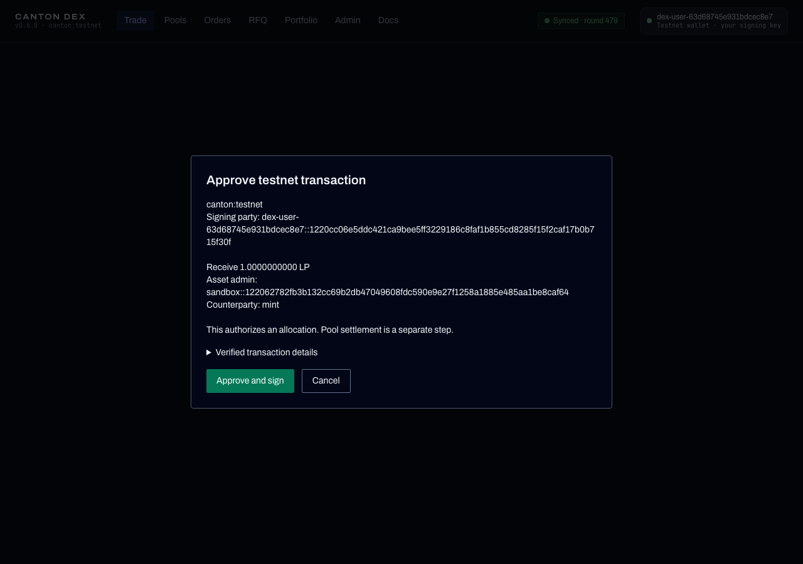

# Hosted testnet profile

The intended public deployment is `https://testnet-dex.bitdynamics.cc`. Its
users create external parties hosted on the configured DEX participant and
control their own Ed25519 signing keys. This profile must be enabled explicitly;
merging the code does not establish that the website has been deployed or that
live CC/USDCx transactions have passed.

The same contracts support other participants that install and vet the required
DARs, connect to the synchronizer, and meet the relevant registries' requirements.
A wallet connection to Loop does not relocate its party to the DEX participant.
TSv2 compliance alone does not guarantee package availability or wallet support.

## Authority and key storage

The browser generates the key using Web Crypto. It stores an encrypted backup
using AES-256-GCM and PBKDF2-SHA256 with 600,000 iterations, a fresh salt, and a
fresh nonce. The origin, network and public key are authenticated with the
ciphertext. Users must download the backup before onboarding. The unlocked key
is imported as non-extractable and retained only in memory until disconnect or
page closure. The passphrase and private key are never sent to the backend.

The backend generates Canton topology for that public key. Before signing, the
browser verifies the topology hash, the exact key, the configured participant,
one signing key, threshold one, and **Confirmation** hosting permission. The
initial Canton 3.5.2 topology format is supported; an unknown topology shape
fails closed. User keys authorize submission; the participant confirms it.

Each wallet API operation binds a one-time signed challenge to its action,
payload hash, public key, origin, network and expiry. The backend selects the
party from its stored key binding. A supplied party ID cannot substitute for
authentication. Challenges, bindings, completed submissions and daily limits
are persisted in SQLite.

The dedicated submission user receives `CanReadAs` and `CanExecuteAs` for these
external parties. It receives no `CanActAs` grant from onboarding. Canton must
reject unsigned submissions for them even when a privileged transport credential
is used. The browser recomputes each prepared transaction hash and compares its
network, command ID, signing party and command values before approval. The
backend executes only its stored prepared transaction with that user's signature.

This is a browser hot wallet, not a hardware wallet. A compromised browser,
extension, frontend build or script served by this origin can compromise an
unlocked wallet. The operator still hosts the participant, sees hosted-party
ledger data and can interrupt service. Loss of both the backup and passphrase
has no operator reset. Key rotation, replacement devices without a backup,
hardware signing and external-party migration need separate operational support.
Existing key bindings and caller sessions must be revoked when keys are rotated
outside this adapter; automatic topology-based revocation is not implemented.

## Configuration

Use a dedicated Ledger API user and token for wallet preparation, execution and
private reads. Do not reuse the DEX operator user. A separate server-side
administration credential authorizes external-party allocation and rights grants.
The administration credential must never be included in `VITE_*` settings.
The participant must enforce Ledger API authentication. Startup probes anonymous
access and the dedicated user's rights, and refuses to enable this profile if
anonymous access succeeds or the user has acting or administration authority.
Restrict participant administration and ledger ports to authorized services;
an application-level signature check does not secure an exposed participant.

Backend settings, in addition to the existing registry and operator configuration:

```dotenv
DEX_HOSTED_WALLET=1
CANTON_NETWORK=canton:testnet
DEX_HOSTED_WALLET_ORIGIN=https://testnet-dex.bitdynamics.cc
DEX_HOSTED_PARTICIPANT_ID=<confirming-participant-id>
CANTON_SYNCHRONIZER=<synchronizer-id>
DEX_HOSTED_LEDGER_USER=<dedicated-ledger-user>
DEX_HOSTED_LEDGER_TOKEN=<server-side-user-token>
DEX_HOSTED_ADMIN_TOKEN=<server-side-administration-token>
DEX_CALLER_JWT_SECRET=<strong-server-side-session-secret>
DEX_CALLER_JWT_AUDIENCE=<deployment-specific-audience>
ALLOWED_ORIGINS=https://testnet-dex.bitdynamics.cc
DEX_HOSTED_RFQ_RELAY=0
```

Frontend settings:

```dotenv
VITE_ENABLE_HOSTED_WALLET=1
VITE_CANTON_NETWORK_ID=canton:testnet
VITE_API_BASE=/api
VITE_CANTON_DEX_PACKAGE_ID=<deployed-package-hash>
```

The backend refuses this profile in read-only mode, on a non-testnet network,
with the custodial RFQ relay enabled, or with missing signing/session settings.
The UI exposes it only on testnet. The existing external-wallet adapters remain
available when separately configured. There is no production fallback to the
development operator-signing relay.

## Assets and supported operations

CC and USDCx retain their actual Splice/DSO and DA Utilities admin identities.
Configure `DEX_EXTERNAL_REGISTRIES` and the Amulet discovery settings as described
in the registry integration guide. Holdings and funding use `{admin, id}`, not
the displayed symbol alone. The LP token remains the reference registry's TSv2
asset, issued and redeemed within the pool's atomic settlement.

The retired hosted branch's reference-token faucet is not imported. This profile
does not mint CC or USDCx and does not provide automatic public funding. Users
need real testnet holdings on their new external party before adding liquidity
or swapping. External-party Splice setup, traffic funding, incoming-transfer
acceptance/preapproval and any issuer credentials must be provisioned through
the relevant issuer/validator flow. They are separate from Canton party creation.
Do not advertise an immediately funded public wallet until that flow is deployed
and tested. Reference assets named CC or USDCx are not an interoperability proof.

The adapter signs allocation funding for swaps and LP add/remove, and order
funding requests. Its command surface is deliberately bounded. It is not a full
wallet for arbitrary transfers, signing arbitrary messages, governance, key
rotation or asset administration. Operator-only order matching and RFQ routes
retain their existing authority requirements.

Each allocation may require its own approval. Only final pool settlement is
atomic across all registries. If approval or recovery fails partway through,
earlier allocations may remain locked. Inspect their state and use the registry's
authorized cancel/withdraw flow before starting a new deposit. A timeout must be
reconciled by update/command ID; it is not proof that a transaction failed.

LP holdings are on-ledger and user-controlled. Pool reserves remain controlled
by the operator, and redemption also requires the LP registrar. There is no
unilateral holder withdrawal from reserve slices. See [audit scope](AUDIT_SCOPE.md)
and [liquidity and custody](docs/concepts/liquidity-and-custody.md).

## Deployment and evidence

Deploy from a clean, pinned release checkout. Preserve the previous checkout,
web build, service configuration and database backup for rollback. Do not reset
or overwrite a dirty server checkout to make it resemble the audit tag. Record
the actual running commit, DAR hash, package ID, participant version and frontend
build configuration alongside the audit manifest. Existing contracts must match
the deployed package lineage.

The local sandbox proof verifies external-party onboarding, rejection of
unsigned submission, signed execution, request/transaction binding and receipt
handling. It uses disposable parties and reference assets. Production browser
builds, HTTP authorization tests, and an actual CC/USDCx add/swap/remove cycle
are additional checks. A second participant must be tested before claiming
multi-participant interoperability.

The browser approval below was exercised against a disposable local participant.
It demonstrates the LP receipt authorization, not live CC/USDCx settlement.



With frontend and backend dependencies installed, run:

```sh
app/web/node_modules/.bin/tsc -p scripts/tsconfig.hosted-proof.json
DEX_PROVE_EXTERNAL_SIGNING=1 bash scripts/run-dpm-sandbox-proof.sh
```

Onboarding is capped at 3 attempts per source IP per day and 200 globally per
day. Authentication and submission also have per-IP and per-key limits. The
source is the direct socket address; spoofed forwarded headers are ignored.
Behind a reverse proxy, users may share a bucket. Configure a trusted edge
limiter for the public service and size these limits before opening access.
SQLite is the single-instance authority store; independent replicas must not
each keep their own onboarding or challenge database.
