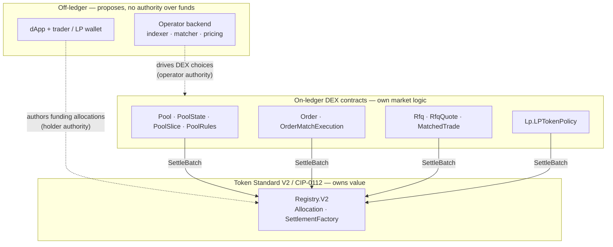
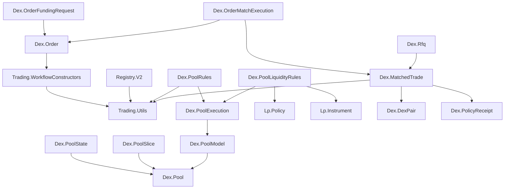

# Canton DEX Architecture

Canton DEX keeps market logic — orders, pools, RFQ — in its own Daml contracts,
but it never moves value itself: every settlement runs through the Token
Standard V2 (CIP-0112) allocation and batch-settlement APIs, so the exchange has
no bespoke escrow and no custody path of its own. This page is the map of that
split. [Non-goals](non-goals.md) records what the reference deliberately leaves
out, and why.

## The three layers



Three bands, top to bottom:

- **Off-ledger orchestration** has no authority over funds. The operator backend
  indexes the ledger, matches orders, prices pools, and *proposes* actions. It
  cannot lock a user's holdings; funds are locked only by an allocation the
  holder authors under the holder's own authority.
- **On-ledger DEX contracts** own market logic — price-time priority,
  cancellation, pool accounting, RFQ ranking — and drive settlement, but they
  express funds only as Token Standard allocations.
- **The Token Standard V2 settlement spine** owns value. `Registry.V2`
  implements the holding, allocation, and settlement interfaces;
  `SettlementFactory_SettleBatch` is the one primitive that actually transfers
  anything.

The trust boundary is the pair of dashed edges crossing into the ledger: the
operator drives DEX choices under its own authority, but it can neither fund a
trade nor bypass the validation those choices perform on-ledger. That claim is
the design's core, and [the executor-control
constraint](#the-executor-control-constraint) makes it precise.

## What settles value: the Token Standard V2 spine

Every value movement in the DEX reduces to two things: a set of **allocations**
(funds locked by their owner, pinned to a settlement) and one
**`SettlementFactory_SettleBatch`** that atomically executes the transfer legs
those allocations authorize.

Two properties of the V2 allocation surface — the CIP-0112 extensions, now
merged into `canton-network/splice` `main` — are load-bearing here:

- **Allocations represent funds, not just approval.** A bid, an ask, and each
  side of pool inventory are all backed by a live allocation whose holdings are
  actually locked.
- **Allocations can be committed and iterated.** `committed` keeps LP liquidity
  from being casually withdrawn; `nextIterationFunding` and
  `FinalizedAllocation.extraTransferLegSides` let one allocation fund a
  long-lived position and roll forward across many settlements. That is what
  makes pool inventory *allocation-native* rather than a custom balance with an
  escrow bridge behind it.

`Registry.V2` is the reference registry implementing these interfaces for the
in-script tests, the testnet harness, and the live DEX. It is not privileged:
any registry that implements the same V2 holding/allocation/settlement APIs can
back a traded instrument, so the DEX treats `InstrumentId` and registry-supplied
choice context as the stable integration boundary, not this template. The
guarantees the DEX relies on are enforced inside `SettlementFactory_SettleBatch`:
allocation-to-leg coverage (exactly one allocation authorizes each side of each
leg) and per-instrument sender/receiver balance across the whole batch.

## The on-ledger DEX contracts

Read the app as four contract families, each pairing a market object with the
allocations that fund it.

### Pools — four contracts, deliberately split

A constant-product pool is not one contract but four, split so a swap contends
on as little state as possible:

- `Pool` — immutable configuration: the pair, `feeBps`, and the parties. The
  stable identifier everything else hangs off.
- `PoolState` — the hot singleton: aggregate `reserves`, LP supply, status. A
  swap must read global reserves to price `x*y=k`, so this is the one
  irreducible serialization point, kept as small as possible.
- `PoolSlice` — one committed allocation backing one side. Funds are *sharded*
  across many slices, so add creates a slice (conflicting with nothing) while
  swap and remove touch only the slices they source.
- `PoolRules` — the operations (`PoolRules_Swap`, `PoolRules_Pause`,
  `PoolRules_ReconcileState`). Nonconsuming and operator-signed.

```daml
template Pool with
    poolId : PoolId
    operator : Party
    lpRegistrar : Party      -- owns the LP instrument; separate from operator
    admin : Party            -- asset registrar for base + quote
    baseInstrumentId : Text  -- id under `admin`; full identity is { admin, id }
    quoteInstrumentId : Text
    lpInstrumentId : V2.InstrumentId
    feeBps : Int             -- swap fee in bps; accrues entirely to LPs
  where
    signatory operator
    observer lpRegistrar
```

The non-obvious part is *why the funds live off the `Pool`*. If reserves and the
committed allocations sat on one contract, every swap would rewrite the whole
thing and no two pool operations could ever run concurrently. Instead `reserves`
on `PoolState` is derived pricing state and the slices are the source of truth
for funds; `PoolRules_Swap` adjusts only the input slice and the output-side
covering prefix, with the operator's indexer supplying the ordered slice
contract ids. Keeping those two views consistent is what
[the executor-control constraint](#the-executor-control-constraint) guards.

### Orders and matching

An `Order` is the market object (side, pair, `limitPrice`, `remainingQty`,
expiry); a prefunded `V2.Allocation` is the reserved-funds object. Placement
locks the funding as `nextIterationFunding` with no legs; a match carries the
concrete legs through `SettleBatch` and rolls the residual budget forward;
cancel releases the allocation.

`OrderMatchExecution_Execute` is where a resting order is defended. It fetches
both orders and refuses any fill outside their own limit prices, remaining
quantities, instruments, or bound allocations, so a buggy or malicious
off-ledger matcher cannot fill an order on terms its owner never agreed to. The
fill, the roll-forward of both remainders, and the trade record all happen in
one transaction — the settle archives the very allocations the orders are bound
to, so a partly-completed match could otherwise strand an order pointing at a
consumed allocation.

### RFQ and OTC block trades

`Rfq` is a trader's request to a whitelisted dealer set; each `RfqQuote` is a
dealer-signed price. `Rfq_Accept` (joint trader + operator) picks a quote,
records a `PolicyReceipt` — the ranking the operator applied over the quote set
the trader saw, replayable for audit — and creates a `MatchedTrade`. OTC and RFQ
both settle via the `TradingAppV2` pattern: request an allocation from each
authorizer, group settlement by admin, and settle with
`SettlementFactory_SettleBatch`.

### LP token

Pool shares are their own Token Standard instrument (`Lp.LPTokenPolicy`), minted
and burned under DEX rules by the `lpRegistrar` — a party deliberately separate
from the operator — and holdable like any other V2 instrument. Add- and
remove-liquidity are delivery-versus-payment: the deposit legs and the LP
mint/burn settle atomically, each batch under its own registry admin.

## The executor-control constraint

Committed and iterated allocations are what make long-lived pool and order
inventory possible — but they also hand the executor (the operator) the ability
to drive those funds' settlement path. That is safe only because every permitted
use is validated by on-ledger contract state, not by the off-ledger service.

Concretely, `PoolState.reserves` is derived and the slices are the truth, so the
invariant **`reserves == sum of active slice amounts per side`** must hold.
Every `PoolRules` / `PoolLiquidityRules` choice that rewrites `reserves` asserts,
inside the choice, that its reserve delta equals the net slice-amount change the
same choice performs:

```daml
    outputSliceDelta = outputLeftover - outputConsumedTotal
    inputSliceDelta = inputAmount  -- new input slice amount - old
...
assertMsg "swap: base reserve delta must equal net base slice delta"
  (newBaseReserve - state.reserves.baseAmount
    == (if inputIsBase then inputSliceDelta else outputSliceDelta))
```

These are assertions on the choice's own arithmetic — cheap and contention-free
— so a later code change cannot silently drift reserves and slices apart. For an
on-demand global check, the nonconsuming `PoolRules_ReconcileState` fetches the
full active slice set and asserts the per-side sums equal the reserves exactly
(see [Reference](#reference-reserves-integrity-in-full)).

One residual trust boundary remains: `PoolState` is operator-signed, so a
malicious operator could fabricate a parallel state with arbitrary reserves.
This reference assumes listing-trust in the operator; production hardening would
bind state updates to an admin-co-signed `Pool`.

## Off-ledger services: what they may and may not do

The operator backend (`services/operator-backend`) does the work a ledger
cannot:

- a polling **indexer** that projects contracts into queryable state and feeds
  the ordered slice/order contract ids to the rules choices;
- an **order matcher** and **pool pricing / quote generation** — the quote math
  is the same function `PoolRules_Swap` re-derives on-ledger, so preview and
  settlement agree;
- registry **choice-context lookup**, and transaction submission with retries
  behind a small HTTP surface.

The guardrail is structural: the backend has a fixed choice vocabulary and never
synthesizes DEX state by directly creating or archiving DEX templates — every
state change goes through a contract choice. Trader-authority writes (place
order, add liquidity, author a swap's funding allocation) have no HTTP endpoint
at all; they go through the trader's wallet. The dApp (`app/web`) is a React
frontend with a wallet-provider boundary that reads ledger state directly and
calls the backend only for one-shot orchestration.

> **Decentralizing the operator.** The validation logic can itself be
> decentralized. See the
> [BitSafe decentralization manager proposal](https://github.com/canton-foundation/canton-dev-fund/blob/main/proposals/2026-05-BitSafe-decentralization-manager.md)
> for decentralizing the execution of validation logic, and the
> [Splice DSO automation architecture](https://docs.canton.network/sdks-tools/api-reference/splice-architecture#decentralized-transaction-validation-and-automation)
> for decentralizing the off-ledger automation a backend like this drives.

## What proves it end to end

- [`EndToEndTests.daml`](../../trading-tests/CantonDex/Tests/EndToEndTests.daml)
  — every public workflow settles through the reference registry: pool
  add-liquidity keeps reserves backed, order placement → operator bind →
  trader-funded `Order_Fund`, RFQ accept produces a `MatchedTrade` with a
  derived `PolicyReceipt`, `PoolRules_Swap` end to end, full OTC `MatchedTrade`
  settle, and atomic order-match roll-forward with match-time limit-price
  enforcement.
- [`RegistryConservationTests.daml`](../../trading-tests/CantonDex/Tests/RegistryConservationTests.daml)
  — the settlement spine rejects any batch whose allocations do not cover its
  legs exactly or whose per-instrument sender/receiver totals do not balance,
  and proves roll-forward funding stays within real locked backing across
  iterations.
- [`PoolStateInvariantTests.daml`](../../trading-tests/CantonDex/Tests/PoolStateInvariantTests.daml)
  — `PoolRules_ReconcileState` holds across a full add → swap → remove
  lifecycle, and catches an omitted slice, a desynced operator-fabricated
  `PoolState`, or a slice from a different pool.

---

## Reference

### Design inputs

Three concrete upstream inputs shaped the architecture:

- **`TradingAppV2`** — the allocation-request / per-admin
  `SettlementFactory_SettleBatch` pattern reused for OTC and RFQ. Its V1/V2
  bridging is not carried over; this repo declares no V1 allocation dependency.
- **Registry workflows** — anchor the instrument model behind `InstrumentId`:
  the reference `Registry.V2` uses `InstrumentConfig`, holder/issuer
  credentials, and optional external ids (ISIN/CUSIP), but a production registry
  may expose the same V2 interfaces with a different internal model.
- **The V2 allocation extensions** — iterated settlement,
  `nextIterationFunding`, committed allocations, and
  `FinalizedAllocation.extraTransferLegSides` — which let allocations back
  long-lived pool inventory, not only trade reservation.

Two further principles run through the design: it is **workflow-first** (the
shape of choices and state transitions matters more than AMM feature parity —
see [Workflows](workflows.md)), and it trades **arbitrary `InstrumentId` pairs**,
not hardcoded "cash vs asset" families.

### Reference: reserves integrity in full

The `reserves == sum of active slice amounts per side` invariant is protected at
three levels:

- **Per-choice delta conservation, asserted on-ledger.** Every choice that
  rewrites `reserves` asserts its reserve delta equals the net slice-amount
  change it performs (created slice amounts minus consumed/drained amounts).
  Cheap and contention-free.
- **Global equality, auditable on demand.** `PoolRules_ReconcileState` takes the
  `PoolState` and the full list of active `PoolSlice` ids, verifies each belongs
  to the pool, and asserts the per-side sums equal the reserves exactly. It runs
  off the hot path. Completeness of the slice list is the caller's
  responsibility — an omitted slice understates the sum, so a clean reconcile
  proves `reserves <= sum over all active slices`; pair the call with the
  indexer's active-slice count to close the gap.
- **Residual trust boundary.** `PoolState` is operator-signed, so a clean
  reconcile is only as trustworthy as the operator's listing. Production
  hardening would co-sign state updates with an admin-signed `Pool`.

### Reference: one registry admin per pair

Both legs of a pair currently share one registry `admin`: `DexPair`, `Order`,
`Pool`, and `MatchedTrade` each carry a single `admin : Party`, and the
standard's `TransferLeg.instrumentId` is bare `Text`, so a leg cannot name its
own admin — the constraint lives in the app-layer templates, not the settlement
spine. [Non-goals](non-goals.md#one-registry-admin-per-pair) frames it as a
deliberate limitation; [Registry Integration](../guides/registry-integration.md#what-the-dex-does-not-assume)
sets out what lifting it would take.

### Reference: instrument lifecycle stays outside the DEX

The standard holding stays minimal (amount, instrument, owner). Richer semantics
— a bond's CUSIP/maturity/coupon, an option's strike/expiry, an LP token's pool
identity and redemption policy — are attached by the registry that administers
the `InstrumentId`, through V2 views, metadata, and choice context, not by DEX
templates. Token Standard V2 does not standardize lifecycle today, so until a
registry-level lifecycle API exists it is a registry-specific integration and
usually a versioning problem: mint a new instrument-config version when stateful
semantics change, and derive the new instrument identity from it. The traded
asset stays a standard holding even when its lifecycle is rich.

### Reference: component and package boundary

- `CantonDex.Dex.*` owns pair, order, RFQ, matched-trade, pool, and rules
  workflows; `CantonDex.Lp.*` owns the LP-token policy; `CantonDex.Registry.V2`
  is the reference registry used for tests and demos.
- The DAR implements the upstream Token Standard V2 interfaces but does not
  define custom Daml interfaces decoupling the LP component from the DEX venue; the
  shared boundary today is the V2 holding/allocation/settlement surface plus
  explicit template references. A package split or app-facing interface would be
  a separate step.
- Pair listing is direct: the operator creates `DexPair` contracts. There is no
  separate `DexRules` governance contract for pair admission yet, leaving room for forks
  to add governance or a decentralized rules layer.

The internal module dependencies (`CantonDex.*` imports) — `Trading.Utils` is the
shared base, and the pool, order, and RFQ/OTC clusters are otherwise independent:



### Reference: repository shape

```text
canton-dex/
  trading/
    CantonDex/
      Dex/        # pair, order, RFQ, matched-trade, pool, rules
      Lp/         # LP instrument and policy component
      Registry/   # reference V2 registry implementation
  trading-tests/
    CantonDex/    # Daml Script coverage for the public workflows
  services/
    operator-backend/
    registry-client/
  app/web/
    src/          # React frontend and wallet-provider boundary
  examples/
    stable-pool/  # separate Daml project consuming the DEX DAR
  vendor/splice/  # vendored token-standard packages
```

---

**Where to read next:** [Workflows](workflows.md) · [Pricing](pricing.md) · [Liquidity & Custody](liquidity-and-custody.md) · [Glossary](glossary.md) · [All docs](../README.md)
