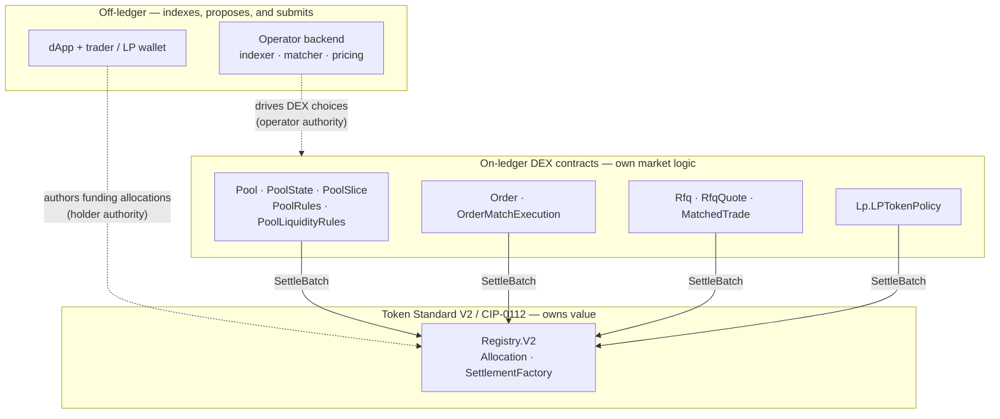
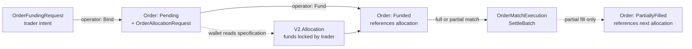
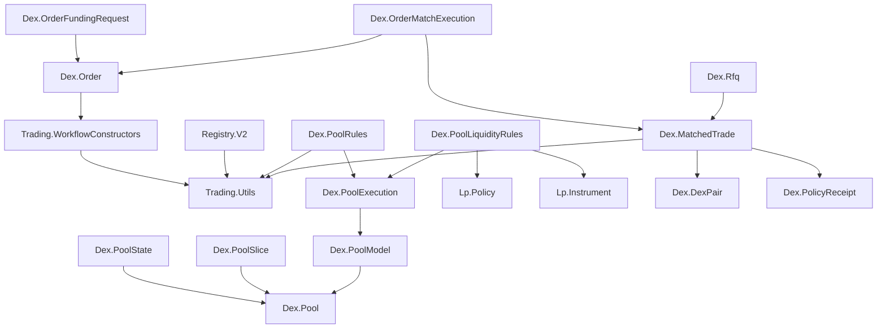

# Canton DEX Architecture

This is Step 6 of the
[canonical newcomer learning path](../README.md#canonical-newcomer-learning-path).
Complete the [15-minute design tour](design-tour.md) first.

Canton DEX keeps market logic—orders, pools, and RFQs—in its Daml contracts.
Those contracts do not hold or move token value. Every settlement uses Token
Standard V2 (CIP-0112) allocations and batch settlement, including pool
custody. This page maps that boundary. [Non-goals](non-goals.md) records what
the reference deliberately leaves out.

## The three layers



Three bands, top to bottom:

- **Off-ledger orchestration** indexes the ledger, matches orders, prices pools,
  and submits operator-controlled choices. In the self-custodial order, swap,
  and LP flows it cannot lock a user's holdings; those funds are locked only by
  an allocation the holder authors. The operator-mediated RFQ path is an explicitly
  separate demo authority model, described below.
- **On-ledger DEX contracts** enforce market rules — order limits,
  cancellation, pool accounting, and RFQ acceptance — and drive settlement,
  but they express funds only as Token Standard allocations. Matching and
  price-time priority remain off-ledger proposals whose terms are rechecked by
  the contracts.
- **The Token Standard V2 settlement spine** owns value. `Registry.V2`
  implements the holding, allocation, and settlement interfaces;
  `SettlementFactory_SettleBatch` is the one primitive that actually transfers
  anything.

The trust boundary is the pair of dashed edges crossing into the ledger. For
self-custodial flows the operator drives DEX choices under its own authority,
but it can neither fund a trade nor bypass the validation those choices perform
on-ledger. [The executor-control constraint](#the-executor-control-constraint)
makes that boundary precise. The operator-mediated RFQ path instead requires trader
act-as rights and must not be mistaken for the self-custodial path.

## What settles value: the Token Standard V2 spine

Every value movement in the DEX reduces to two things: a set of **allocations**
(funds locked by their owner, pinned to a settlement) and one
**`SettlementFactory_SettleBatch`** that atomically executes the transfer legs
those allocations authorize.

Two properties of the V2 allocation surface are load-bearing here:

- **Allocations represent funds, not just approval.** A bid, an ask, and each
  side of pool inventory are all backed by a live allocation whose holdings are
  actually locked.
- **Allocations can be committed and iterated.** `committed` keeps LP liquidity
  from being casually withdrawn; `nextIterationFunding` and
  `FinalizedAllocation.extraTransferLegSides` let one allocation fund a
  long-lived position and roll forward across many settlements. That is what
  makes pool inventory *allocation-native* rather than a custom balance with an
  escrow bridge behind it.

`Registry.V2` is the reference registry implementing these interfaces for the
in-script tests, the testnet harness, and the live DEX. It is not privileged:
any registry that implements the same V2 holding/allocation/settlement APIs can
back a traded instrument. A listed base/quote pair currently keeps both ids under
one registry admin; the LP registrar may differ. The DEX treats `InstrumentId`
and registry-supplied choice context as the stable integration boundary, not
this template. The
guarantees the DEX relies on are enforced inside `SettlementFactory_SettleBatch`:
allocation-to-leg coverage (exactly one allocation authorizes each side of each
leg) and per-instrument sender/receiver balance across the whole batch.

## The on-ledger DEX contracts

Read the app as four contract families. DEX contracts describe market state;
they do not contain token balances. Whenever a position needs funds, the DEX
contract stores or consumes a contract id for a Token Standard V2 allocation
whose holdings are locked by the holder.

| Contract family | Market state | Where the funds are | Choice that changes state |
|---|---|---|---|
| Pool | `Pool`, `PoolState`, and independent `PoolSlice` contracts | committed V2 allocations referenced by the slices | `PoolRules_Swap` or a `PoolLiquidityRules` settle choice |
| Order | one `Order` contract in `Pending`, `Funded`, or `PartiallyFilled` state | an iterated V2 allocation referenced by a funded order; committed through an expiry, trader-withdrawable for GTC | `Order_Fund`, `OrderMatchExecution_Execute`, or `Order_Cancel` |
| RFQ / OTC | `Rfq`, `RfqQuote`, and `MatchedTrade` contracts | one V2 allocation per settlement authorizer | `Rfq_Accept` followed by `MatchedTrade_Settle` |
| LP token | `Lp.LPTokenPolicy` supply state | LP holdings managed through the token registry | add/remove liquidity DvP settlement records mint or burn |

The common pattern is therefore **intent → holder-funded allocation →
validated DEX choice → V2 batch settlement**. Each workflow has a named choice
because its validation differs; value movement itself always ends at the same
Token Standard settlement interface.

### Follow one order from intent through settlement



1. The trader creates `OrderFundingRequest`, which contains order intent but no
   locked value.
2. `OrderFundingRequest_Bind` consumes that intent and creates a `Pending`
   `Order` plus an `OrderAllocationRequest` describing the required funding.
3. The trader's wallet authors the V2 allocation. An expiring order is committed
   through its deadline; a GTC order is uncommitted so the trader can withdraw
   it without the operator. Only the trader can lock these holdings.
4. The consuming `Order_Fund` choice replaces the pending order with a `Funded`
   order that references the allocation contract id.
5. `OrderMatchExecution_Execute` rechecks both orders' pair, side, limit price,
   quantity, expiry, and allocation before calling `SettleBatch`. A full fill
   closes the order; a partial fill atomically creates its remainder bound to
   the next allocation.
6. Before settlement, `Order_Cancel` consumes the order and cancels its
   allocation, releasing the trader's holdings.

If the operator is unavailable, the allocation interface remains the custody
exit: a GTC authorizer may exercise `Allocation_Withdraw` immediately, while an
expiring committed order becomes withdrawable after its deadline. The stale
`Order` may remain visible, but it cannot settle after its allocation is gone.

### Pools: five templates, deliberately split

A constant-product pool is not one contract but five templates. The split keeps
immutable configuration, aggregate accounting, individual inventory
allocations, trading operations, and liquidity operations independently
readable:

- `Pool` — immutable configuration: the pair, `feeBps`, and the parties. The
  stable identifier everything else hangs off.
- `PoolState` — the hot singleton: aggregate `reserves`, LP supply, status. A
  swap must read global reserves to price `x*y=k`, so this is the one
  irreducible serialization point, kept as small as possible.
- `PoolSlice` — one committed allocation backing one side. Funds are *sharded*
  across many slices, so swap and remove need only the slices that cover their
  transfer rather than a list of every allocation in the pool state.
- `PoolRules` — the operations (`PoolRules_Swap`, `PoolRules_Pause`,
  `PoolRules_ReconcileState`). Nonconsuming and operator-signed.
- `PoolLiquidityRules` — request and settle choices for add/remove liquidity.
  The contract is jointly signed at bootstrap; a settle submission needs the
  operator to exercise the rules choice and the LP registrar to exercise the
  nested `LPTokenPolicy` mint/burn choice.

`PoolModel` and `PoolExecution` are pure helper modules, not contracts. They keep
pricing, slice selection, and settlement assembly out of the templates without
adding another public execution surface.

```daml
template Pool with
    poolId : PoolId
    operator : Party
    lpRegistrar : Party      -- owns the LP instrument; separate from operator
    admin : Party            -- asset registrar for base + quote
    baseInstrumentId : Text  -- id under `admin`; full identity is { admin, id }
    quoteInstrumentId : Text
    lpInstrumentId : V2.InstrumentId
    feeBps : Int             -- swap fee in bps; accrues entirely to LPs
  where
    signatory operator
    observer lpRegistrar
```

The non-obvious part is *why the funds live off the `Pool`*. Keeping every
allocation id on the singleton state would make that contract grow with every
liquidity contribution and require every operation to rewrite the whole list.
Instead `reserves` on `PoolState` is derived pricing state and the slices are the
source of truth for funds; `PoolRules_Swap` adjusts only the input slice and the
output-side covering prefix, with the operator's indexer supplying the ordered
slice contract ids. Every reserve-changing operation still consumes and
recreates `PoolState`, so operations on one pool serialize there; the slice split
reduces state size and settlement input, not that irreducible contention.
Keeping the accounting and allocation views consistent is what
[the executor-control constraint](#the-executor-control-constraint) guards.

### Orders and matching

An `Order` is the market object (side, pair, `limitPrice`, `remainingQty`,
expiry); a prefunded `V2.Allocation` is the reserved-funds object. Placement
locks the funding as `nextIterationFunding` with no legs; a match carries the
concrete legs through `SettleBatch` and rolls the residual budget forward;
cancel releases the allocation.

`OrderMatchExecution_Execute` is where a resting order is defended. It fetches
both orders and refuses any fill outside their own limit prices, remaining
quantities, instruments, or bound allocations, so a buggy or malicious
off-ledger matcher cannot fill an order on terms its owner never agreed to. The
fill, the roll-forward of both remainders, and the trade record all happen in
one transaction — the settle archives the very allocations the orders are bound
to, so a partly-completed match could otherwise strand an order pointing at a
consumed allocation.

`Order_Adjust` and `Order_RecordPartialFill` are retired compatibility choices:
deployed Daml package lineage prevents removing them, so both reject every
exercise. They are not workflow APIs. Matching and partial-fill roll-forward
belong exclusively to `OrderMatchExecution_Execute`.

### RFQ and OTC block trades

`Rfq` is a trader's request to a whitelisted dealer set; each `RfqQuote` is a
dealer-signed price. `Rfq_Accept` (joint trader + operator) picks a quote,
records a `PolicyReceipt` — the ranking the operator applied over the quote set
the trader saw, replayable for audit — and creates a `MatchedTrade`. OTC and RFQ
both settle via the `TradingAppV2` pattern: request an allocation from each
authorizer, group settlement by admin, and settle with
`SettlementFactory_SettleBatch`.

### LP token

Pool shares are their own Token Standard instrument (`Lp.LPTokenPolicy`), minted
and burned under DEX rules by the `lpRegistrar` — a party deliberately separate
from the operator — and holdable like any other V2 instrument. Add- and
remove-liquidity are delivery-versus-payment: the deposit legs and the LP
mint/burn settle atomically, each batch under its own registry admin.

## The executor-control constraint

Iterated allocations make long-lived pool and order inventory possible.
Commitment additionally gives the executor an availability guarantee and is
used for pool slices and deadline-bounded orders. Pool slices deliberately use
`committed = true` with no settlement deadline: the operator authorizer cannot
withdraw them, but the operator is also the settlement executor and can cancel
them. LP holders have neither authority. This is an explicit operator-custody
boundary, not a permissionless LP exit. GTC order funding remains uncommitted so
iteration does not remove the trader's unilateral withdrawal right.

Every permitted settlement use is validated by on-ledger contract state rather
than accepted from the off-ledger service. The separate availability and exit
trade-offs are documented in
[Liquidity and Custody](liquidity-and-custody.md#availability-and-the-lp-exit-boundary).

Concretely, `PoolState.reserves` is derived and the slices are the truth, so the
invariant **`reserves == sum of active slice amounts per side`** must hold.
Every `PoolRules` / `PoolLiquidityRules` choice that rewrites `reserves` asserts,
inside the choice, that its reserve delta equals the net slice-amount change the
same choice performs:

```daml
    outputSliceDelta = outputLeftover - outputConsumedTotal
    inputSliceDelta = inputAmount  -- new input slice amount - old
...
assertMsg "swap: base reserve delta must equal net base slice delta"
  (newBaseReserve - state.reserves.baseAmount
    == (if inputIsBase then inputSliceDelta else outputSliceDelta))
```

These are assertions on the choice's own arithmetic — cheap and contention-free
— so a later code change cannot silently drift reserves and slices apart. For an
on-demand global check, the nonconsuming `PoolRules_ReconcileState` fetches the
full active slice set and asserts the per-side sums equal the reserves exactly
(see [Reference](#reference-reserves-integrity-in-full)).

One residual trust boundary remains: `PoolState` is operator-signed, so a
malicious operator could fabricate a parallel state with arbitrary reserves.
This reference assumes listing-trust in the operator; production hardening would
bind state updates to an admin-co-signed `Pool`.

## Off-ledger services: what they may and may not do

The operator backend (`services/operator-backend`) does the work a ledger
cannot:

- a polling **indexer** that projects contracts into queryable state and feeds
  the ordered slice/order contract ids to the rules choices;
- an **order matcher** and **pool pricing / quote generation** — the quote math
  is the same function `PoolRules_Swap` re-derives on-ledger, so preview and
  settlement agree;
- registry **choice-context lookup**, and transaction submission with retries
  behind a small HTTP surface.

The matcher also chooses observation order, match timing, and which eligible
cross to submit first. Limit-price and allocation checks constrain what can
settle, but they do not prove fair arrival ordering or prevent censorship,
front-running, or private reordering. That operator discretion is an explicit
[non-goal](non-goals.md#fair-ordering-and-private-mev).

The write surface is explicit rather than uniform:

- Administrative bootstrap directly creates operator-signed listing and pool
  contracts (`DexPair`, `Pool`, initial `PoolState`, rules, and LP policy).
  Ongoing market transitions use named choices that recheck their inputs.
- Order funding, swap funding, and LP add/remove author trader allocations
  through the wallet before an operator choice can settle them.
- The operator-mediated RFQ routes submit as the configured trader, and RFQ accept
  submits as both trader and operator. This requires corresponding ledger
  rights and is an authority-boundary example, not a self-custodial wallet path
  or a public relay service.

The dApp (`app/web`) makes these paths visible through a wallet-provider boundary
and a separate operator API client; neither path changes the on-ledger choice
authorization.

## Where the proof lives

Use the [Daml proof map](../reference/daml-proof-map.md) to connect an
architecture claim to its source choice and focused Daml Script test. Use the
[testing reference](../reference/testing.md) to understand the difference
between mock choreography, real-holding tests, backend/UI tests, and live
Canton proofs. Keeping the suite catalog in those reference pages avoids
duplicating volatile test names here.

---

## Reference

### Design inputs

Three concrete upstream inputs shaped the architecture:

- **`TradingAppV2`** — the allocation-request / per-admin
  `SettlementFactory_SettleBatch` pattern reused for OTC and RFQ. This repo uses
  only the V2 allocation APIs.
- **Registry workflows** — anchor the instrument model behind `InstrumentId`:
  the reference `Registry.V2` uses `InstrumentConfig` for precision, supply
  bookkeeping, optional external ids, and placeholder requirement records, but
  a production registry may expose the same V2 interfaces with a different
  internal model.
- **The V2 allocation extensions** — iterated settlement,
  `nextIterationFunding`, committed allocations, and
  `FinalizedAllocation.extraTransferLegSides` — which let allocations back
  long-lived pool inventory, not only trade reservation.

Two further principles run through the design: it is **workflow-first** (the
shape of choices and state transitions matters more than AMM feature parity —
see [Workflows](workflows.md)), and it trades **arbitrary base/quote ids under
one registry admin**, not hardcoded "cash vs asset" families. Pairing two asset
admins is an explicit [app-layer limitation](non-goals.md#one-registry-admin-per-pair).

### Reference: reserves integrity in full

The `reserves == sum of active slice amounts per side` invariant is protected at
three levels:

- **Per-choice delta conservation, asserted on-ledger.** Every choice that
  rewrites `reserves` asserts its reserve delta equals the net slice-amount
  change it performs (created slice amounts minus consumed/drained amounts).
  Cheap and contention-free.
- **Global equality, auditable on demand.** `PoolRules_ReconcileState` takes the
  `PoolState` and the full list of active `PoolSlice` ids, verifies each belongs
  to the pool, and asserts the per-side sums equal the reserves exactly. It runs
  off the hot path. Completeness of the slice list is the caller's
  responsibility — an omitted slice understates the sum, so a clean reconcile
  proves `reserves <= sum over all active slices`; pair the call with the
  indexer's active-slice count to close the gap.
- **Residual trust boundary.** `PoolState` is operator-signed, so a clean
  reconcile is only as trustworthy as the operator's listing. Production
  hardening would co-sign state updates with an admin-signed `Pool`.

### Reference: one registry admin per pair

Both legs of a pair currently share one registry `admin`: `DexPair`, `Order`,
`Pool`, and `MatchedTrade` each carry a single `admin : Party`, and the
standard's `TransferLeg.instrumentId` is bare `Text`, so a leg cannot name its
own admin — the constraint lives in the app-layer templates, not the settlement
spine. [Non-goals](non-goals.md#one-registry-admin-per-pair) frames it as a
deliberate limitation; [Registry Integration](../guides/registry-integration.md#what-the-dex-does-not-assume)
sets out what lifting it would take.

### Reference: instrument lifecycle stays outside the DEX

The standard holding stays minimal (amount, instrument, owner). Richer semantics
— a bond's CUSIP/maturity/coupon, an option's strike/expiry, an LP token's pool
identity and redemption policy — are attached by the registry that administers
the `InstrumentId`, through V2 views, metadata, and choice context, not by DEX
templates. Token Standard V2 does not standardize lifecycle today, so until a
registry-level lifecycle API exists it is a registry-specific integration and
usually a versioning problem: mint a new instrument-config version when stateful
semantics change, and derive the new instrument identity from it. The traded
asset stays a standard holding even when its lifecycle is rich.

### Reference: component and package boundary

- `CantonDex.Dex.*` owns pair, order, RFQ, matched-trade, pool, and rules
  workflows; `CantonDex.Lp.*` owns the LP-token policy; `CantonDex.Registry.V2`
  is the reference registry used for tests and demos.
- The DAR implements the upstream Token Standard V2 interfaces but does not
  define custom Daml interfaces decoupling the LP component from the DEX venue; the
  shared boundary today is the V2 holding/allocation/settlement surface plus
  explicit template references. A package split or app-facing interface would be
  a separate step.
- Pair listing is direct: the operator creates `DexPair` contracts. There is no
  separate `DexRules` governance contract for pair admission yet, leaving room for forks
  to add governance or a decentralized rules layer.

The internal module dependencies (`CantonDex.*` imports) — `Trading.Utils` is the
shared base, and the pool, order, and RFQ/OTC clusters are otherwise independent:



### Reference: repository shape

```text
canton-dex/
  trading/
    CantonDex/
      Dex/        # pair, order, RFQ, matched-trade, pool, rules
      Lp/         # LP instrument and policy component
      Registry/   # reference V2 registry implementation
  trading-tests/
    CantonDex/    # Daml Script coverage for the public workflows
  services/
    operator-backend/
    registry-client/
  app/web/
    src/          # React frontend and wallet-provider boundary
  vendor/splice/  # vendored token-standard packages
```

---

**Next canonical step:** [Workflow design](workflows.md). Use
[Pricing](pricing.md), [Liquidity and custody](liquidity-and-custody.md), and
the [Glossary](glossary.md) as topic references.
