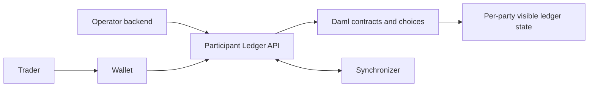
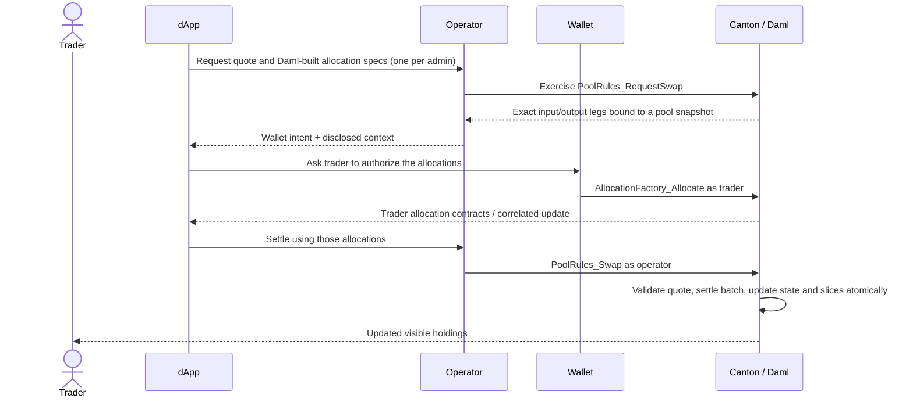

# Canton and Daml primer for DEX builders

This is Step 1 of the
[newcomer learning path](../README.md#newcomer-learning-path).
It assumes you understand AMM reserves, `x*y=k`, swaps, fees, and LP shares,
but have not built a Canton application.

This primer teaches the ledger concepts used by this repository. It is not a
complete Daml language course. Before editing Daml, complete Digital Asset's
official
[Get started with Daml](https://docs.canton.network/sdks-tools/sdks/daml-sdk)
tutorial and
[basic contracts lesson](https://docs.canton.network/appdev/modules/m3-contract-templates).
Installation comes later in Step 3,
[Getting started](../getting-started.md#prerequisites).

By the end, you should be able to answer four questions while reading code:

1. What data is a contract carrying?
2. Which party can see it and which party must authorize a change?
3. Which choice archives or creates contracts?
4. Is the code changing DEX state, Token Standard value, or only an off-ledger
   projection?

## The shortest mental model

Canton is the distributed-ledger system. Daml is the language and ledger model
used to define application contracts and their authorized transitions.



- A **party** is the on-ledger identity that authorizes actions. Trader, DEX
  operator, asset admin, and LP registrar are distinct logical roles and are
  normally separate parties in production; an explicitly documented local
  learning setup may let some control roles share one party.
- A **participant** is the Canton node through which hosted parties read their
  visible ledger state and submit commands.
- A **synchronizer** coordinates compatible participant transactions. It does
  not make every contract globally visible like a public-chain full node.
- A **Daml contract** is an immutable instance of a template.
- A **choice** is a permitted transition on a contract. Its controller must
  authorize the exercise.
- A **transaction** is atomic: all commands and nested choices commit, or none
  do.

The frontend does not become a ledger client merely because it can call the
operator backend. A self-custodial write crosses the trader's wallet because
only the trader can authorize trader-controlled commands.

## Templates become contracts

A Daml `template` combines data, visibility, authorization, and operations. A
shortened excerpt of
[`DexPair.daml`](../../trading/CantonDex/Dex/DexPair.daml) illustrates all four:

```daml
template DexPair with
    operator : Party
    baseInstrumentId : V2.InstrumentId  -- full identity { admin, id }
    quoteInstrumentId : V2.InstrumentId -- admin may differ from the base's
    publicReaders : Optional [Party]
    active : Bool
  where
    signatory operator                          -- authorizes creation; always sees the contract
    observer optional [] identity publicReaders -- listed readers; need not authorize creation

    choice DexPair_SetActive : ContractId DexPair
      with newActive : Bool
      controller operator    -- only the operator authorizes this transition
      do create this with active = newActive
```

Read it from top to bottom:

1. `DexPair` is the schema for one market listing.
2. A created instance gets a contract ID, often called a `cid` in this repo.
3. The `operator` is the signatory; the listed `publicReaders` are observers.
4. `DexPair_SetActive` is a consuming choice by default. Exercising it archives
   the old pair contract and creates a successor with the new flag.

That archive-and-create pattern is how immutable contracts represent state
updates. Do not look for a database-style in-place mutation.

### Signatory, observer, and controller are different roles

| Role | Question it answers | In the excerpt |
|---|---|---|
| Signatory | Who authorizes contract creation and is a stakeholder? | `operator` |
| Observer | Which additional stakeholder sees the contract? | `publicReaders` |
| Controller | Who authorizes this choice exercise? | `operator` |

Visibility is deliberate. A contract that is visible to the operator is not
automatically visible to every trader. Conversely, being able to see a
contract does not grant authority to exercise every choice on it.

## Commands become one atomic transaction

A client submits commands such as “create this template” or “exercise this
choice.” Choices can fetch other contracts and exercise nested choices. Canton
commits the resulting transaction only if authorization, visibility,
preconditions, and contract freshness all hold.

A Daml Script test expresses the submitting authority explicitly:

```daml
pairCid <- submit operator $ createCmd DexPair with ...

newPairCid <- submit operator $ exerciseCmd pairCid DexPair_SetActive with
  newActive = False
```

The important word is `operator` after `submit`. Replacing it with an unrelated
trader should fail because the choice controller is the operator. Tests use
this property to document both the happy path and forbidden paths.

### Consuming and nonconsuming choices

- A **consuming choice** archives the contract it is exercised on. It may
  create a successor, as `DexPair_SetActive` does.
- A **nonconsuming choice** leaves that contract active. It is useful for a
  stable rules contract that validates an operation without replacing itself.

Do not assume “nonconsuming” means read-only. A nonconsuming choice may still
exercise other contracts and create or archive application state inside the
same transaction.

## Parties are not services or users

Keep these three concepts separate:

| Concept | Example in this repo | Meaning |
|---|---|---|
| Human/application user | person using the Trade page | Off-ledger identity and session |
| Daml party | `trader`, `operator`, `lpRegistrar` | Ledger identity named in contracts and authorization |
| Canton participant | node exposing the Ledger API | Hosts parties, validates/submits commands, and stores their visible ledger state |

A backend credential can submit as a party only when the participant grants
the corresponding ledger rights. Writing `actAs: [trader]` in a request does
not manufacture trader authority.

Real Canton party IDs normally contain a hint and fingerprint, for example
`alice::1220…`. Short names such as `trader-demo` in the browser preview are
seed labels, not production party IDs.

## Packages, DARs, and the Ledger API

Daml source is built into a **DAR** (Daml Archive). A DAR contains one or more
compiled packages and their dependencies. A Canton participant must know the
packages before it can create those templates or exercise their choices.

This repository separates three representations:

```text
trading/**/*.daml
    │ dpm build
    ▼
trading/.daml/dist/canton-dex-trading-v2-1.0.0.dar
    │ upload / vet for the target network
    ▼
Canton participant
    │ JSON Ledger API
    ▼
services/operator-backend
```

- `daml.yaml` pins the SDK version and declares DAR dependencies.
- `dpm build` compiles the package (`dpm`, the Daml Package Manager, is the
  SDK's build-and-test CLI used throughout this repo).
- Uploading a DAR makes package code available to a participant; it does not
  create parties, holdings, pools, or liquidity.
- The backend's production ledger adapter sends JSON Ledger API commands and
  reads transaction/contract data visible to its ledger user.

The shortest proof that this package works on a real Canton process is the
repository's DPM sandbox runner. From the repository root, run:

```bash
bash scripts/run-dpm-sandbox-proof.sh
```

It starts the Canton sandbox bundled with the pinned SDK, uploads the package
closure, and runs a live holdings/allocation/delivery-versus-payment (DvP) driver. It is intentionally
throwaway. Its operator, asset admin, and LP registrar share the bootstrap
party, while the LP/trader and swapper are separately allocated so real value
moves between counterparties. Read
[Local Canton from a clean clone](../guides/localnet.md) before treating that
proof as evidence for any broader integration.

## The Active Contract Set is current state

The **Active Contract Set (ACS)** is the set of contracts that have been
created and not archived, as visible to the querying party. For an AMM, the
interesting active contracts include:

- `Pool`: immutable pool configuration;
- `PoolState`: aggregate reserves used for pricing;
- `PoolSlice`: committed reserve inventory;
- `PoolRules`: stable choices for swap validation and execution;
- Token Standard `Holding` and `Allocation` contracts.

The ACS is not a globally readable SQL table. Results depend on the querying
party's visibility. The backend indexer projects ledger events into a database
for API reads, but that database is a derived view, not the authorization or
settlement source of truth.

## Why a Canton AMM needs Token Standard contracts

The DEX contracts define market intent and validation. Token Standard V2
contracts represent and move value. This separation is the central design of
the repository.

| AMM idea | Daml/Token Standard representation |
|---|---|
| Trader's balance | one or more `Holding` contracts for an instrument |
| Permission to use exact funds for a trade | trader-authored `Allocation` tied to settlement terms |
| Pool reserves used for pricing | `PoolState.reserves` |
| Pool inventory that backs those reserves | committed allocation slices represented by `PoolSlice` |
| Atomic input-for-output exchange | one `SettlementFactory_SettleBatch` per instrument admin (one or two) inside the pool swap transaction |
| LP share | a Token Standard V2 LP instrument held in ordinary `Holding` contracts |

An allocation is intentionally narrower than an ERC-20 router allowance. It
locks identified backing for a particular settlement specification and names
the authorized settlement context. In a swap or liquidity operation the trader
authors every leg up front, so the operator can execute a valid settle but
cannot add to or rewrite those signed legs.

## One swap, in Canton terms

For a BTC-to-USDC swap, the flow is:



There are two authorities because there are two decisions:

- The trader authorizes the exact value locked from the trader's holdings.
- The operator authorizes execution against the venue's pool under on-ledger
  rules.

If the pool changed after the quote, the bound contract IDs are stale and the
transaction fails rather than silently repricing the signed trade.

## “In memory” means two different things here

This distinction prevents a common first-day misunderstanding:

| Name used in the repo | Engine | Enforces Daml? | Holds Token Standard value? | Runs Canton? |
|---|---|---:|---:|---:|
| Backend `InMemoryLedger` | TypeScript map + selected handlers | No | No | No |
| Daml Script runner | Daml ledger engine | Yes | Yes, when the fixture creates real `Holding`s | No participant process |
| DPM sandbox proof | Real throwaway Canton process + JSON Ledger API | Yes | Yes | Yes, one local sandbox process |
| Optional DevKit LocalNet / remote testnet | Persistent Canton/Splice services | Yes | Yes | Yes |

The browser preview uses the first row. `dpm test` uses the second. The default
live proof uses the third. DevKit is only an optional, separately distributed
manager for the fourth row; neither the DEX source nor its DARs depend on it at
runtime. Passing one row is not evidence that the next row is configured.

## Map the repository before reading details

```text
app/web/                         user interface and wallet handoff
        │ HTTP
        ▼
services/operator-backend/       orchestration, indexing, matching, ledger adapter
        │ JSON Ledger API in live mode
        ▼
trading/CantonDex/Dex/           market-state templates and choices
        │ nested Daml choices
        ▼
trading/CantonDex/Registry/      reference Token Standard holdings and settlement
```

`trading-tests/` drives the bottom two layers directly with Daml Script. The
tests are therefore the best executable contract documentation, but they do
not include the React dApp or HTTP backend.

## A first reading exercise

Open [`DexPair.daml`](../../trading/CantonDex/Dex/DexPair.daml) and answer:

1. Which fields define the market and fee schedule?
2. Who signs the contract?
3. Who observes it?
4. Which choices can change it?
5. Does each choice mutate the old contract, or create a successor?

Then open the beginning of
[`PoolWorkflowTests.daml`](../../trading-tests/CantonDex/Tests/PoolWorkflowTests.daml).
Its header explains what the mock-registry fixture proves, what it does not
prove, and which pool scripts to read first. Use the
[Daml proof map](../reference/daml-proof-map.md) to find the real-holding proof
for each design claim.

## You are ready to continue when…

You can explain these statements in your own words:

- A template is code; a contract is an active instance with a contract ID.
- A party supplies ledger authority; a participant is a node, not an identity.
- A choice describes a legal transition; its controller must authorize it.
- Contract visibility is party-scoped, not globally broadcast.
- The DEX validates market state, while Token Standard factories move value.
- Mock Wallet contract IDs prove a UI handoff only.
- Daml Script can prove contract behavior without proving the HTTP/live-network
  integration.

**Next step:** [Overview](overview.md). Keep the
[Glossary](glossary.md) open as a companion reference.
