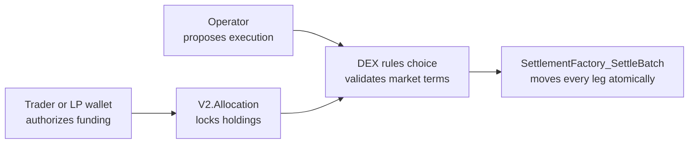
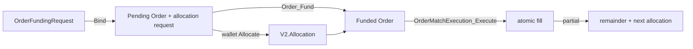

# Understand the design in 15 minutes

This page is the shortest path from the core Daml vocabulary to the Canton DEX
design. It explains which contracts carry market state, which party authorizes
each step, and where Token Standard V2 moves value. If terms such as template,
choice, controller, party, contract id, or active contract set are new, first
read the [Canton and Daml primer](canton-daml-primer.md); it assumes no Canton
background. Then return here and follow deeper links only when you need the
detail behind a statement.

## Start with the boundary

The DEX decides whether a market action is valid. A token registry owns holdings
and performs value movement.

The recurring workflow is:

1. A market contract records intent or state.
2. The holder's wallet creates the exact `V2.Allocation` needed by the flow.
3. An operator-controlled DEX choice fetches the market state and validates the
   proposed action.
4. The DEX choice groups the allocations and legs by instrument admin and
   exercises one `SettlementFactory_SettleBatch` per admin — one to three
   depending on the flow — inside a single atomic transaction.

The operator can decide when to propose an action. It cannot author a trader's
allocation. For swaps and liquidity the trader or LP authors every leg up front,
so settlement cannot add or alter their authority. The order book instead relies
on the operator as settlement executor: `OrderMatchExecution`'s checks constrain
the legs it fills to the matched price, quantity, pair, and ownership, but the
registry itself cannot prove the operator entered through that choice rather than
another.

## Know the actors

| Actor | What it controls | What it cannot do alone |
|---|---|---|
| Trader or LP | Its wallet submission and holder-authored allocations | Exercise operator-controlled settlement choices |
| Operator | Pair and pool state, matching proposals, pool execution, submission | Lock a self-custodial user's holdings |
| Asset registry admin | Registry implementation, factories, context, and token policy | Change a trader's signed DEX intent |
| LP registrar | LP instrument policy and mint/burn recording | Move reserve assets without the pool settlement path |

The operator-mediated RFQ example is different: its backend ledger user has
act-as rights for configured parties. That authority model is not the
self-custodial path used by wallet-funded orders, swaps, and liquidity, and the
repository does not expose it as a public relay service.

## The Token Standard settlement spine

A `Holding` is spendable token value. An `Allocation` locks holdings for one
settlement and describes the sides its authorizer permits. A
`FinalizedAllocation` supplies the exact sides used in this iteration.
`SettlementFactory_SettleBatch` checks that the batch is balanced and that each
side is authorized before value moves.

Two V2 fields matter throughout this repository:

- `committed` controls whether the authorizer may withdraw before the settlement
  deadline.
- `nextIterationFunding` allows unused locked value or received value to back a
  successor allocation in the same settlement.

The local `CantonDex.Registry.V2` is a runnable implementation of this boundary,
not a privileged registry. Production assets may come from another registry that
implements the same V2 APIs. Read [Registry Integration](../guides/registry-integration.md)
for the exact assumptions.

## Pair and governance state

`DexPair` is the operator-signed listing record. It names the base and quote
instruments by full `InstrumentId {admin, id}`, enabled trading modes, and fees.
The operator creates it directly and controls its update choices. There is no separate
`DexRules` governance contract in this reference.

That is a deliberate single-operator boundary, not decentralized pair admission.
A production fork that needs proposals, voting, or threshold approval should put
that authority in a governance contract rather than copy the direct bootstrap
path.

Read:

- Contract: [`DexPair.daml`](../../trading/CantonDex/Dex/DexPair.daml)
- Workflow map: [Active workflows](workflows.md#active-workflow-map)
- Guide: [Add a trading pair](../guides/add-a-trading-pair.md)

## Signed pool swaps

`PoolRules_RequestSwap` reads a precise pool snapshot and returns one allocation
specification per instrument admin — one combined specification for a
single-admin pair, or two (input admin and output admin) when base and quote
are on different registries. Together they carry the trader's input side and
every pool-to-trader output side. The wallet signs the returned specifications.

A pool's reserves are not held as one balance per side: each side is a set of
many small `PoolSlice` allocations (detailed in the next section). A swap
consumes only an ordered few of them — the *output slice list* below — and leaves
the rest untouched.

`PoolRules_Swap` then:

1. requires the same pool state, input slice, output slice list, and slippage
   minimum that the request bound;
2. recomputes the constant-product output on-ledger;
3. requires the trader allocation to match the exact input and output legs;
4. settles the trader and pool allocations atomically; and
5. replaces `PoolState` and only the reserve slices touched by the swap.

The operator cannot lower the signed output or swap against another snapshot.

Read:

- Rules: [`PoolRules.daml`](../../trading/CantonDex/Dex/PoolRules.daml)
- Math: [Pricing](pricing.md)
- Proofs: `testPoolSwapViaRequestSwap` and `testRealRegistryDvpSwapSettles`

## Liquidity and pool custody

The pool is split so each concern remains small:

| Contract or module | Responsibility |
|---|---|
| `Pool` | Immutable pool configuration and stable pool id |
| `PoolState` | Aggregate reserves, LP supply, status, and fee accrual |
| `PoolSlice` | One side-specific reserve amount and its backing V2 allocation |
| `PoolRules` | Swap, pause/resume, and reconciliation choices |
| `PoolLiquidityRules` | Add/remove request and settlement choices |
| `PoolModel`, `PoolExecution` | Pure pricing, slice selection, and assembly helpers |

Add liquidity is DvP: base and quote enter the pool in the same transaction in
which the provider receives LP tokens. Remove is the reverse. If the base/quote
registry admin differs from the LP registrar, the choice performs one settlement
batch per admin and passes each registry its own choice context.

### Why pool slices have no deadline

Reserve slices are `committed = true` with `settlementDeadline = None`, so under
the V2 withdrawal rule no one — not even the LP — can unilaterally call
`Allocation_Withdraw` on a routine slice. The operator holds custody: it is the
settlement executor and the only party that can release reserves, and routine LP
redemption needs the operator and LP registrar together. If either disappears,
the reference has no trustless LP exit.

This is a deliberate long-lived-custody choice. The full rationale — including
why simply adding a deadline would not give holders an exit — is in
[Liquidity and Custody](liquidity-and-custody.md#availability-and-the-lp-exit-boundary).

## Prefunded orders

An order has two parts: an operator-signed `Order` containing market terms and
the trader-authored allocations containing the reserved funds — one for a
single-admin pair, one per instrument admin when base and quote are on different
registries.

`OrderMatchExecution_Execute` fetches both orders and rechecks pair, side, price,
quantity, expiry, and bound allocation. It settles the fill and creates any
remainders in the same transaction. Expiring orders are committed through their
deadline. GTC orders are uncommitted so the trader can withdraw even if the
operator disappears.

The operator still chooses which eligible orders to match and when. On-ledger
checks prevent invalid fills; they do not prove fair arrival ordering or prevent
operator censorship and reordering. See [Ordering and MEV](non-goals.md#fair-ordering-and-private-mev).

Read:

- Intent and funding: [`OrderFundingRequest.daml`](../../trading/CantonDex/Dex/OrderFundingRequest.daml)
- Order state: [`Order.daml`](../../trading/CantonDex/Dex/Order.daml)
- Atomic fill: [`OrderMatchExecution.daml`](../../trading/CantonDex/Dex/OrderMatchExecution.daml)
- Proof: `testOrderMatchRollsOrdersForwardAtomically`

## RFQ and OTC settlement

An RFQ records a trader request and dealer quotes. `Rfq_Accept` jointly requires
the trader and operator, records the ranking in a `PolicyReceipt`, and
creates a `MatchedTrade`. Each counterparty then authors its allocations — one
specification per instrument admin it touches — and `MatchedTrade_Settle` groups
the transfer legs by registry admin before calling that admin's settlement
factory.

The accepted RFQ state does not mean value moved. Settlement occurs only after
both sides' allocations exist and the matched-trade settle succeeds.

Read:

- RFQ state: [`Rfq.daml`](../../trading/CantonDex/Dex/Rfq.daml)
- Settlement: [`MatchedTrade.daml`](../../trading/CantonDex/Dex/MatchedTrade.daml)
- Real holdings proof: `testRfqBuySettlesAgainstRealHoldings`

## Cross-registry settlement

Factory contract ids are not sufficient. Before a registry choice, the operator
fetches that admin's choice context and disclosed contracts off-ledger. Context is
keyed by admin, not by list position. Each per-admin batch receives only the legs,
factory, and `extraArgs` for that admin; all required disclosures accompany the
single Canton submission.

The evidence is intentionally both positive and negative:

- `testDvpSettleThreadsBothAdminContexts` succeeds with distinct contexts;
- `testDvpSettleRequiresPoolAdminContext` removes only the pool-admin context and
  must fail;
- `testDvpSettleRequiresLpRegistrarContext` removes only the LP context and must
  fail; and
- `testMatchedTradeSettlesPerAdminLegSubsets` proves each admin receives its
  exact transfer-leg subset against the upstream context-requiring registry.

Read [Choice Context](../guides/choice-context.md) for backend assembly and
submission details.

## Active and compatibility surfaces

Public source can contain declarations that are not active workflow APIs. Code
comments use one of these markers:

- `[COMPAT]` means a type, field, template, or fixture remains for Daml package
  lineage. Active code does not rely on it unless the comment says otherwise.
- `[RETIRED]` means a choice remains callable in the package shape but always
  rejects and names the replacement.
- `[POLICY]` marks active behavior that deliberately ignores a field for a
  stated policy reason.

The `CantonDex.Instrument.*` module family is a `[COMPAT]` standalone lifecycle sample.
It is not Token Standard V2 and is not used by active DEX workflows. Active value
flows use `CantonDex.Registry.V2` or another V2 registry. Matching and
partial-fill roll-forward belong to `OrderMatchExecution_Execute`.

## Choose the next detailed page

| If you want to understand | Read next |
|---|---|
| Component and authority boundaries | [Architecture](architecture.md) |
| Every workflow step | [Workflows](workflows.md) |
| Reserve representation and LP exits | [Liquidity and Custody](liquidity-and-custody.md) |
| Registry assumptions and context | [Registry Integration](../guides/registry-integration.md) |
| What tests prove | [Testing](../reference/testing.md) |
| Deliberate limitations | [Non-goals](non-goals.md) |

**Next canonical step:** [Architecture](architecture.md). Use the other rows
above as topic references when you need their detail.
