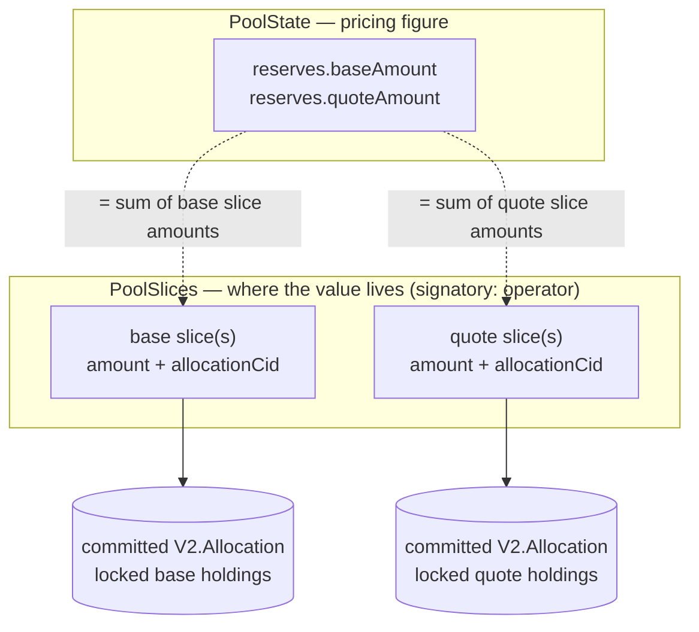

# Liquidity and custody

A pool keeps its liquidity in two forms: a `Decimal` reserve figure it prices
against, and the actual assets, which sit in committed allocations the operator
holds on the pool's behalf. This page explains where the value physically
lives, the invariant that ties the two forms together, and why every flow moves
them as one.

## Reserves are accounting; slices are custody

`PoolState.reserves` is a `PoolReserves { baseAmount, quoteAmount }` — two
`Decimal`s. It is *derived* state: the pool keeps it only so a constant-product
swap can price against the global totals in a single transaction. It custodies
nothing.

The assets live on `PoolSlice` contracts — one committed allocation each, one
side (base or quote) each. A slice pairs a committed `V2.Allocation`, which
locks real holdings, with a cached `amount`:

```daml
template PoolSlice with
    poolId : PoolId
    operator : Party
    side : Side
      -- ^ Which pool leg (base or quote) this slice funds.
    allocationCid : ContractId V2.Allocation
      -- ^ The committed allocation holding this slice's funds.
    amount : Decimal
      -- ^ Cached funded amount; reconciled against the allocation by the
      --   choice that writes the slice.
  where
    signatory operator
```

Two things here are specific to this design:

- **Slices are locality units, not LP shares.** A slice does not belong to an
  LP — there is no `PoolSlice.owner`. The `operator` is the sole signatory, and
  the operator-backend indexer tracks slices by `poolId` and hands the relevant
  `ContractId`s to each choice. Add creates a *new* slice, which conflicts with
  nothing; remove and swap touch only the slices they source. So no single hot
  contract serializes every pool operation — only the small `PoolState` does.
- **`amount` is a cache, not the source of truth.** The committed allocation
  holds the funds; `amount` is stored alongside so the rules choices can walk
  slices without a `fetch` per slice, and it is reconciled against the
  allocation by the choice that writes the slice. That the committed allocation
  really locks holdings worth its funding is proved in
  [`RegistryConservationTests.daml`](../../trading-tests/CantonDex/Tests/RegistryConservationTests.daml)
  (a settle can never move more than the locked backing; a roll-forward carries
  real locked holdings worth its funding; surplus returns to the authorizer
  unlocked).

## The invariant: reserves equal the sum of slice funding

Per instrument, the reserve equals the sum of the active slices' amounts on
that side: the sum of active base `PoolSlice.amount` equals
`reserves.baseAmount`, and likewise for quote. The slices are authoritative; the
reserve is their aggregate. Two on-ledger mechanisms keep the two from drifting:

- **Per-choice delta conservation.** Every `PoolRules` / `PoolLiquidityRules`
  choice that rewrites `reserves` asserts, in that same choice, that its reserve
  delta equals the net slice-amount change it just performed — for example
  `PoolLiquidityRules_SettleAddLiquidity` asserts `"add: base reserve delta must
  equal created base slice amount"`. A code change cannot silently move one
  without the other.
- **Global reconciliation.** The nonconsuming `PoolRules_ReconcileState` choice
  re-derives both side totals from the full active slice set and asserts each
  equals the recorded reserve (`baseTotal == state.reserves.baseAmount`). It
  writes no state, so an operator or auditor can run it against a live pool
  without contending with swaps. Completeness of the slice list is the caller's
  responsibility — pair the call with the indexer's active-slice count.

Both are exercised by
[`PoolStateInvariantTests.daml`](../../trading-tests/CantonDex/Tests/PoolStateInvariantTests.daml):
reconcile stays clean across a full add → swap → remove lifecycle at every
stage, and fails on an omitted slice, a slice from another pool, or a
fabricated, desynced `PoolState`.



## Every flow moves holdings and reserves together

Because the assets are real committed allocations, moving them is settlement,
not bookkeeping. Add, remove, and swap each run as a delivery-versus-payment
`SettlementFactory_SettleBatch` and rewrite `PoolState` once, inside one Daml
transaction — so holdings and reserves change co-atomically, or nothing changes.

- **Add.** The LP's base and quote deposits settle into operator-authored
  receiver allocations, which roll forward (via `nextIterationFunding`) into the
  two new slices; the registrar mints LP tokens to the LP; `PoolState` is
  rewritten once with the new reserves and supply. Base/quote settle under
  `pool.admin` and the LP mint under `pool.lpRegistrar`, so this is two
  per-admin batches in the same transaction.
- **Remove** is symmetric to swap: the sourced slices deliver base and quote to
  the holder (exactly as `PoolRules_Swap` delivers to the swapper), each fully
  drawn slice drains, the boundary slice re-wraps its leftover, the holder's LP
  tokens burn, and `PoolState` drops by the same amounts.
- **Swap** pays the input into one side's slice and delivers the output from the
  other, updating both reserves in the same choice.

[`PoolLiquidityRulesTests.daml`](../../trading-tests/CantonDex/Tests/PoolLiquidityRulesTests.daml)
drives these end to end against the reference registry: an add funds base+quote
and mints the LP holding in one flow; a remove delivers base+quote to the
*holder* (not the operator) and burns the LP tokens; a stale supply quote aborts
the settle.

The mint/burn legs and the co-controlled `PoolLiquidityRules` contract are what
give a settle the authority to touch both the operator-signed slice state and
the registrar-controlled LP tokens at once; that machinery is covered in
[LP Tokens](lp-tokens.md).

---

### Reference / details

- **Residual trust boundary.** `PoolState` is operator-signed, so a malicious
  operator could fabricate a parallel state contract that overstates reserves.
  `PoolRules_ReconcileState` catches that against the real slices (the desync
  case above), but listing-trust in the operator is assumed; production
  hardening would bind state updates to an admin-co-signed `Pool`.
- **Slices are long-lived, and some registries cap that.** The committed
  allocations backing slices persist between operations. A registry may bound
  allocation lifetime — Amulet enforces `tokenStandardMaxTTL` (default
  **90 days**) from Splice 0.6.11 — so against such a registry the operator must
  roll slices into fresh allocations before the cap expires. See
  [Registry Integration](../guides/registry-integration.md#allocation-lifetime-caps).
- **Mint/burn accounts.** The LP-token legs use the special
  `mintAccount`/`burnAccount` (`owner = None`); the registry must support them
  at the `Allocation` signatory, settlement crediting, and allocate-factory
  sites. `Registry.V2` already does.
- **Off-ratio adds don't inflate reserves.** LP tokens are minted against the
  limiting side, so only the ratio-matched part of a deposit enters the slices;
  the unmatched excess is refunded to the provider in the same batch and never
  reaches `reserves`.

**Where to read next:** [LP Tokens](lp-tokens.md) · [Pricing](pricing.md) · [Registry Integration](../guides/registry-integration.md) · [All docs](../README.md)
