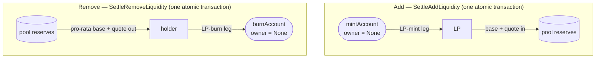

# LP tokens

An LP token is an ordinary V2 holding whose mint and burn ride the *same*
atomic settlement that moves the underlying base and quote. Under the liquidity
choices there is no separate issuance lifecycle — no settle, no mint. One
fungible instrument per pool, and its value is realised only by redeeming it.

## One fungible instrument per pool

Each pool has exactly one LP instrument, fixed at pool creation as
`Pool.lpInstrumentId : V2.InstrumentId` (with `admin = lpRegistrar`). Its
identity and circulating supply live in a small `LPTokenPolicy` that knows
nothing about the pool — no base, no quote, no reserves, just the instrument id,
a `totalSupply`, and an `active` flag.

The token is **unversioned**: the `instrumentId` never carries a version suffix
or per-iteration tag, so two `BTC-USDC-LP` holdings of the same amount
are interchangeable — no rebase, no per-version balance map. It MUST NOT be
derived from the pool's contract id, settlement iteration, or status, all of
which change over a pool's life and would re-version the LP behind holders'
backs. (Why this matters for wallets and downstream dApps is in
[Reference](#reference-versioning-and-upgrades).)

## Mint and burn are a sibling of the settlement

Adding and removing liquidity settle through `PoolLiquidityRules` —
`PoolLiquidityRules_SettleAddLiquidity` and
`PoolLiquidityRules_SettleRemoveLiquidity`. Each choice is one atomic
transaction that groups settlement per instrument admin and exercises one
`SettlementFactory_SettleBatch` per admin — one to three in all:

- the base and quote batches, each under its asset's own registry admin, moving
  the real assets into or out of the operator-custodied reserves;
- the LP mint/burn batch under the LP registrar (`lpRegistrar`), creating or
  destroying the LP holding.

When base and quote share an admin, their batches collapse into one.

A mint and a burn are just transfer legs to and from two reserved accounts whose
`owner` is `None`. `Registry.V2` recognises exactly these as admin-authorised
issuance sources (`mintAccount` id `"cip-112/mint"`, `burnAccount` id
`"cip-112/burn"`), so a leg *from* `mintAccount` is an issuance and a leg *to*
`burnAccount` is a redemption — [`lpMintLeg` / `lpBurnLeg`](../../trading/CantonDex/Lp/Instrument.daml):

```daml
lpMintLeg recipient lpInstrumentId amount = V2.TransferLeg with
  transferLegId = "lp-mint"
  sender = Utils.mintAccount
  receiver = recipient
  amount
  instrumentId = lpInstrumentId
  meta = emptyMetadata

lpBurnLeg holder lpInstrumentId amount = V2.TransferLeg with
  transferLegId = "lp-burn"
  sender = holder
  receiver = Utils.burnAccount
  amount
  instrumentId = lpInstrumentId
  meta = emptyMetadata
```

Two things about this are non-obvious:

- **No settle, no mint.** The mint leg lives in the *same choice* as the deposit
  legs. Both batches are all-or-nothing together: you cannot receive LP tokens
  without your base+quote landing in the reserves, and you cannot pull assets out
  without your LP holding burning. The mint is a sibling of the delivery, not a
  standalone issuance step that could run on its own. This guarantee is a
  property of `PoolLiquidityRules_SettleAddLiquidity` and
  `PoolLiquidityRules_SettleRemoveLiquidity`, not of the LP instrument itself: the
  reference registry still exposes the raw `Registry_Mint`/`Registry_Burn`, and
  the policy's `LPTokenPolicy_RecordMint`/`_RecordBurn` (controller `lpRegistrar`)
  can be exercised on their own. A registrar driving those choices directly sits
  outside this guarantee.
- **The mint amount is bounded, not trusted.** The LP receipt carries the
  operator's off-ledger quote, and that quoted amount is what mints; the settle
  validates it against the fair entitlement — `sqrt(base·quote)` at first
  funding, else pro-rata — within a `1e-6` dust tolerance, rejecting a receipt
  that claims more. This check runs procedurally inside the add choice, not as a
  template invariant. The registrar signs the mint; `PoolLiquidityRules` bounds
  it.



Supply is tracked in two places and kept in lockstep: `LPTokenPolicy.totalSupply`
and `PoolState.totalLpSupply`. Each settle asserts they already agree, then
`LPTokenPolicy_RecordMint` / `LPTokenPolicy_RecordBurn` moves the policy's total
while the same choice rewrites `PoolState` with the matching delta. The lockstep
is maintained by the settle choices; `LPTokenPolicy_RecordMint`/`_RecordBurn`
exercised on their own move only the policy's total, leaving `PoolState`
untouched.

## Value is realised by redemption

The LP token never pays a coupon and never rebases. Swap fees stay in the pool's
reserves (see [Pricing](pricing.md)), so the reserves a fixed LP balance can
claim grow as the pool trades. Value comes out only on
`PoolLiquidityRules_SettleRemoveLiquidity`, which burns the holder's LP and pays
the current pro-rata share of reserves:

```
share   = lpTokensToRedeem / knownTotalLpSupply   -- floored
baseOut  = reserves.baseAmount  · share           -- floored
quoteOut = reserves.quoteAmount · share            -- floored
```

Redemption pays the floored pro-rata share of the pool's *current* reserves.
A directional swap raises one reserve and lowers the other, so as the pool
trades its reserves settle into a shifted mix — more of whatever was swapped in,
less of what was taken out — on top of the fees that accrue in the pool. A fixed
LP balance's share of that mix can therefore be worth more or less per side than
what backed it at deposit time, depending on net trade direction. What grows
monotonically is `x·y` (the constant-product `k`): each swap retains its fee in
the pool and its floored output can leave a little extra, so `k` grows — the
growth is the retained fee plus rounding, not the fee alone. That growth in pool units
is not a guaranteed gain in outside value, though. Measured against an external
reference asset, adverse price moves (impermanent loss) and the one-directional floor
rounding can leave a redeemer with less value than simply holding the deposited
base and quote. Rounding is one-directional (`floorDiv`/`floorMul`), so the pool
never pays out more than the exact share.
The paid-out base and quote leave the reserves, so removal *lowers* them and
`x·y = k` falls; `k` stays non-decreasing only across swaps, not on removal. A
pool that never traded returns, on a full redemption, exactly what went in (a
partial redemption floors its share); there is no off-ledger event a holder must
settle first.

---

## Reference: versioning and upgrades

The single-instrument choice buys three things a versioned LP would cost:
**fungibility** (all holders of a pool hold one instrument and transfer freely),
**composability** (a lending market or vault treats an LP holding as collateral
by checking one `instrumentId`, with no per-version balance map), and **UX
simplicity** (one LP balance per pool, not a timeline of versioned slivers).

- **Settlement iterations are not versions.** The V2 allocation API uses
  `nextIterationAllocationCid` so the pool hands pool-side allocations forward
  across settlement batches without users re-allocating. That is an allocation
  lifecycle concern; the LP holdings users hold are unaffected.
- **Fee or rule changes keep the instrument.** Existing LPs simply share future
  fees at the new rate. Honouring old LPs at old rates means the operator spins
  up a *new* pool with a new `lpInstrumentId` — a deliberate migration, never an
  incidental rebase.
- **Policy upgrades are package upgrades.** Replacing the LP policy itself
  (security fix, choice-signature change) is a Canton package upgrade: same
  `instrumentId`, new package hash; holders are unaffected.
- **Registry-specific lifecycle is separate.** Token Standard V2 does not
  standardize instrument lifecycle transitions. The reference LP token needs no
  such extension: its registrar is fixed, fees accrue through reserve growth,
  and one stable `InstrumentId` identifies the pool share. See
  [CIP-0112](https://github.com/global-synchronizer-foundation/cips/blob/main/cip-0112/cip-0112.md)
  for the standard interfaces this implementation uses.

## Tests

- [`PoolLiquidityRulesTests.daml`](../../trading-tests/CantonDex/Tests/PoolLiquidityRulesTests.daml)
  — mint/burn as the sibling batch of a real add/remove:
  `testDvpAddLiquidity` (deposit + LP mint settle atomically),
  `testDvpRemoveDeliversToHolder` (partial redemption pays reserves, burns the
  redeemed amount, and preserves the holder's unlocked LP remainder),
  `testAddRejectsOverMint` (a receipt above the on-ledger fair share is
  rejected), and `testSettleRequiresCoControl` (the settle needs both `operator`
  and `lpRegistrar`).

---

**Where to read next:** [Liquidity & Custody](liquidity-and-custody.md) · [Pricing](pricing.md) · [Add an LP or Instrument](../guides/add-lp-or-instrument.md) · [All docs](../README.md)
