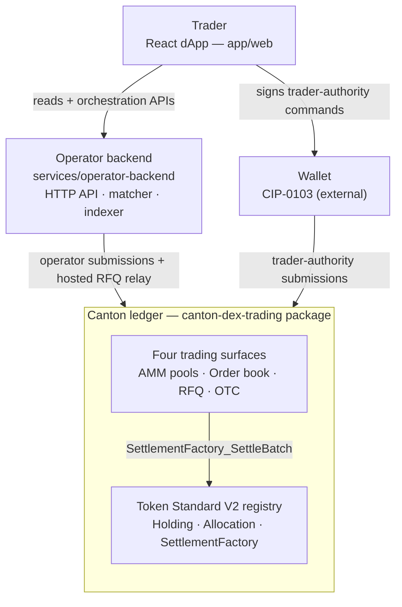

# Overview

This is your first stop. It says what Canton DEX is, shows the whole system on
one diagram, and points you at the doc that answers your next question.

## What Canton DEX is

Canton DEX is a runnable **Token Standard V2 (CIP-0112) reference exchange** for
the Canton Network. An exchange has two separate jobs: decide the terms of a
trade, then move both sides' assets without either party taking settlement risk.
This reference shows four ways to decide the terms:

- an **automated market maker (AMM)** calculates a price from two pool reserves;
- an **order book** crosses compatible buy and sell limit orders;
- a **request for quote (RFQ)** lets selected dealers quote a larger trade; and
- an **OTC matched trade** records terms the two parties already agreed.

All four use the same value-movement boundary. The holder locks funds in a Token
Standard V2 allocation, the DEX choice validates the market-specific terms, and
the registry settles every transfer leg atomically. There is no custom
off-ledger balance model. Self-custodial swap, order, and liquidity flows keep
trader authority in the wallet; the hosted RFQ demo uses an explicitly
documented operator relay.

The repo ships the Daml package, operator backend, React dApp with a CIP-0103
wallet boundary, tests, and runbooks. Its demo stack runs without a Canton
participant; separate opt-in tests exercise the same flows against a live
participant.

## Five ideas before reading the code

| Idea | Plain-language meaning | Where it appears here |
|---|---|---|
| **Holding** | Spendable units of one token owned by an account. | BTC, quote assets, and LP shares are registry-managed V2 holdings. |
| **Market object** | A DEX contract that records terms or accounting, but does not contain token balances. | `Order`, `MatchedTrade`, `PoolState`, and `Rfq` describe what may happen. |
| **Allocation** | Holdings locked by their owner for a named future settlement. It is narrower than an open-ended token allowance. | A wallet authors the allocation that funds an order, swap, or liquidity action. |
| **DvP batch** | Delivery versus payment: every required transfer succeeds in one transaction, or none does. | `SettlementFactory_SettleBatch` moves the trader and pool/counterparty legs together. |
| **Iterated settlement** | A settlement can create a successor allocation carrying the remaining locked funds. | Pool slices and partially filled orders continue without asking the owner to re-fund every step. |

The DEX therefore never updates an application-level balance to pretend a trade
happened. DEX contracts decide what is permitted; Token Standard contracts hold,
lock, and settle the actual value.

## One swap in plain language

Suppose a trader wants to sell `0.1 BTC` into a BTC/USDC pool:

1. `PoolState` records the aggregate BTC and USDC reserves. Separate
   `PoolSlice` contracts reference the committed allocations that actually back
   those reserves.
2. The backend reads `PoolState` to show an estimated USDC output.
   `PoolRules_RequestSwap` returns the exact input-allocation specification the
   wallet must authorize; it does not fix the eventual execution price.
3. The trader's wallet locks `0.1 BTC` in a V2 allocation. The operator cannot
   create this allocation on the trader's behalf in the self-custodial flow.
4. The backend submits `PoolRules_Swap` with that allocation and the reserve
   slices needed for the output.
5. The choice calculates the execution price from current state, checks the trader's
   minimum output, verifies every allocation, and calls
   `SettlementFactory_SettleBatch`.
6. BTC moves to the pool and USDC moves to the trader atomically. The choice
   recreates `PoolState` and binds the remaining reserve value to successor
   slices. If any check fails, neither side moves.

The other workflows change how terms are formed and what state is recreated;
they do not invent a different custody or settlement mechanism.

## Who this reference is for

- **Daml application builders** learning how app state composes with Token
  Standard V2 holdings, allocations, and settlement.
- **Wallet and registry integrators** validating authority, choice-context, and
  disclosed-contract boundaries against a complete dApp.
- **Venue operators and reviewers** evaluating order, RFQ, pool, LP, recovery,
  and observability workflows before adapting them to a production design.

It is deliberately not a production exchange specification. It does not define
governance, permissionless listing, routing, concentrated liquidity, or a
decentralized operator; [Non-goals](non-goals.md) explains each boundary.

## System at a glance

There are two submission paths, split by **who is allowed to sign what**. A
wallet signs trader-authored allocations for orders, swaps, and liquidity. The
operator backend submits listing, matching, and settlement commands. The hosted
RFQ demo also relays trader-authority commands, so its ledger user must have
act-as rights for the hosted trader; that exception is not a self-custodial
wallet model. Both paths submit into `canton-dex-trading`, whose trading
surfaces settle through a Token Standard V2 registry.



- **dApp** (`app/web/`) — the trader-facing screens and the wallet-provider
  boundary (Mock, CIP-0103 SDK, WalletConnect, PartyLayer, and more).
- **Operator backend** (`services/operator-backend/`) — HTTP API, JSON Ledger
  API driver, the reference matcher, indexer, idempotency, and recovery. Ships an
  in-memory dev ledger so the stack runs without Canton.
- **`canton-dex-trading` package** (`trading/`) — the DEX templates, the LP-token
  component, and a reference V2 registry.
- **Registry** — external by contract. The reference ships one, but V2 does not
  require this exact registry; the DEX integrates against `InstrumentId` and
  registry-provided choice context, not a specific config template.

### Actors and authority

The contract topology is easiest to understand by asking who may authorize each
step. A service can prepare a command for another party, but it cannot submit as
that party without their wallet or delegated authority.

| Actor | What it authorizes | What it cannot do alone |
|---|---|---|
| Trader / liquidity provider | create market intent; lock their holdings in allocations; authorize an RFQ acceptance | settle or redirect pool inventory |
| Dealer | create an RFQ quote; lock their side of an accepted trade | select the winning quote or settle the trade |
| DEX operator | list markets; propose matches; invoke validated settle and recovery choices | lock a self-custodial user's holdings or fill outside signed terms |
| Asset registry admin | token holding, allocation, and settlement behavior for its instruments | change DEX market rules |
| LP registrar | authorize LP mint and burn accounting | move base or quote reserves by itself |

## The four trading surfaces

Each surface posts its own market object, but they converge on the same
allocate-then-settle-a-batch pattern:

| Surface | Market object → settlement | Price source |
|---|---|---|
| **AMM pool** | `Pool` / `PoolState` / `PoolSlice` → `PoolRules_Swap` | constant-product curve, computed on-ledger |
| **Order book** | `OrderFundingRequest` → `Order` → `OrderMatchExecution` | the trader's `limitPrice` |
| **RFQ** | `Rfq` / `RfqQuote` → `Rfq_Accept` → `MatchedTrade` | the dealer's quoted price |
| **OTC** | `MatchedTrade` → `MatchedTrade_Settle` | leg amounts both sides pre-agreed |

Settlement is **grouped by registry admin**. One DEX choice can call one batch
per admin inside the same Daml transaction, so every batch succeeds or the
whole transaction aborts. `MatchedTrade_Settle` shows the shape:

```daml
results <- forA (Map.toList batchesByAdmin) $ \(batchAdmin, batch) -> do
  ...
  result <- exercise batch.factoryCid V2.SettlementFactory_SettleBatch with
    settlement
    transferLegs = batchLegs
    allocations = batch.allocations
    actors = [venue]
    extraArgs = batch.extraArgs
  pure (batchAdmin, result)
```

## Coming from EVM or Uniswap?

If your mental model is Uniswap on an EVM chain, the table below covers most of
the surprises. The core shift: a token is not a balance in a shared contract but
an individual holding contract you own, and a trade is an atomic multi-party
settlement rather than a call into a router.

| Uniswap / EVM | Canton DEX / Token Standard V2 | Key difference |
|---|---|---|
| `IERC20.approve(router, amount)` | `AllocationFactory_Allocate` | Locks specific holding contracts for one named settlement, not an open-ended balance allowance. |
| Router `swapExactTokensForTokens` | `PoolRules_Swap` + `SettlementFactory_SettleBatch` | The swap settles as one atomic multi-party batch: the input holding and the pool's reserve slice move in a single transaction. |
| LP balance in the pair contract | `LPTokenPolicy` + fungible LP `Holding`s | LP tokens are first-class V2 holdings in the provider's wallet, minted and burned by DvP, not a mapping entry. |
| `reserve0` / `reserve1` in the pair | `PoolState` (pricing) + `PoolSlice`s (custody) | Reserves are a `Decimal` accounting figure; committed slices bound the state and input size, while `PoolState` remains the serialization point for one pool. |
| Public mempool + global state | Per-party projection | Contract visibility follows Canton stakeholders. The operator custodies pool allocations, while trader allocations remain under the trader's authority in self-custodial flows. |

## The authority boundary

For DvP settlement, the operator cannot spend a trader's holdings without a
trader-authored allocation. When a trader funds an order, adds liquidity, or
authorizes a swap, the dApp composes that command and the trader's **wallet**
signs it over CIP-0103. The hosted RFQ UI uses a different trust model: its
backend co-submits as the hosted trader and operator, and therefore needs both
ledger authorities. [Architecture](architecture.md) draws these boundaries;
[Workflows](workflows.md) shows how each flow choreographs them.

## How to read these docs

Read top to bottom for the design, or jump to the row that matches your question.

| Doc | What you'll learn |
|---|---|
| **Overview** (this page) | What the DEX is, the system shape, and the authority boundary. |
| [Architecture](architecture.md) | The layered system model, component boundaries, and the executor-authority constraint that keeps operator-held funds governed on-ledger. |
| [Workflows](workflows.md) | How each surface choreographs allocate-then-settle — the actors, contracts, and state transitions, workflow-first. |
| [Pricing](pricing.md) | Where every executable price comes from (pool curve, limit price, quote) and why there is no oracle. |
| [LP Tokens](lp-tokens.md) | Why each pool's LP share is a single, unversioned V2 instrument. |
| [Liquidity & Custody](liquidity-and-custody.md) | How the pool custodies reserves as committed slices and crosses the LP boundary via DvP. |
| [Glossary](glossary.md) | The vocabulary: allocation, commitment, iterated settlement, DvP, slice, registrar. |
| [Non-goals](non-goals.md) | What the reference leaves out on purpose, and why. |

> **This is a reference implementation, not an audited production exchange.** It
> is built for learning, evaluation, demos, and forks. Production adopters should
> do their own security review, operational hardening, compliance work, and
> version-compatibility checks.

The tests separate fast workflow choreography from real-value settlement:

- **AMM pool** — [`testPoolSwapEndToEnd`](../../trading-tests/CantonDex/Tests/EndToEndTests.daml)
  checks the choice choreography against `MockRegistry`, while
  [`testRealRegistryDvpSwapSettles`](../../trading-tests/CantonDex/Tests/RealRegistryDvpTests.daml)
  proves exact value movement against a context-requiring V2 registry.
- **Order book** — [`testOrderFundingFlow`](../../trading-tests/CantonDex/Tests/EndToEndTests.daml)
  proves intent → operator binding → trader-authored allocation → funded
  order; [`testPartialFillUsesRolledFundingBudget`](../../trading-tests/CantonDex/Tests/RegistryConservationTests.daml)
  proves a partial fill retains real locked backing.
- **RFQ** — [`testRfqBuySettlesAgainstRealHoldings`](../../trading-tests/CantonDex/Tests/RfqSettlementTests.daml)
  proves the accepted quote, policy receipt, exact balance deltas, and lock
  cleanup against real holdings.
- **OTC** — [`testMatchedTradeSettlesPerAdminLegSubsets`](../../trading-tests/CantonDex/Tests/RealRegistryDvpTests.daml)
  settles a cross-admin trade atomically against real registry holdings.

---

### Reference: standards and versioning

Canton DEX builds on three CIPs. **CIP-0056** is the base Canton Network Token
Standard (holdings, transfers, metadata). **CIP-0112** is Token Standard **V2**,
the privacy / performance / traditional-accounting revision that adds the
allocation and settlement surface — every asset here (base, quote, and the LP
token) is a V2 instrument. **CIP-0103** is the dApp standard the wallet boundary
uses for trader-authorized submissions.

This repo commits the released V2 DAR dependencies so builds are reproducible;
the exact Splice release is recorded in
[`../../vendor/splice/VENDOR_PIN.md`](../../vendor/splice/VENDOR_PIN.md), and the
[Allocation Surface](../reference/allocation-surface.md) reference records the
committed-allocation and iterated-settlement semantics the pool depends on.

**Where to read next:** [Getting Started](../getting-started.md) · [Architecture](architecture.md) · [Workflows](workflows.md) · [All docs](../README.md)
