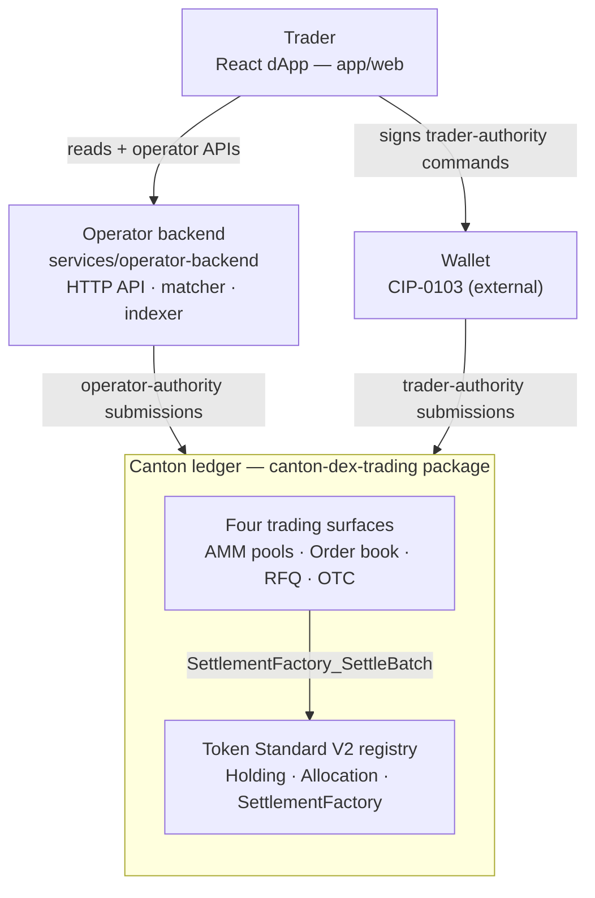

# Overview

This is your first stop. It says what Canton DEX is, shows the whole system on
one diagram, and points you at the doc that answers your next question.

## What Canton DEX is

Canton DEX is a runnable **Token Standard V2 (CIP-0112) reference exchange** for
the Canton Network. It offers four ways to trade — AMM pools, a prefunded order
book, request-for-quote, and bilateral OTC blocks — and every one of them moves
funds the same way: the holder locks a holding into a V2 **allocation**, and the
matched legs settle atomically as a delivery-versus-payment batch through a
registry's `SettlementFactory_SettleBatch`. There is no custom off-ledger balance
model and no house wallet; the DEX contracts own market logic, and the token
standard owns custody and settlement. The repo ships the Daml package, an
operator backend, a React dApp with a CIP-0103 wallet boundary, tests, and
runbooks, and runs end-to-end locally with no Canton participant.

## System at a glance

Two backends sit between the trader and the ledger, split by **who is allowed to
sign what**. The operator backend submits only operator-authority commands
(listing, matching, settling). Anything that moves a trader's assets is signed by
the trader's own wallet over CIP-0103. Both submit into one Daml package,
`canton-dex-trading`, whose trading surfaces settle through a Token Standard V2
registry.



- **dApp** (`app/web/`) — the trader-facing screens and the wallet-provider
  boundary (Mock, CIP-0103 SDK, WalletConnect, PartyLayer, and more).
- **Operator backend** (`services/operator-backend/`) — HTTP API, JSON Ledger
  API driver, the reference matcher, indexer, idempotency, and recovery. Ships an
  in-memory dev ledger so the stack runs without Canton.
- **`canton-dex-trading` package** (`trading/`) — the DEX templates, the LP-token
  component, and a reference V2 registry.
- **Registry** — external by contract. The reference ships one, but V2 does not
  require this exact registry; the DEX integrates against `InstrumentId` and
  registry-provided choice context, not a specific config template.

## The four trading surfaces

Each surface posts its own market object, but they converge on the same
allocate-then-settle-a-batch pattern:

| Surface | Market object → settlement | Price source |
|---|---|---|
| **AMM pool** | `Pool` / `PoolState` / `PoolSlice` → `PoolRules_Swap` | constant-product curve, computed on-ledger |
| **Order book** | `OrderFundingRequest` → `Order` → `OrderMatchExecution` | the trader's `limitPrice` |
| **RFQ** | `Rfq` / `RfqQuote` → `Rfq_Accept` → `MatchedTrade` | the dealer's quoted price |
| **OTC** | `MatchedTrade` → `MatchedTrade_Settle` | leg amounts both sides pre-agreed |

Settlement is **grouped by registry admin** and executed in one transaction, so a
trade either clears every leg or none. `MatchedTrade_Settle` shows the shape:

```daml
results <- forA (Map.toList batchesByAdmin) $ \(batchAdmin, batch) -> do
  ...
  result <- exercise batch.factoryCid V2.SettlementFactory_SettleBatch with
    settlement
    transferLegs = batchLegs
    allocations = batch.allocations
    actors = [venue]
    extraArgs = batch.extraArgs
  pure (batchAdmin, result)
```

## The authority boundary

The one idea to carry into every other doc: **the operator never moves a
trader's assets.** When a trader funds an order, adds liquidity, or authorizes a
swap, the dApp composes that command and the trader's **wallet** signs it over
CIP-0103. The operator orchestrates and settles only what it is authorized to
submit. That boundary is why funding and liquidity always route through a wallet,
and it is enforced by the token standard's own authorization rules, not by the
backend. [Architecture](architecture.md) draws the component boundaries;
[Workflows](workflows.md) shows how each flow choreographs them.

## How to read these docs

Read top to bottom for the design, or jump to the row that matches your question.

| Doc | What you'll learn |
|---|---|
| **Overview** (this page) | What the DEX is, the system shape, and the authority boundary. |
| [Architecture](architecture.md) | The layered system model, component boundaries, and the executor-authority constraint that keeps operator-held funds governed on-ledger. |
| [Workflows](workflows.md) | How each surface choreographs allocate-then-settle — the actors, contracts, and state transitions, workflow-first. |
| [Pricing](pricing.md) | Where every executable price comes from (pool curve, limit price, quote) and why there is no oracle. |
| [LP Tokens](lp-tokens.md) | Why each pool's LP share is a single, unversioned V2 instrument. |
| [Liquidity & Custody](liquidity-and-custody.md) | How the pool custodies reserves as committed slices and crosses the LP boundary via DvP. |
| [Glossary](glossary.md) | The vocabulary: allocation, commitment, iterated settlement, DvP, slice, registrar. |
| [Non-goals](non-goals.md) | What the reference leaves out on purpose, and why. |

> **This is a reference implementation, not an audited production exchange.** It
> is built for learning, evaluation, demos, and forks. Production adopters should
> do their own security review, operational hardening, compliance work, and
> version-compatibility checks.

Each claim above is exercised end-to-end by a Daml Script test against the
reference registry:

- **AMM pool** — [`testPoolSwapEndToEnd`](../../trading-tests/CantonDex/Tests/EndToEndTests.daml)
  drives a swap through `PoolRules_Swap` and the registry.
- **Order book** — [`testOrderFundingFlow`](../../trading-tests/CantonDex/Tests/EndToEndTests.daml)
  proves the trader-signed → operator-bound → trader-accepted funding path.
- **RFQ** — [`testRfqAcceptProducesMatchedTradeWithReceipt`](../../trading-tests/CantonDex/Tests/EndToEndTests.daml)
  shows an accepted quote yielding a `MatchedTrade` plus a `PolicyReceipt`.
- **OTC** — [`testMatchedTradeFullSettle`](../../trading-tests/CantonDex/Tests/EndToEndTests.daml)
  settles a matched trade as per-admin DvP batches in one transaction.

---

### Reference: standards and versioning

Canton DEX builds on three CIPs. **CIP-0056** is the base Canton Network Token
Standard (holdings, transfers, metadata). **CIP-0112** is Token Standard **V2**,
the privacy / performance / traditional-accounting revision that adds the
allocation and settlement surface — every asset here (base, quote, and the LP
token) is a V2 instrument. **CIP-0103** is the dApp standard the wallet boundary
uses for trader-authorized submissions.

Token Standard V2 is **merged into `canton-network/splice` `main`** and is the
network default. This repo vendors the V2 sources so builds are reproducible; the
exact commit is pinned in
[`../../vendor/splice/VENDOR_PIN.md`](../../vendor/splice/VENDOR_PIN.md), and the
[Allocation Surface](../reference/allocation-surface.md) reference records the
committed-allocation and iterated-settlement semantics the pool depends on.

**Where to read next:** [Getting Started](../getting-started.md) · [Architecture](architecture.md) · [Workflows](workflows.md) · [All docs](../README.md)
