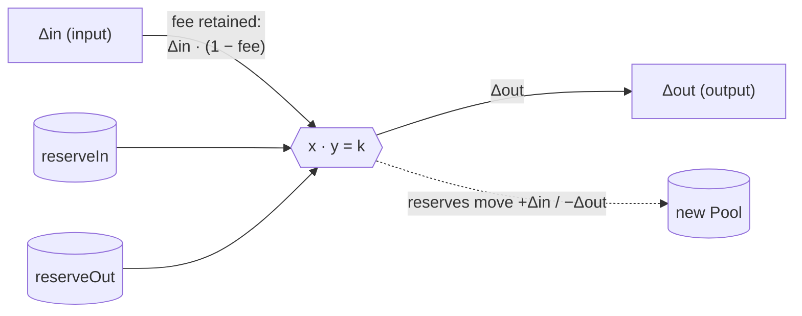

# Pricing and price sources

This DEX has no price oracle. Every price it can execute is set inside the
system, so no external feed can move funds on the ledger.

## The four price surfaces

A price here is always one of four things, and each is signed by whoever is
accountable for it:

| Surface | Price source | Signed by |
|---|---|---|
| AMM pool (`PoolRules_Swap`) | the constant-product curve over the pool's reserves | operator (reserve snapshot); trader (exact input and output sides after checking `minOutputAmount`) |
| Order book (`OrderFundingRequest`) | the trader's `limitPrice` | the trader |
| RFQ (`RfqQuote`) | the dealer's quoted `price`; the operator ranks quotes but never rewrites one | dealer (quote); trader + operator (accept) |
| OTC (`MatchedTrade`) | the leg amounts both sides pre-agreed | both authorizers |

Only the first is a price the *system* computes; the rest are prices someone
posted. The rest of this page covers the AMM.

## How the pool prices a swap

The pool is a constant-product AMM: it holds a reserve of each asset and prices
every swap off the invariant `x · y = k`. A swap pays `Δin` into one reserve and
takes the `Δout` from the other that keeps the product from decreasing; the
marginal price is the reserve ratio, and each trade moves that ratio against the
taker (price impact).

Two things about this implementation matter more than the curve itself:

- **The fee is retained in the pool.** It is charged on the input
  (`Δin · (1 − fee)` drives the curve) while the full `Δin` still lands in the
  reserve, so `k` is strictly non-decreasing across a swap. That surplus is what
  accrues to liquidity providers.
- **The trader signs the exact output authority.** `PoolRules_RequestSwap`
  computes `Δout`, binds the current `PoolState` and selected slices, and returns
  a specification containing both the trader's input sender side and every
  output receiver side. The dApp verifies the binding and minimum, then the
  wallet signs the exact legs. `PoolRules_Swap` re-derives `Δout` on-ledger and
  accepts the allocation only if the snapshot and exact legs still match, so
  the operator cannot quote one number and settle another. The dApp's quote
  endpoint runs the same function off-ledger, so preview and settlement agree
  to the last digit.

The computation is one helper,
[`constantProductOut`](../../trading/CantonDex/Dex/PoolModel.daml):

```daml
constantProductOut reserveIn reserveOut feeBps inputAmount =
  let amountInAfterFee =
        floorDiv (floorMul inputAmount (intToDecimal (10000 - feeBps))) 10000.0
  in floorDiv (floorMul amountInAfterFee reserveOut) (reserveIn + amountInAfterFee)
```



**Rounding is one-directional.** `floorMul` and `floorDiv` round `Δout` down, so
the pool never pays more than the exact amount and `k` stays non-decreasing even
after scale-10 `Decimal` rounding. Verified in
[`PoolRoundingTests.daml`](../../trading-tests/CantonDex/Tests/PoolRoundingTests.daml)
(a swap never overpays; `k` never decreases) and
[`PoolStateInvariantTests.daml`](../../trading-tests/CantonDex/Tests/PoolStateInvariantTests.daml)
(reserves stay consistent across a swap).

## Practical consequences

- Pool prices track reserves. A thin or stale pool quotes a stale price, and
  only arbitrage pulls it back; there is no oracle "fair value" guard.
- Order and RFQ prices are whatever was posted. For RFQ, the
  [`PolicyReceipt`](../../trading/CantonDex/Dex/PolicyReceipt.daml) records which
  quote won under which policy version — evidence the ranking was applied
  honestly, not that the price was good.

## Fiat estimates in the dApp

The dollar figures next to balances are advisory: pool mid-price, falling back
to a static feed and then to "—", served from `/v1/prices`. Display only; never
an input to settlement.

---

### Reference: where an oracle would attach

Pricing is endogenous by design, so a compromised feed cannot move funds. If a
later version added an oracle, the attachment points would be a slippage band on
`PoolRules_Swap` (a signed price + timestamp from a separate `oracleAuthority`), a
`PoolPriceObservation` template for TWAP reporting, or an edge-side price API for
fiat display. None are implemented.

**Where to read next:** [Architecture](architecture.md) · [Workflows](workflows.md) · [Registry integration](../guides/registry-integration.md)
