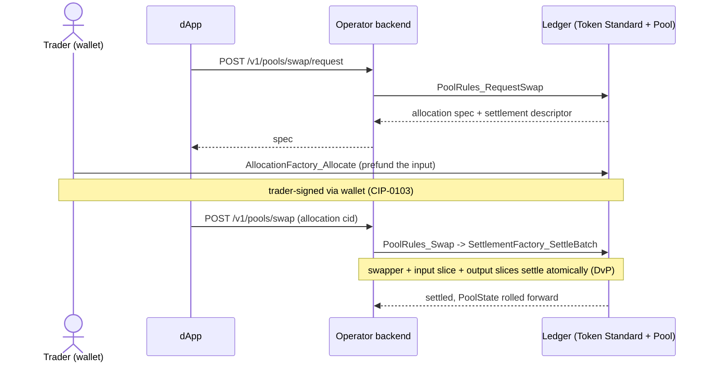
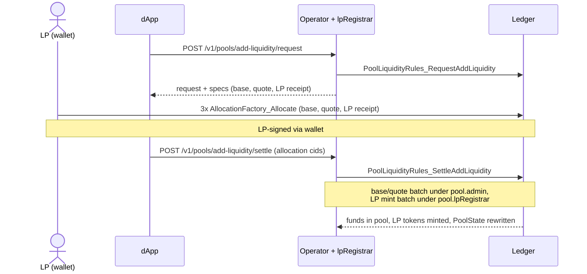
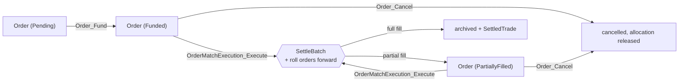
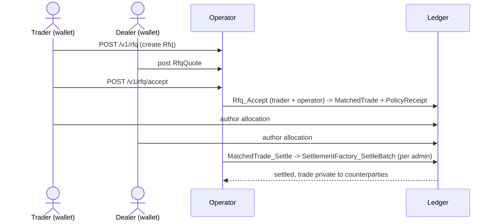

# Canton DEX workflow design

Every settling workflow in this DEX is one app choice that builds the transfer
legs and calls a single Token Standard settlement. The app contracts own market
structure; the Token Standard owns the funds; the registry owns what an
instrument means. The hard part was never Uniswap parity — it was getting those
Daml workflows right.

## Two workflow families

Every flow settles through the same primitive — `SettlementFactory_SettleBatch`
over Token Standard allocations — but they split into two families that keep
different application state and cancellation rules.

- **Bilateral settlement** — OTC and RFQ block trades. A `MatchedTrade` names
  two pre-agreed legs; each side authors a one-shot allocation; the operator
  batches them by registry admin and settles.
- **Pool and prefunded orders** — swaps, add/remove liquidity, and resting
  orders. Funds sit under *committed*, *iterated* allocations that the settle
  rolls forward via `FinalizedAllocation.nextIterationFunding`, so the same
  reserve or order can settle repeatedly without re-authoring.

The rest of this page walks the four workflows that carry the design: swap,
add/remove liquidity, the order lifecycle, and RFQ. Secondary flows (pair
listing, pool creation, asset lifecycle) and the design principles are in
[Reference](#reference).

## Actors and core contracts

| Actor | Role |
|---|---|
| `Trader` / `LiquidityProvider` | authors allocations from their own wallet over CIP-0103 |
| `DexOperator` | drives the settling choices; also acts as `Matcher` and `PoolOperator` in a reference deployment |
| `Registrar` / `lpRegistrar` | signs mint/burn of the LP instrument |

The market objects (`DexPair`, `Order`, `MatchedTrade`, `Rfq`, `RfqQuote`) stay
separate from the pool-accounting objects (`Pool`, `PoolState`, `PoolSlice`) and
the LP-token policy (`LPTokenPolicy`). This is a template boundary, not a custom
Daml-interface boundary: the DAR implements upstream Token Standard V2
interfaces but defines no app-facing interface of its own.

## The settlement shape every workflow shares

Two mechanics recur below and are worth stating once, because they are the
non-obvious part:

- **Prefunded, iterated allocations.** A pool reserve slice and a resting order
  are authored with `nextIterationFunding = Some ...` and no transfer legs. The
  settling choice supplies the real legs as `extraTransferLegSides` on a
  `FinalizedAllocation`, and the registry rolls the residual budget into a fresh
  allocation the choice binds back onto the slice or order. A one-shot
  allocation (`nextIterationFunding = None`) could not do this.
- **Per-admin batches.** Legs are grouped by the registry `admin` that governs
  the instrument. Liquidity settles as *split-admin* DvP: base and quote under
  `pool.admin`, the LP mint/burn under `pool.lpRegistrar` — two
  `SettleBatch`es in one transaction, each carrying its own registry choice
  context.

## Swap against a pool

**Intent:** a trader swaps one pool asset for the other at the constant-product
price, atomically against the pool's reserves.



`PoolRules_Swap` prices `amountOut` from the current reserves *inside the
choice* (`constantProductOut`, see [Pricing](pricing.md)), enforces the taker's
`minOutputAmount` floor, then settles the swapper against the pool in one batch.
The input reserve slice rolls forward grown by the full input; the output side
is drained from an ordered slice prefix so a routine swap never touches every
reserve slice.

```daml
let swapperFinalized = Utils.mkFinalizedAllocation swapperAllocationCid
      (Utils.legsToSides swapperAccount (swapInLeg :: outDel.legs)) None
    inputFinalized = Utils.mkFinalizedAllocation inputSlice.allocationCid
      (Utils.legsToSides poolAccount [swapInLeg])
      (Some (TextMap.fromList [(inputInstrumentId, inputSlice.amount + inputAmount)]))

settleResult <- exercise factoryCid V2.SettlementFactory_SettleBatch with
  settlement
  transferLegs = swapInLeg :: outDel.legs
  allocations = swapperFinalized :: inputFinalized :: outDel.sliceFinalizeds
  actors = [operator]
  extraArgs
```

Proven in
[`EndToEndTests.daml`](../../trading-tests/CantonDex/Tests/EndToEndTests.daml) —
`testPoolSwapEndToEnd` (reserves move, the consumed input slice is replaced by
its next-iteration slice, sibling slices stay untouched) and
`testPoolSwapViaRequestSwap` (the spec `PoolRules_RequestSwap` emits settles
end to end).

## Add and remove liquidity

**Intent:** fund the pool and mint LP shares, or burn LP shares and return the
provider's proportional reserves — each in one atomic settlement.



`PoolLiquidityRules_SettleAddLiquidity` runs the split-admin DvP: the LP's
committed deposits and LP-mint receipt settle together, the operator's receiver
allocations roll forward into the two new `PoolSlice`s, and the registrar mints
LP tokens to the provider. Only the ratio-matched part of an off-ratio deposit
enters the reserves; the excess is refunded in the same batch, so it never buys
LP tokens.

```daml
-- base/quote batch (pool.admin): deposits in, operator receivers roll
-- forward with nextIterationFunding on the finalized step.
bqResult <- exercise baseQuoteSettleCid V2.SettlementFactory_SettleBatch with
  settlement
  transferLegs = [baseDepositLeg, quoteDepositLeg] ++ baseRefundLegs ++ quoteRefundLegs
  allocations = ...
  actors = [operator]
  extraArgs = poolAdminExtraArgs
...
-- LP-mint batch (pool.lpRegistrar).
_ <- exercise lpSettleCid V2.SettlementFactory_SettleBatch with
  settlement
  transferLegs = [lpMintLeg]
  allocations = [Utils.finalAllocation regMint, Utils.finalAllocation lpReceiptCid]
  actors = [operator]
  extraArgs = lpRegistrarExtraArgs
```

Remove is the mirror: `PoolLiquidityRules_SettleRemoveLiquidity` draws the
pro-rata payout across an ordered slice prefix (full slices drain, only the
boundary slice is re-wrapped for its leftover), delivers base and quote to the
holder, and burns the LP tokens under `pool.lpRegistrar`.

Proven in
[`PoolLiquidityRulesTests.daml`](../../trading-tests/CantonDex/Tests/PoolLiquidityRulesTests.daml) —
`testDvpAddLiquidity` (LP funds base+quote and receives real LP holdings in one
flow), `testDvpAddOffRatioRefundsExcess` (the unmatched leg is refunded, not
donated), `testDvpRemoveDeliversToHolder` (base+quote go to the holder, LP burns),
and `testDvpMultiSliceRemove` (a redemption draws across multiple slices).

## Order lifecycle

**Intent:** rest a prefunded bid or ask, then convert two crossing orders into
one settled trade without either side trusting the matcher.



A resting order is an authorization for a future match whose exact legs are not
yet known — a prefunded, iterated allocation, not a one-shot one.
`OrderMatchExecution_Execute` fetches both orders and refuses any fill their own
terms do not permit, so a buggy or malicious matcher cannot cross a resting
order outside its limit price or for instruments it never agreed to.

```daml
assertMsg "fill price must be positive" (match.fillPrice > 0.0)
assertMsg "fill price above bid limit"
  (match.fillPrice <= buyOrder.limitPrice)
assertMsg "fill price below ask limit"
  (match.fillPrice >= sellOrder.limitPrice)
```

The same transaction settles the batch and rolls both orders forward: a fully
filled order is archived, a partial fill is recreated bound to the allocation
the settle minted, and a `SettledTrade` records the fill. Doing this in one
choice is load-bearing — the settle archives the allocations the orders point
at, so an order left behind by a two-step flow would be uncancellable and
unfillable. `Order_Cancel` is the single operator-controlled path for
trader-requested cancels and post-expiry cleanup.

Proven in
[`EndToEndTests.daml`](../../trading-tests/CantonDex/Tests/EndToEndTests.daml) —
`testOrderMatchEnforcesLimitPrice` (a fill outside `[ask, bid]` is rejected) and
`testOrderMatchRollsOrdersForwardAtomically` (both orders roll onto the minted
allocations and the trade is recorded, in one transaction).

## RFQ and OTC block trades

**Intent:** let a trader request quotes from a whitelisted dealer set, accept
one, and settle the bilateral trade — with an audit trail of how the quote was
ranked.



`Rfq_Accept` is jointly controlled by `trader, operator`: the trader consumes
the `Rfq` and every quote, the operator signs the resulting `MatchedTrade`. It
ranks the considered quotes, records the winner and its rank in a
[`PolicyReceipt`](../../trading/CantonDex/Dex/PolicyReceipt.daml) (evidence the
published policy was applied, not that the price was good), and copies the RFQ's
`expiresAt` onto the trade's `settlementDeadline`.

```daml
tradeCid <- create MT.MatchedTrade with
  venue = operator
  admin
  transferLegs = legs
  settlementDeadline = Some expiresAt
  policyReceipt = Some receipt
```

That deadline coupling is a real hazard: `Allocation_Settle` aborts once the
deadline passes, and because `Rfq_Accept` is consuming there is nothing left to
retry with, so an RFQ that expires between accept and settle strands both
sides' funds until someone cancels — which is why the backend clamps a
requested expiry to a floor.

Proven in
[`RfqSettlementTests.daml`](../../trading-tests/CantonDex/Tests/RfqSettlementTests.daml),
which runs against real `Registry.V2` holdings —
`testRfqBuySettlesAgainstRealHoldings` (balances and the rank-1 receipt are
exactly as expected, no locks stranded) and
`testExpiryBetweenAcceptAndSettleBlocksTheSettle` (past the inherited deadline
the settle fails and the funds stay locked).

---

## Reference

### Secondary workflows

- **Pair listing.** `DexOperator` creates a `DexPair` recording the base/quote
  `InstrumentId`s, fee model, and trading mode (RFQ, order book, or pool). There
  is no separate `DexRules` admission contract yet; a production fork can add one
  if listing needs multi-party approval.
- **Pool creation.** `DexOperator` creates a `Pool` for a `DexPair` and the LP
  instrument definition (an `InstrumentConfiguration` in the reference
  registry). The pool starts `Unfunded` with a constant-product invariant until
  the first add-liquidity settles.
- **Direct creation.** `DexPair`, `Pool`, and `PoolState` are all directly
  operator-created; no rules contract mediates their creation.
- **Asset lifecycle.** Token Standard V2 does not standardize coupon, maturity,
  or exercise transitions. The DEX only responds to registry-published tradable
  instrument versions; it never calculates lifecycle events itself.

### Design principles

1. One workflow, one business object — orders, trades, pools, and LP issuance
   each get their own app contract.
2. Allocations represent funds, not abstract approvals.
3. Settlement is explicit — the app creates matched trade/swap state before
   calling settlement.
4. Cancellation is a first-class workflow, with no hidden cleanup.
5. Registry lifecycle stays outside market logic — the DEX trades
   `InstrumentId`; the registry explains what it means through V2 views.
6. Executor-controlled funds are usage-constrained on-ledger. Because the
   executor can drive iterated settlement on committed pool allocations, the
   `Pool`/`PoolSlice` state must fully determine which reserve slice is
   consumed, the permitted legs, and the resulting reserve update. Off-ledger
   services choose *when* to settle, never *what* the funds may be used for.
7. Keep hot-path transactions shard-local — an ordinary swap or redemption
   touches only the slices it draws from, with consolidation as an explicit
   maintenance path. `PoolRules_ReconcileState` is the off-hot-path audit anchor
   that asserts the per-side slice sums equal the recorded reserves.

### Implemented scope

Covered: pair listing; OTC/RFQ settlement; constant-product pools; add and
remove liquidity; single-hop swaps with slippage bounds; LP token issuance;
cancellation, expiry, and operator observability.

Deferred: concentrated liquidity and ticks; multi-hop routing; permissionless
pool creation; NFT-style LP positions; advanced oracle/TWAP surfaces. These are
later features, not requirements for validating the Canton-native design.

### Contract boundary

The shared boundary between the market objects and the pool/LP objects is the
Token Standard allocation-and-settlement surface, not a custom internal escrow
system. The reference stops at that boundary: it introduces no custom Daml
interfaces and no separate `DexRules` governance contract.

---

**Where to read next:** [Architecture](architecture.md) · [Pricing](pricing.md) · [Builder Guide](../guides/builder-guide.md) · [Allocation Surface](../reference/allocation-surface.md) · [All docs](../README.md)
