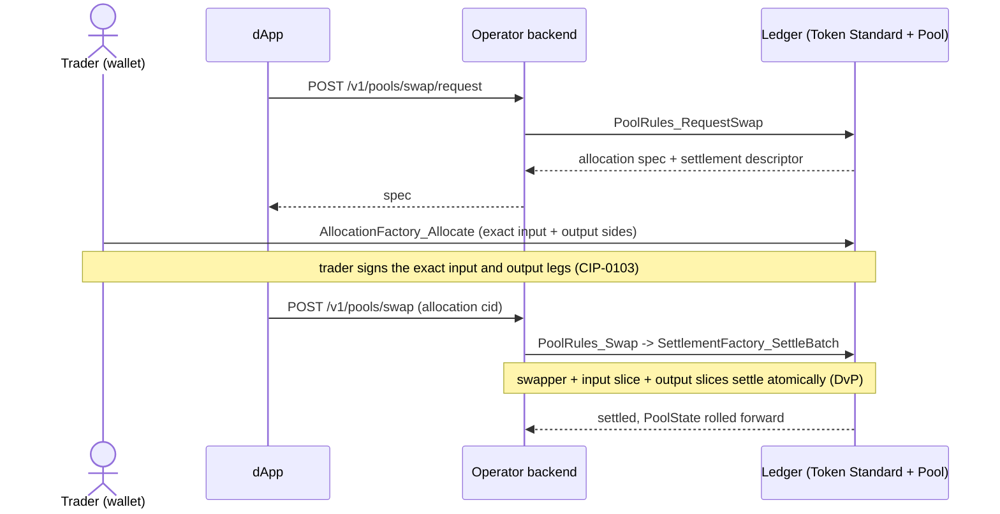
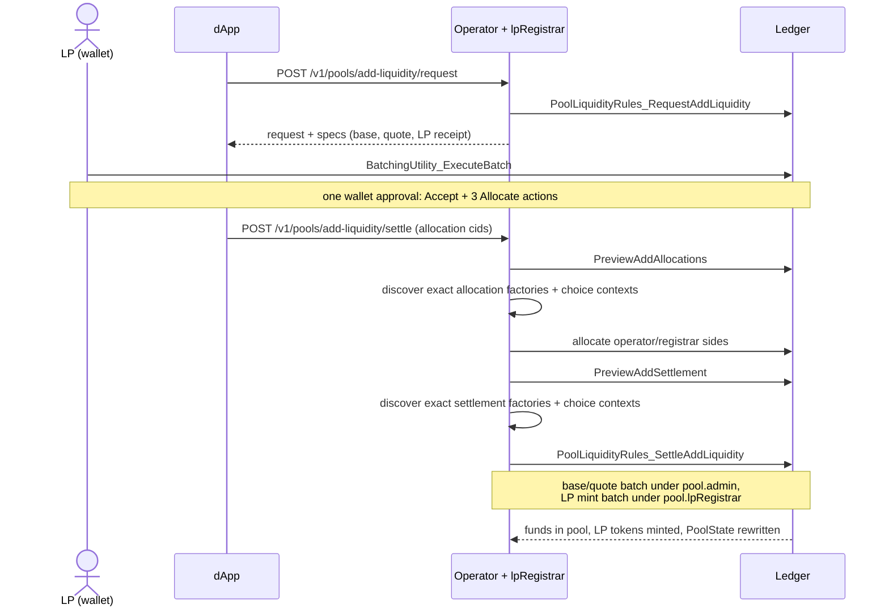
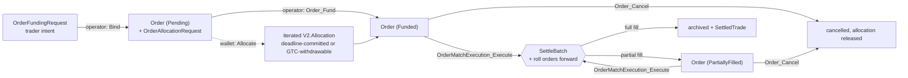
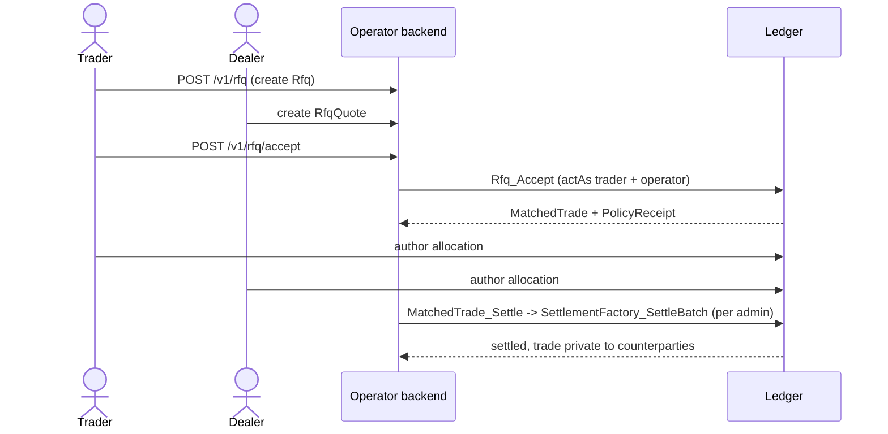
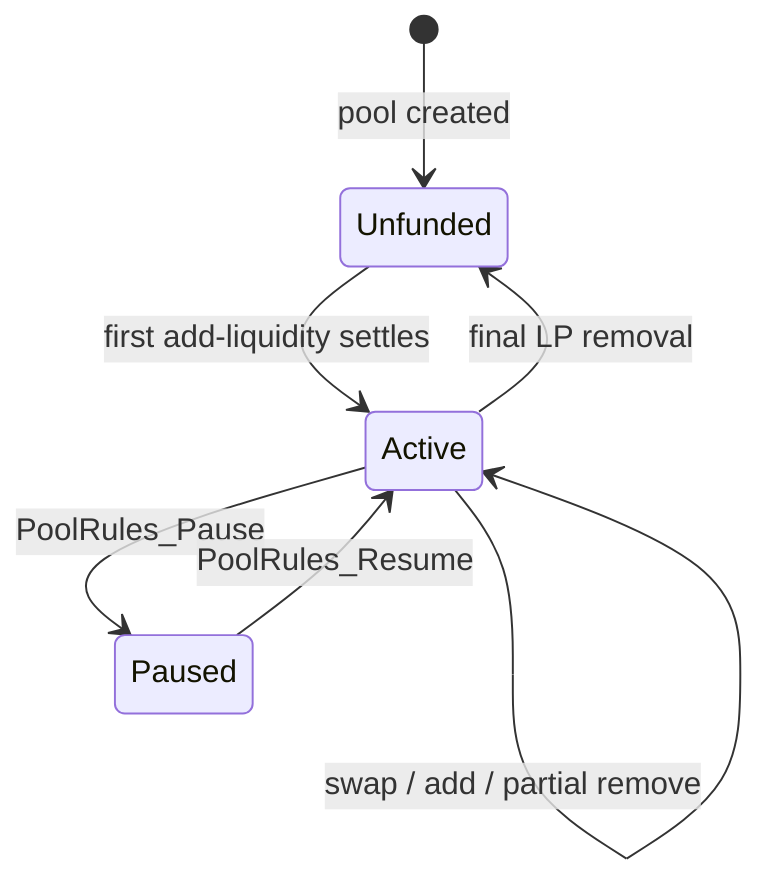

# Canton DEX workflow design

This is Step 7 of the
[canonical newcomer learning path](../README.md#canonical-newcomer-learning-path).
Complete [Architecture](architecture.md) first.

Each state transition has a named app choice. A value-moving choice validates
the business rules, then asks Token Standard V2 to settle. Different registry
admins may require more than one `SettlementFactory_SettleBatch`, but all
batches remain atomic inside one Daml transaction. App contracts own market
state; the registry owns holdings and settlement.

## The common workflow in five steps

Ignore the contract names for a moment. Every value-moving flow follows the
same sequence:

1. **Describe intent.** A trader, dealer, or liquidity provider states the
   proposed action; a pool already carries its standing swap terms in state.
2. **Fix the terms.** The pool curve, order limits, dealer quote, or bilateral
   agreement determines the transfer legs and settlement identity.
3. **Reserve value.** Each holder's wallet locks the required holdings in a V2
   allocation whose terms match that settlement.
4. **Validate.** A named DEX choice checks current state, authority, price,
   quantity, expiry, and allocation identity.
5. **Settle and record.** The registry moves all legs atomically; the same Daml
   transaction closes or recreates the affected market state.

The backend may discover contracts, calculate candidates, and submit commands,
but it cannot bypass the checks in steps 3 and 4.

## Two workflow families

Every flow settles through the same primitive — `SettlementFactory_SettleBatch`
over Token Standard allocations — but they split into two families that keep
different application state and cancellation rules.

- **Bilateral settlement** — OTC and RFQ block trades. A `MatchedTrade` names
  two pre-agreed legs; each side authors a one-shot allocation; the operator
  batches them by registry admin and settles.
- **Long-lived pool and order inventory** — pool slices and resting orders use
  iterated allocations so their remaining funding can roll forward without
  re-authoring. Pool slices are committed; expiring orders commit through their
  deadline; GTC orders remain trader-withdrawable. A trader's swap is a
  separate terminal allocation consumed by that swap.

The rest of this page walks the four workflows that carry the design: swap,
add/remove liquidity, the order lifecycle, and RFQ. Secondary flows (pair
listing, pool creation, asset lifecycle) and the design principles are in
[Reference](#reference).

## Active workflow map

This table is the shortest route from a user action to the choices worth reading.
Retired package-lineage choices are deliberately omitted because no active flow
may exercise them.

| User action | Intent / request | Holder-authorized step | Validating terminal choice | Result |
|---|---|---|---|---|
| Swap | `PoolRules_RequestSwap` | `AllocationFactory_Allocate` | `PoolRules_Swap` | holdings move; `PoolState` and touched slices roll forward |
| Add liquidity | `PoolLiquidityRules_RequestAddLiquidity` | accept request and allocate deposits/receipt | `PoolLiquidityRules_SettleAddLiquidity` | reserves increase and LP holdings are minted |
| Remove liquidity | `PoolLiquidityRules_RequestRemoveLiquidity` | accept request and allocate payout/burn legs | `PoolLiquidityRules_SettleRemoveLiquidity` | reserves decrease, assets return, and LP holdings burn |
| Place order | `OrderFundingRequest_Bind` | `AllocationFactory_Allocate` | `Order_Fund` | pending order becomes funded |
| Match orders | funded buy + sell orders | already prefunded | `OrderMatchExecution_Execute` | atomic fill; each remainder rolls forward |
| Cancel order | funded or partially filled order | already prefunded | `Order_Cancel` | order closes and remaining funding unlocks |
| Accept RFQ | `Rfq` + `RfqQuote` | `Rfq_Accept` under the operator-mediated authority model | `Rfq_Accept` | `MatchedTrade` and policy receipt are created; no value moves yet |
| Settle RFQ / OTC | `MatchedTrade` allocation requests | each counterparty authors its allocation | `MatchedTrade_Settle` | bilateral legs settle atomically |

## Actors and core contracts

| Actor | Role |
|---|---|
| `Trader` / `LiquidityProvider` | authors allocations from their own wallet over CIP-0103 |
| `DexOperator` | drives the settling choices; also acts as `Matcher` and `PoolOperator` in a reference deployment |
| `Registrar` / `lpRegistrar` | signs mint/burn of the LP instrument |

The market objects (`DexPair`, `Order`, `MatchedTrade`, `Rfq`, `RfqQuote`) stay
separate from the pool-accounting objects (`Pool`, `PoolState`, `PoolSlice`) and
the LP-token policy (`LPTokenPolicy`). This is a template boundary, not a custom
Daml-interface boundary: the DAR implements upstream Token Standard V2
interfaces but defines no app-facing interface of its own.

`DexPair.active` and `DexPair.tradingMode` are listing metadata for off-ledger
discovery and routing. They are deliberately absent from the value-moving table
above: neither `PoolRules` nor `OrderMatchExecution` fetches a pair contract, so
changing those fields does not itself block a direct Daml settlement. Bind and
validate `DexPair` in terminal choices if a fork needs an on-ledger market gate.

## The settlement shape every workflow shares

Two mechanics recur below and are worth stating once, because they are the
non-obvious part:

- **Prefunded, iterated allocations.** A pool reserve slice and a resting order
  are authored with `nextIterationFunding = Some ...` and no transfer legs. The
  settling choice supplies the real legs as `extraTransferLegSides` on a
  `FinalizedAllocation`, and the registry rolls the residual budget into a fresh
  allocation the choice binds back onto the slice or order. A one-shot
  allocation (`nextIterationFunding = None`) could not do this. Commitment is a
  separate decision: it guarantees executor availability but restricts the
  authorizer's withdrawal right.
- **Per-admin batches.** Legs are grouped by the registry `admin` that governs
  the instrument. Liquidity settles as *split-admin* DvP: base and quote under
  `pool.admin`, the LP mint/burn under `pool.lpRegistrar` — two
  `SettleBatch`es in one transaction, each carrying its own registry choice
  context.

## Swap against a pool

**Intent:** a trader swaps one pool asset for the other at the constant-product
price, atomically against the pool's reserves.



`PoolRules_RequestSwap` binds the current `PoolState`, selected input/output
slices, and `minOutputAmount`, then emits an allocation specification containing
the exact input sender side and every output receiver side. The wallet signs
that complete specification. `PoolRules_Swap` re-derives `amountOut` from the
bound reserves *inside the choice* (`constantProductOut`, see
[Pricing](pricing.md)), requires the signed legs to match, and settles the
swapper against the pool in one batch. The operator cannot lower the output or
use a different pool snapshot if doing so changes the signed legs.
The input reserve slice rolls forward grown by the full input; the output side
is drained from an ordered slice prefix so a routine swap never touches every
reserve slice.

```daml
let swapperFinalized = Utils.finalAllocation swapperAllocationCid
    inputFinalized = Utils.mkFinalizedAllocation inputSlice.allocationCid
      (Utils.legsToSides poolAccount [swapInLeg])
      (Some (TextMap.fromList [(inputInstrumentId, inputSlice.amount + inputAmount)]))

settleResult <- exercise factoryCid V2.SettlementFactory_SettleBatch with
  settlement
  transferLegs = swapInLeg :: outDel.legs
  allocations = swapperFinalized :: inputFinalized :: outDel.sliceFinalizeds
  actors = [operator]
  extraArgs
```

For the focused choreography and real-holding checks behind this section, see
[Daml proof map — AMM pool](../reference/daml-proof-map.md#amm-pool).

## Add and remove liquidity

**Intent:** fund the pool and mint LP shares, or burn LP shares and return the
provider's proportional reserves — each in one atomic settlement.



The previews are read-only Daml choices. They return the exact canonical V2
choice arguments, which the backend sends to each registry's operation-specific
off-ledger discovery endpoint before exercising the real allocate or settle
choice. This avoids guessing a factory contract or reusing context from a
different operation.

`PoolLiquidityRules_SettleAddLiquidity` then runs the split-admin DvP: the LP's
committed deposits and LP-mint receipt settle together, the operator's receiver
allocations roll forward into the two new `PoolSlice`s, and the registrar mints
LP tokens to the provider. Only the ratio-matched part of an off-ratio deposit
enters the reserves; the excess is refunded in the same batch, so it never buys
LP tokens.

```daml
-- base/quote batch (pool.admin): deposits in and reserve allocations continue
-- with the funding declared by their allocation specifications.
bqResult <- exercise baseQuoteSettleCid V2.SettlementFactory_SettleBatch with
  settlement
  transferLegs = [baseDepositLeg, quoteDepositLeg] ++ baseRefundLegs ++ quoteRefundLegs
  allocations = ...
  actors = [operator]
  extraArgs = poolAdminExtraArgs
...
-- LP-mint batch (pool.lpRegistrar).
_ <- exercise lpSettleCid V2.SettlementFactory_SettleBatch with
  settlement
  transferLegs = [lpMintLeg]
  allocations = [Utils.finalAllocation regMint, Utils.finalAllocation lpReceiptCid]
  actors = [operator]
  extraArgs = lpRegistrarExtraArgs
```

Remove is the mirror: `PoolLiquidityRules_SettleRemoveLiquidity` draws the
pro-rata payout across an ordered slice prefix (full slices drain, only the
boundary slice is re-wrapped for its leftover), delivers base and quote to the
holder, and burns the LP tokens under `pool.lpRegistrar`.

Pool reserve allocations are committed without a settlement deadline, so the
LP has no unilateral exit if the operator or registrar becomes unavailable.
See [Availability and the LP exit boundary](liquidity-and-custody.md#availability-and-the-lp-exit-boundary)
and [LP redemption has an explicit liveness dependency](non-goals.md#lp-redemption-has-an-explicit-liveness-dependency).

The add, refund, remove, and full-redemption proofs are cataloged in
[Daml proof map — AMM pool](../reference/daml-proof-map.md#amm-pool).

## Order lifecycle

**Intent:** rest a prefunded bid or ask, then convert two crossing orders into
one settled trade without either side trusting the matcher.



The funding request and the allocation request serve different purposes:

1. The trader creates `OrderFundingRequest` to state side, pair, price,
   quantity, and expiry. It contains no locked funds.
2. The operator exercises `OrderFundingRequest_Bind`, creating the pending
   `Order` and an `OrderAllocationRequest` with the exact funding specification.
3. The wallet reads that specification and calls `AllocationFactory_Allocate`
   under the trader's authority. In the current order flow it does not exercise
   `AllocationRequest_Accept` as a separate command.
4. `Order_Fund` validates the allocation, consumes the pending order and its
   allocation request, and creates the funded successor.
5. Matching or cancellation can now consume the allocation. A pending order is
   deliberately neither matchable nor cancellable as a funded position.

A resting order is an authorization for a future match whose exact legs are not
yet known — a prefunded, iterated allocation, not a one-shot one.
`OrderMatchExecution_Execute` fetches both orders and refuses any fill their own
terms do not permit, so a buggy or malicious matcher cannot cross a resting
order outside its limit price or for instruments it never agreed to.

```daml
assertMsg "fill price must be positive" (match.fillPrice > 0.0)
assertMsg "fill price above bid limit"
  (match.fillPrice <= buyOrder.limitPrice)
assertMsg "fill price below ask limit"
  (match.fillPrice >= sellOrder.limitPrice)
```

The same transaction settles the batch and rolls both orders forward: a fully
filled order is archived, a partial fill is recreated bound to the allocation
the settle minted, and a `SettledTrade` records the fill. Doing this in one
choice is load-bearing — the settle archives the allocations the orders point
at, so an order left behind by a two-step flow would be uncancellable and
unfillable. `Order_Cancel` is the single operator-controlled path for
trader-requested cancels and post-expiry cleanup.

Custody does not depend on that operator path. An expiring order is committed
only until its deadline and is then withdrawable by the trader through
`Allocation_Withdraw`. A GTC order has no deadline, so its allocation is
uncommitted and trader-withdrawable at any time. Withdrawing leaves an
operator-signed `Order` record that may remain visible, but the missing
allocation makes settlement fail atomically; no funds remain locked.

The operator still controls which visible crossing orders are matched and when
the resulting transactions are submitted. The choice checks limits, quantities,
expiry, instruments, and backing, but cannot prove fair intake ordering or stop
censorship and private reordering among valid fills. This distinction is
documented as [Fair ordering and private MEV](non-goals.md#fair-ordering-and-private-mev).

For the limit, roll-forward, backing, and cancellation proofs, see
[Daml proof map — Resting orders](../reference/daml-proof-map.md#resting-orders).

## RFQ and OTC block trades

**Intent:** let a trader request quotes from a whitelisted dealer set, accept
one, and settle the bilateral trade — with an audit trail of how the quote was
ranked.



`Rfq_Accept` is jointly controlled by `trader, operator`: the trader consumes
the `Rfq` and every quote, the operator signs the resulting `MatchedTrade`. It
ranks the considered quotes, records the winner and its rank in a
[`PolicyReceipt`](../../trading/CantonDex/Dex/PolicyReceipt.daml) (evidence the
published policy was applied, not that the price was good), and copies the RFQ's
`expiresAt` onto the trade's `settlementDeadline`.

`RfqQuote.tier` is dealer-declared in this reference. The operator observes the
quote and endorses the considered set by co-authorizing `Rfq_Accept`; there is no
separate on-ledger tier-administration contract. Policy v2.0 ranks tier, later
expiry, earlier posting time, then dealer party id; price is deliberately not a
ranking key, and the trader still chooses which considered quote to accept.

The included RFQ page covers creation, quote review, and acceptance through
operator-mediated API routes: the backend ledger user must have act-as rights
for the trader (and dealer when it authors quotes), while
accept also needs operator authority. This is distinct from the wallet-authored
allocation flow used by pools and orders. A self-custodial deployment must
replace that example with a wallet, delegation, or co-submission mechanism that
supplies the same controllers. The repository does not provision a public RFQ
relay or party-onboarding service.

The page's **Accepted** tab means that `Rfq_Accept` created the `MatchedTrade`;
it does not mean balances moved. The following allocation requests and
`MatchedTrade_Settle` are available through the Daml and operator-service flow
and are covered by the settlement tests, but the RFQ page does not drive
those later steps.

```daml
tradeCid <- create MT.MatchedTrade with
  venue = operator
  admin
  transferLegs = legs
  settlementDeadline = Some expiresAt
  policyReceipt = Some receipt
```

The RFQ expiry becomes the trade settlement deadline. Allocations created for
that trade cannot settle after the deadline; their owners must cancel or
withdraw them to release the locked holdings. Integrators therefore need to
leave enough time between acceptance, wallet funding, and settlement.

For receipt, real-holding, deadline, and cancellation proofs, see
[Daml proof map — RFQ and OTC](../reference/daml-proof-map.md#rfq-and-otc).

### Explicit exits and recovery choices

Failure and abandonment are explicit choices, not hidden background cleanup.
The [resting-order](../reference/daml-proof-map.md#resting-orders) and
[RFQ/OTC](../reference/daml-proof-map.md#rfq-and-otc) proof tables identify the
controller and resulting contract/fund-state checks for each exit.

## Pool lifecycle

A pool starts empty, becomes tradable once funded, and can be paused for an
emergency stop:



The mock lifecycle, real first-funding, and complete-redemption checks are in
[Daml proof map — AMM pool](../reference/daml-proof-map.md#amm-pool).

---

## Reference

### Secondary workflows

- **Pair listing.** `DexOperator` creates a `DexPair` recording the base/quote
  `InstrumentId`s, fee model, and mode (`TM_OrderBook`, `TM_Pool`, or `TM_Both`).
  `active` and `tradingMode` guide off-ledger listing/routing only; they are not
  fetched by the active settlement choices. There is no separate `DexRules`
  admission contract yet; a production fork can add one if listing needs
  multi-party approval. Source and focused checks are in
  [Daml proof map — Pair listing metadata](../reference/daml-proof-map.md#pair-listing-metadata).
- **Pool creation.** `DexOperator` creates a `Pool` for a `DexPair` and the LP
  instrument definition (an `InstrumentConfig` in the reference
  registry). The pool starts `Unfunded` with a constant-product invariant until
  the first add-liquidity settles.
- **Direct creation.** `DexPair`, `Pool`, and `PoolState` are all directly
  operator-created; no rules contract mediates their creation.
- **Asset lifecycle.** Token Standard V2 does not standardize coupon, maturity,
  or exercise transitions. The DEX only responds to registry-published tradable
  instrument versions; it never calculates lifecycle events itself.

### Design principles

1. One workflow, one business object — orders, trades, pools, and LP issuance
   each get their own app contract.
2. Allocations represent funds, not abstract approvals.
3. Settlement is explicit — the app creates matched trade/swap state before
   calling settlement.
4. Cancellation is a first-class workflow, with no hidden cleanup.
5. Registry lifecycle stays outside market logic — the DEX trades
   `InstrumentId`; the registry explains what it means through V2 views.
6. Executor-controlled funds are usage-constrained on-ledger. Because the
   executor can drive iterated settlement on committed pool allocations, the
   `Pool`/`PoolSlice` state must fully determine which reserve slice is
   consumed, the permitted legs, and the resulting reserve update. Off-ledger
   services choose *when* to settle, never *what* the funds may be used for.
7. Keep hot-path transactions shard-local — an ordinary swap or redemption
   touches only the slices it draws from, with consolidation as an explicit
   maintenance path. `PoolRules_ReconcileState` is the off-hot-path audit anchor
   that asserts the per-side slice sums equal the recorded reserves.

### Implemented scope

Covered: pair listing; OTC/RFQ settlement; constant-product pools; add and
remove liquidity; single-hop swaps with slippage bounds; LP token issuance;
cancellation, expiry, and operator observability.

Deferred: concentrated liquidity and ticks; multi-hop routing; permissionless
pool creation; NFT-style LP positions; advanced oracle/TWAP surfaces. These are
later features, not requirements for validating the Canton-native design.

### Contract boundary

The shared boundary between the market objects and the pool/LP objects is the
Token Standard allocation-and-settlement surface, not a custom internal escrow
system. The reference stops at that boundary: it introduces no custom Daml
interfaces and no separate `DexRules` governance contract.

---

**Next canonical step:** [Make your first AMM code change](../tutorials/make-your-first-amm-change.md).
Use [Liquidity and custody](liquidity-and-custody.md),
[Pricing](pricing.md), [Non-goals](non-goals.md), and the
[Allocation Surface](../reference/allocation-surface.md) as topic references.
