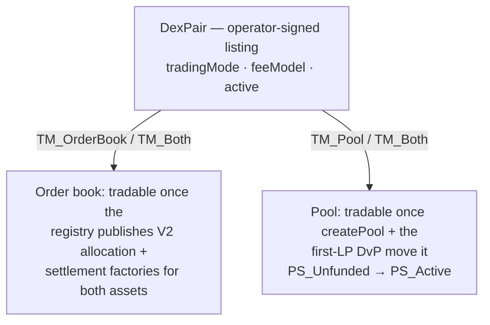

# Adding a new trading pair

Listing a pair (say `ETH/USDT`) is one operator-signed contract, `DexPair`. That
contract is a venue record — trading mode, fee schedule, active flag — and nothing
more. It does **not** by itself make the market tradable: order-book mode needs the
registry's Token Standard V2 factories behind each asset, and pool mode needs a pool
that a first liquidity provider has funded. This recipe creates the listing, then
does whichever of those the pair requires.

It assumes the operator backend is already wired to a participant, and that the base
and quote assets already have registries producing V2 holdings, allocation factories,
and settlement factories. If either asset lacks a V2-compatible registry, do that
first — see [`add-lp-or-instrument.md`](add-lp-or-instrument.md) — because pair
creation will succeed but trades will not flow.

## What a listing is, and what it isn't

`DexPair` is signed by the operator and observed by the pair's registry `admin` (plus
any `publicReaders`):

```daml
signatory operator
observer admin :: optional [] identity publicReaders
```

So the operator owns the listing, the admin can see it, and traders see it only if
you add them as public readers. The listing carries the trading mode and fee model;
tradability comes from elsewhere:



## Inputs you need

| Input | Where it comes from |
|---|---|
| `baseInstrumentId : Text` | the `id` component of the base asset's V2 `InstrumentId`; full identity is `{ admin, id }` |
| `quoteInstrumentId : Text` | same, for the quote asset |
| `admin : Party` | the registry admin for the base + quote instruments |
| `tradingMode : "TM_OrderBook" \| "TM_Pool" \| "TM_Both"` | which surfaces are enabled |
| `feeModel : { makerFeeBps, takerFeeBps, poolFeeBps }` | fee schedule, in basis points |
| `publicReaders : [Party]` (Optional) | parties that should observe the listing |

## Step 1 — List the pair (`DexPair`)

Operator-signed, submitted by the operator backend:

```bash
curl -X POST http://localhost:8080/v1/admin/pairs \
  -H 'Content-Type: application/json' \
  -d '{
    "baseInstrumentId": "ETH",
    "quoteInstrumentId": "USDT",
    "admin": "<admin-party>",
    "tradingMode": "TM_Both",
    "feeModel": {"makerFeeBps": 10, "takerFeeBps": 30, "poolFeeBps": 30},
    "active": true
  }'
```

The route calls `AdminService.createPair` in
[`services/operator-backend/src/admin/index.ts`](../../services/operator-backend/src/admin/index.ts),
which submits one `create` for `CantonDex.Dex.DexPair:DexPair` as the operator:

```ts
this.ledger.submit<ContractId<"DexPair">>({
  actAs: [this.operatorParty],
  commandId: `pair-create:${input.baseInstrumentId}:${input.quoteInstrumentId}`,
  command: {
    kind: "create",
    templateId: "CantonDex.Dex.DexPair:DexPair",
    argument: { operator: this.operatorParty, admin: input.admin, /* … */
      active: input.active ?? true, publicReaders: null, /* … */ },
  },
});
```

Response: `{ pairCid: ContractId<DexPair> }`. Note it. If `tradingMode` is
`TM_OrderBook`, the listing is complete — traders can now post V2-allocation-backed
orders, provided the registries publish the required factories.

## Step 2 — For pool mode, create the pool

`TM_Pool` and `TM_Both` need a pool. One admin call provisions everything the pool
needs:

```bash
curl -X POST http://localhost:8080/v1/admin/pools \
  -H 'Content-Type: application/json' \
  -d '{
    "baseInstrumentId": "ETH",
    "quoteInstrumentId": "USDT",
    "lpInstrumentId": "ETH-USDT-LP",
    "lpRegistrar": "<lp-registrar-party>",
    "admin": "<admin-party>",
    "feeBps": 30
  }'
```

`AdminService.createPool` creates, in one flow: the immutable `Pool` config, its
`PoolState` in `PS_Unfunded`, the per-venue `PoolRules`, the co-signed
`PoolLiquidityRules` (operator + lpRegistrar), and the matching
`CantonDex.Lp.Policy:LPTokenPolicy`. There is **no** separate LP-policy step —
creating the pool creates the policy. Response: `{ poolCid: ContractId<Pool> }`.

Because the LP policy is `signatory lpRegistrar` and `PoolLiquidityRules` is signed by
both parties, the backend must be authorized to submit as **both** the operator and
the `lpRegistrar`. The pool starts with no reserves and is not tradable; the first LP
funds it in Step 3.

The pool's executable swap fee is the pool's own `feeBps` set here — the pair's
`feeModel.poolFeeBps` is a listing-level record, not the number the curve charges.

## Step 3 — Seed the first liquidity (pool mode)

The first LP moves the pool from `PS_Unfunded` to `PS_Active` through the same
add-liquidity DvP used for every later deposit:

1. Hold V2 base and quote holdings of the amounts to deposit.
2. `POST /v1/pools/add-liquidity/request` — returns the request plus the allocation
   specs and factory contract ids the wallet needs.
3. The wallet authors the three requested allocations with `AllocationFactory_Allocate`:
   base deposit, quote deposit, and the LP receipt.
4. `POST /v1/pools/add-liquidity/settle` — operator and `lpRegistrar` co-settle via
   `PoolLiquidityRules_SettleAddLiquidity`, which seeds the first pool slices,
   transitions the pool to `PS_Active`, and mints `sqrt(baseAmount * quoteAmount)` LP
   tokens atomically.

## Step 4 — Surface and verify

The dApp's `/v1/pairs` returns the new pair on the next backend tick; the Pools page
shows the pool once it is seeded. For the pair to appear on the trader's Trade page,
`active` must be `true` and `tradingMode` must be `TM_OrderBook` or `TM_Both`.

```bash
curl -s http://localhost:8080/v1/pairs | jq '.[] | select(.baseInstrumentId=="ETH")'
curl -s http://localhost:8080/v1/pools | jq '.[] | select(.baseInstrumentId=="ETH")'
```

After the first seed, liquidity and swap events show up on `/v1/swaps`:

```bash
curl -s 'http://localhost:8080/v1/swaps?pair=ETH/USDT&limit=10'
```

## Common pitfalls

| Symptom | Cause |
|---|---|
| `/v1/admin/pools` fails with an authorization error | The backend can only act as the operator. Pool creation submits the co-signed `PoolLiquidityRules` and the `lpRegistrar`-signed `LPTokenPolicy`, so the backend must be authorized to act as both the operator and the `lpRegistrar`. |
| `DexPair` created but absent from `/v1/pairs` | The backend isn't observing the new contract; check the backend's `operator` party matches the pair's `operator` signatory. |
| Pool created but `/v1/pools` is empty | `Pool` is observed only by operator + lpRegistrar. The backend reads as `operator`; a different signing party won't be seen. |
| `/v1/pools/add-liquidity/request` or `/settle` fails with an allocation mismatch | The wallet-authored allocation triple doesn't match the request's expected specs; recreate the request and re-author from that payload. |
| `/settle` fails with a quote/supply guard | The pool moved or the request expired before settle; recreate the request and re-author fresh allocations. |
| Trades fail even though `DexPair` exists | The listing is only a venue record. The registries still need to publish V2 holdings, allocation factories, settlement factories, and any required choice context for the instruments. |

## Reference: post-listing lifecycle choices

After listing, the operator adjusts the pair through `DexPair`'s own choices — all
`controller operator` — each fronted by an admin route:

| Choice | Route |
|---|---|
| `DexPair_UpdateFeeModel` | `POST /v1/admin/pairs/{pairCid}/fee-model` |
| `DexPair_SetActive` | `POST /v1/admin/pairs/{pairCid}/active` |
| `DexPair_UpdateTradingMode` | `POST /v1/admin/pairs/{pairCid}/trading-mode` |
| `DexPair_UpdatePublicReaders` | (no admin route; submit via the backend) |

Listing many pairs at once is a script, not a curl loop: build every `create` command
in one batch keyed off your asset list, and never list a pair whose base or quote
lacks a V2 registry — the listing will exist, but no wallet can create or settle the
holdings and allocations a trade requires.

### What proves this

- [`builder-guide.md#a-pair-and-instrument-listing`](builder-guide.md#a-pair-and-instrument-listing)
  — the pair-and-instrument-listing workflow family and its contract surface.
- [`PoolLiquidityRulesTests.daml`](../../trading-tests/CantonDex/Tests/PoolLiquidityRulesTests.daml)
  (`testDvpAddLiquidity`) — proves the first seed moves the pool `PS_Unfunded → PS_Active`
  and mints `sqrt(baseAmount * quoteAmount)` LP tokens.
- [`InstrumentTests.daml`](../../trading-tests/CantonDex/Tests/InstrumentTests.daml)
  (`testInstrumentConfigCreate`) — proves the reference registry's per-instrument
  configuration that a pool-mode pair's assets rely on.

---

**Where to read next:** [Add an LP or Instrument](add-lp-or-instrument.md) · [Builder Guide](builder-guide.md) · [All docs](../README.md)
