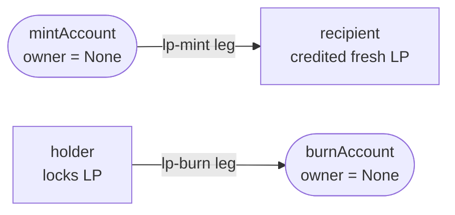

# Issuing a new LP token or lifecycle-rich instrument

Most assets on this DEX need no new Daml. You register an instrument in the
reference registry and mint it; the DEX treats the resulting `instrumentId` as
opaque. This page gives five escalating recipes — from the LP token you already
get for free, up to a custom vesting wrapper — and marks clearly where you leave
the reference registry and start writing your own templates.

## Two layers you build on

Token Standard V2 (CIP-0112) standardizes the *holding, allocation, and
settlement* surface — how value is held, locked, and moved atomically. It does
**not** standardize instrument configuration or lifecycle. Those live in the
registry that administers the `instrumentId` — here, `CantonDex.Registry.V2`. A
different registry can publish different config and credentials and still
implement the same V2 `Holding`, `AllocationFactory`, and `SettlementFactory`
interfaces.

So a "lifecycle-rich" instrument in this repo is a per-instrument
[`InstrumentConfig`](../../trading/CantonDex/Registry/V2.daml) plus optional
issuer-signed `Credential`s the minter must present. `InstrumentConfig` can encode:

- **supply caps** (`supplyCap`; enforced by `InstrumentConfig_BumpSupply`)
- **issuance credentials** (`issuerRequirements : [CredentialRequirement]`) — who is allowed to mint
- **holder credentials** (`holderRequirements`) — recorded for downstream policy
- **decimals** for display precision
- **external ids** (`isin`, `cusip`)

Transfer and allocation constraints come from the `TransferFactory` /
`AllocationFactory` implementation, not from the config. All of this is
reference-registry behavior, not a Token Standard requirement.

## Pick your recipe

| You want to issue | Recipe | New Daml? |
|---|---|---|
| An LP token for a pool | [A](#a-vanilla-lp-token--already-built) | none — the add-liquidity DvP mints it |
| A plain fungible base/quote asset | [B](#b-a-fresh-base-or-quote-instrument) | none — register + `Registry_Mint` |
| A whitelisted / accredited-only asset | [C](#c-gated-issuance-credential-required) | none — attach credential requirements |
| A token that unlocks over time | [D](#d-vested-lp-custom-lifecycle) | a wrapper template in your fork |
| A token that pays dividends | [E](#e-dividend-paying-instrument) | a distribution script or claim template |

## A. Vanilla LP token — already built

The add-liquidity DvP flow already mints an LP token; there is nothing extra to
write. The token has `instrumentId = "<BASE>-<QUOTE>-LP"`, `admin = lpRegistrar`,
and is a real V2 `Holding` — fungible with other V2 holdings, usable as
`TransferInstruction` input, and lockable into an `Allocation`, so LP tokens can
themselves back orders or pools.

Mint and burn ride the V2 allocation surface as ordinary transfer legs to and
from two reserved accounts whose `owner` is `None`. An account with no owner is
never credited on settlement, so it is a sink for burns and a source for mints:



The legs are pure constructors in
[`Lp/Instrument.daml`](../../trading/CantonDex/Lp/Instrument.daml):

```daml
lpMintLeg _lpRegistrar recipient lpInstrumentId amount = V2.TransferLeg with
  transferLegId = "lp-mint"
  sender = Utils.mintAccount
  receiver = recipient
  ...
lpBurnLeg _lpRegistrar holder lpInstrumentId amount = V2.TransferLeg with
  transferLegId = "lp-burn"
  sender = holder
  receiver = Utils.burnAccount
  ...
```

`PoolLiquidityRules_SettleAddLiquidity` settles the mint leg and bumps the
[`LPTokenPolicy`](../../trading/CantonDex/Lp/Policy.daml) supply;
`PoolLiquidityRules_SettleRemoveLiquidity` settles the burn leg and draws it
back down. The policy tracks circulating LP supply on its own; it is
bookkeeping, not a cap. If you need a hard cap on LP supply, register an
`InstrumentConfig` with `supplyCap = Some 10_000_000.0` — but note the LP mint
path drives `LPTokenPolicy_RecordMint`, not `InstrumentConfig_BumpSupply`, so
that cap is not enforced on the LP token today.

## B. A fresh base or quote instrument

Register the instrument, then mint to a holder. Both are choices on the
[`Registry`](../../trading/CantonDex/Registry/V2.daml) template:

```ts
// 1. Register the instrument
const configCid = await ledger.submit({
  actAs: [admin],
  command: {
    kind: 'exercise',
    templateId: 'CantonDex.Registry.V2:Registry',
    contractId: registryCid,
    choice: 'Registry_RegisterInstrument',
    argument: {
      instrumentId: 'USDC',
      decimals: 6,
      supplyCap: null,          // unbounded
      holderRequirements: [],
      issuerRequirements: [],   // open issuance
      isin: null,
      cusip: null,
    },
  },
});

// 2. Mint to a holder (controller is admin + owner; both go in actAs)
await ledger.submit({
  actAs: [admin, alice],
  command: {
    kind: 'exercise',
    templateId: 'CantonDex.Registry.V2:Registry',
    contractId: registryCid,
    choice: 'Registry_Mint',
    argument: { configCid, owner: alice, amount: '100000.0', issuerClaims: [] },
  },
});
```

The `admin, owner` joint authority is by V2 design: a receiver must consent to
receive a token, so the operator backend cannot mint to `alice` without her
wallet co-signing. In a real deployment this is a CIP-0103 prepare/execute
round-trip through the trader's wallet. On-ledger, `Registry_Mint` bumps supply
and creates the holding:

```daml
nonconsuming choice Registry_Mint : ContractId Holding
  with configCid; owner; amount; issuerClaims
  controller admin, owner
  do
    config <- fetch configCid
    ...
    exercise configCid InstrumentConfig_BumpSupply with delta = amount
    create Holding with admin; owner; instrumentId = config.instrumentId; amount; locked = False
```

`InstrumentConfig_BumpSupply` is consuming, so each mint archives the config and
creates its successor with the new `circulatingSupply` — **re-read the config cid
before each mint** rather than caching it. It is also where the cap bites:

```daml
forA_ supplyCap $ \cap ->
  assertMsg ("mint exceeds supply cap " <> show cap) (next <= cap)
```

## C. Gated issuance (credential-required)

For a security token or whitelisted-investor asset, attach an issuer credential
requirement. `Registry_Mint` checks `issuerRequirements` against the **minting
admin** — this is the credential the admin must hold to be allowed to issue:

```daml
let credsOk =
      null config.issuerRequirements ||
      verifyCredentials admin config.issuerRequirements issuerClaims
assertMsg "issuer credentials not satisfied for mint" credsOk
```

`verifyCredentials` matches each requirement on `issuer`, `property`, `value`,
and `holder == admin`, so `issuerClaims` carries `Credential` **records** (those
four fields), not contract ids:

```ts
// 1. Credential issuer signs a Credential naming the admin as holder
const credCid = await ledger.submit({
  actAs: [credentialIssuer],
  command: {
    kind: 'create',
    templateId: 'CantonDex.Registry.V2:Credential',
    argument: { issuer: credentialIssuer, holder: admin, property: 'accredited-investor', value: 'true' },
  },
});

// 2. Register with the requirement
const configCid = await ledger.submit({
  actAs: [admin],
  command: {
    kind: 'exercise',
    templateId: 'CantonDex.Registry.V2:Registry',
    contractId: registryCid,
    choice: 'Registry_RegisterInstrument',
    argument: {
      instrumentId: 'PRIVATE-EQUITY',
      decimals: 0,
      supplyCap: '1000000.0',
      holderRequirements: [],
      issuerRequirements: [{ issuer: credentialIssuer, property: 'accredited-investor', value: 'true' }],
      isin: null,
      cusip: null,
    },
  },
});

// 3. Mint, supplying the matching claim record
await ledger.submit({
  actAs: [admin, alice],
  command: {
    kind: 'exercise',
    templateId: 'CantonDex.Registry.V2:Registry',
    contractId: registryCid,
    choice: 'Registry_Mint',
    argument: {
      configCid,
      owner: alice,
      amount: '100.0',
      issuerClaims: [{ issuer: credentialIssuer, holder: admin, property: 'accredited-investor', value: 'true' }],
    },
  },
});
```

If the claim is missing, wrong-issuer, or held by anyone other than the minting
admin, the mint rejects. `holderRequirements` is recorded on the config for
downstream policy; the mint itself checks `issuerRequirements` only.

> The reference `verifyCredentials` accepts party-issued claims at face value —
> production **must** replace it with a real credential lookup. See the module
> note in [`Instrument/Credentials.daml`](../../trading/CantonDex/Instrument/Credentials.daml).

## D. Vested LP (custom lifecycle)

Token Standard V2 has no first-class vesting. The pattern is a custom template
that owns or gates a V2 holding until a cliff passes. The following is an
**illustrative example — it is not in the repo**; write it in your fork:

```daml
-- EXAMPLE (not shipped): a wrapper that gates transfer until a cliff.
template VestedLP with
    holder : Party
    admin : Party
    underlying : ContractId V2.Holding   -- the LP holding, held locked
    cliffAt : Time
  where
    signatory admin, holder
    choice VestedLP_Claim : ContractId V2.Holding
      controller holder
      do
        now <- getTime
        assertMsg "not yet cliff" (now >= cliffAt)
        ...                                -- release the underlying via TransferInstruction
```

The `underlying` holding stays locked until `VestedLP_Claim` releases it. It is
still a V2 `Holding` under the wrapper, so it can appear in balance reads; the
wrapper only gates the transfer.

## E. Dividend-paying instrument

Neither pattern ships in the reference; both are straightforward in a fork:

1. **Admin-pushed distribution** — a script queries current holders (the
   `Holding` ACS filtered by `instrumentId`) and creates pro-rata payout
   `TransferInstruction`s. Simple, off-ledger logic; cost falls on the admin.
2. **Pull-based claim** — the admin posts a per-period rate and each holder
   exercises a `Claim` choice for their share. Cheaper for the admin, more
   contracts on-ledger.

## Reference — what needs a registry extension

- **Native rebasing.** V2 holdings have a fixed `amount`; rebases would mean ACS
  rewrites the standard does not support. Expose a rebasing *view* over a wrapper
  instead.
- **Predicates the credential model can't express** (e.g. "holder in
  jurisdiction X but not Y") need a custom registry or a custom `TransferFactory`.
- **Multi-asset baskets in one holding.** V2 holdings are single-instrument; a
  basket is a wrapper template.

## Where to look in this repo

- [`Registry/V2.daml`](../../trading/CantonDex/Registry/V2.daml) — the reference
  registry: `InstrumentConfig`, `Registry_RegisterInstrument`, `Registry_Mint`,
  and the V2 interface instances. *Proves the register-then-mint path in B and C.*
- [`Lp/Instrument.daml`](../../trading/CantonDex/Lp/Instrument.daml) — the LP
  mint/burn legs and allocation specs. *Proves how the LP token in A rides the V2
  allocation surface (mint = leg to `mintAccount`, burn = leg from it).*
- [`Lp/Policy.daml`](../../trading/CantonDex/Lp/Policy.daml) — `LPTokenPolicy`,
  the LP supply component. *Proves LP supply tracking is separate from
  `InstrumentConfig` caps.*
- [`Instrument/Credentials.daml`](../../trading/CantonDex/Instrument/Credentials.daml)
  — the credential primitive and `verifyCredentials`. *Proves the C gate — and
  flags that the check is a placeholder.*
- [`DvpMintBurnTests.daml`](../../trading-tests/CantonDex/Tests/DvpMintBurnTests.daml)
  — `testDvpMintThenBurn` mints 100 LP to Alice then burns it. *Proves a mint
  credits the receiver and a burn leaves nothing behind, not even a stray locked
  holding.* `testHarnessDoesNotGateMintAuthorization` documents that the shipped
  test registry does not enforce mint authorization — production registries do.
- [`InstrumentTests.daml`](../../trading-tests/CantonDex/Tests/InstrumentTests.daml)
  — config, credential-gated mint, and burn over the request-workflow templates.
  *Proves open vs. gated issuance: `testMintGatedIssuance` rejects a mint whose
  credential is absent.*

---

**Where to read next:** [LP Tokens](../concepts/lp-tokens.md) · [Add a Trading Pair](add-a-trading-pair.md) · [All docs](../README.md)
