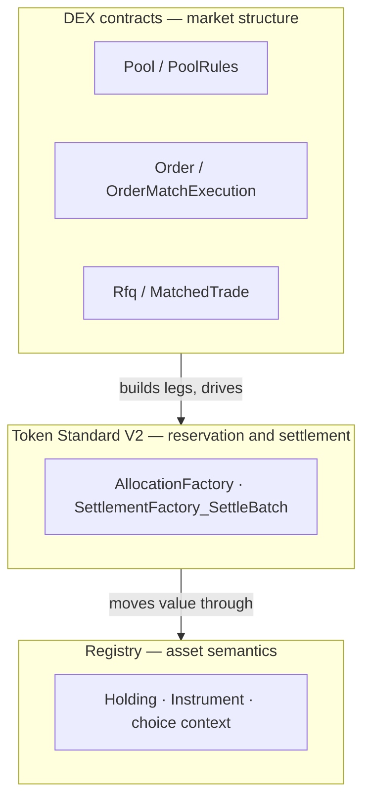

# Builder guide

How to read and extend this reference. Start after
[Getting Started](../getting-started.md) (which runs the stack) and the
[Overview](../concepts/overview.md) and [Architecture](../concepts/architecture.md)
(which explain the design).

## Three layers, one boundary

Every extension lives in one of three layers, and most extensions succeed or fail
on whether they respect the boundary between them.



- **DEX contracts own market structure**: orders, pools, LP issuance, RFQ, trades.
- **Token Standard contracts own reservation and settlement**: a trade is a set of
  committed allocations settled by one `SettlementFactory_SettleBatch`.
- **Registry contracts own asset semantics**: what a holding is, who may hold it,
  and the choice context a settlement needs.

A DEX choice never moves a holding itself. It builds the transfer legs and asks the
settlement factory to move them, under authority the holder already signed. Any
change that blurs these layers shows up later as duplicated state or authority
confusion; keep them separate and most extensions stay local.

## What this reference is

A runnable Canton DEX that:

- represents every asset (base, quote, and LP) as a Token Standard V2 (CIP-0112)
  `V2.Holding`;
- uses iterated allocations, so pool reserves and resting orders adjust in place
  without a re-funding round trip;
- records an operator `PolicyReceipt` on every RFQ accept, so dealer ranking is
  replayable after the fact;
- deploys to a Canton testnet participant with the included tooling
  (`scripts/deploy-testnet.sh`; see [Run on a testnet](run-on-testnet.md)).

It deliberately leaves out a production limit-order-book matcher, order routing,
oracle integration, custody, and a compliance/KYC layer. Those belong in forks or
deployment-specific services, not the shared templates. See
[Non-goals](../concepts/non-goals.md).

## The four workflow families

The Daml test suite exercises four families. Reading them in order is the fastest
way to understand the venue; each lists its contracts, its entry choice, and the
test that proves it.

### A. Pair and instrument listing
Register a tradable pair, and for pool mode its instruments.

- `Dex/DexPair.daml` — the listing: base + quote instrument ids, fee model, trading
  mode (`OrderBook` / `Pool` / `Both`), and an `active` flag.
- `Instrument/InstrumentConfiguration.daml` — the reference registry's per-instrument
  config (credential requirements, optional ISIN/CUSIP). Registry-specific, not a
  Token Standard template.
- Proven by
  [`InstrumentTests.daml`](../../trading-tests/CantonDex/Tests/InstrumentTests.daml)
  (`testInstrumentConfigCreate`).

### B. OTC and RFQ settlement
A bilateral block trade settles as one atomic batch.

- `Dex/MatchedTrade.daml` — `MatchedTrade_RequestAllocations` (one request per
  authorizer), `MatchedTrade_Settle` (groups legs by registry admin, calls
  `SettlementFactory_SettleBatch`), `MatchedTrade_Cancel`.
- `Dex/Rfq.daml` + `PolicyReceipt.daml` — trader RFQ, dealer quotes, then a joint
  `Rfq_Accept` that emits a `MatchedTrade` carrying an operator-signed
  `PolicyReceipt` in `SettlementInfo.meta`.
- Proven by
  [`EndToEndTests.daml`](../../trading-tests/CantonDex/Tests/EndToEndTests.daml)
  (`testMatchedTradeFullSettle`, `testRfqAcceptProducesMatchedTradeWithReceipt`).

### C. Resting orders backed by a V2 allocation
A limit order rests in the book, funded by the trader's own locked allocation.

- `Dex/OrderFundingRequest.daml` — the trader-signed intent.
- `Dex/Order.daml` — the operator-bound `Order` and its `OrderAllocationRequest`. The
  trader authors the allocation with `AllocationFactory_Allocate`, so their own
  authority locks the holding; the operator cannot move it.
- `Dex/OrderMatchExecution.daml` — the atomic match (see the matcher section below).
- Proven by
  [`EndToEndTests.daml`](../../trading-tests/CantonDex/Tests/EndToEndTests.daml)
  (`testOrderFundingFlow`, `testFinalizedAllocationFundingConservation`).

### D. Constant-product pool
An AMM whose reserves are committed allocations.

- `Dex/Pool.daml` + `PoolState.daml` + `PoolSlice.daml` — immutable config, the hot
  reserves/supply/status, and one committed allocation per slice (each slice is its
  own contract, passed by cid).
- `Dex/PoolRules.daml` — `PoolRules_RequestSwap`, `PoolRules_Swap`, `PoolRules_Pause`,
  `PoolRules_Resume`.
- `Dex/PoolLiquidityRules.daml` + `LiquidityAllocationRequest.daml` — the DvP
  add/remove path (`_RequestAddLiquidity` / `_SettleAddLiquidity` and the remove
  pair), co-signed by `operator` and `lpRegistrar`.
- `Lp/Policy.daml` + `Lp/Instrument.daml` — the LP token, owned by `lpRegistrar`,
  keyed by a `V2.InstrumentId`, and unaware of pools or orders.
- Proven by
  [`EndToEndTests.daml`](../../trading-tests/CantonDex/Tests/EndToEndTests.daml)
  (`testPoolFullLifecycle`, `testPoolSwapEndToEnd`) and
  [`PoolLiquidityRulesTests.daml`](../../trading-tests/CantonDex/Tests/PoolLiquidityRulesTests.daml).

## The off-ledger matcher: where a fork does most of its work

The on-ledger `OrderMatchExecution` template settles two opposing allocations
atomically. Everything above it — finding opposing orders and choosing the fill
quantity and price — is operator code, so a fork can rewrite matching without
touching a Daml template.

The operator scans active `Order`s (`/v1/orders`), pairs compatible ones (same pair,
opposite side, `bid.limitPrice >= ask.limitPrice`), sets the fill quantity to
`min(remaining)` and a policy fill price, then creates and exercises the match in one
submission:

```daml
choice OrderMatchExecution_Execute : OrderMatch_ExecuteResult
  with
    factoryCid : ContractId V2.SettlementFactory
    extraArgs : ExtraArgs        -- registry choice context for the batch
  controller operator
  do
    ...  -- finalize both allocations with the concrete match legs,
         -- SettleBatch, roll each order onto its next-iteration
         -- allocation, and write a SettledTrade
```

Using one `createAndExercise` keeps funds and orders moving together: the settle
archives both allocations, so an order left pointing at a spent one could neither be
filled nor cancelled. The split is deliberate — matchers change often, settlement
primitives do not.

## Wallet integration

The dApp never signs as the trader. Trader-authority writes (placing an order,
authoring add/remove-liquidity or swap allocations with `AllocationFactory_Allocate`)
go through the connected wallet over the CIP-0103 dApp standard
(prepare → sign → execute): the operator backend builds the unsigned command tree,
the wallet signs and submits. RFQ accept is the one exception here — trader and
operator co-sign via `POST /v1/rfq/accept`; a production deployment would route the
trader's authority through the wallet too.

Read endpoints (`/v1/pools`, `/v1/trades`, …) are operator-observed and served from
the backend's indexer cache. Keep trader-authority writes on the wallet path; the
operator backend should only orchestrate and settle what it is authorized to submit.

CIP-0103 prepares one top-level command per transaction, so each flow is a single
Daml command. Where a flow needs several allocations at once, the DEX uses the token
standard's batching utility (`Splice.Util.Token.Wallet.BatchingUtilityV2`, vendored
under `vendor/splice/daml/splice-util-token-standard-wallet/`): the wallet
`createAndExercise`s `ExecuteBatch`, which authors every named allocation in one
transaction. Deploy that DAR alongside the DEX DAR.

## Extending the reference

| Goal | How |
|---|---|
| Add a trading pair (BTC/EUR, ETH/USDT, …) | Create a `DexPair`; add a `Pool` for pool mode. See [Add a trading pair](add-a-trading-pair.md). |
| Issue a new LP token or lifecycle-rich instrument (vested, dividend-bearing) | See [Add an LP or instrument](add-lp-or-instrument.md). |
| Use a different registry | Swap `CantonDex.Testing.MockRegistry` for the real registry's `AllocationFactory` + `SettlementFactory`. See [Registry integration](registry-integration.md). |
| Add a pricing curve (StableSwap, weighted) | Fork the `Pool` template; the slice model is curve-agnostic. See `examples/stable-pool/`. |
| Add a fee policy | Extend `Pool.feeBps` / `DexPair.feeModel` and the `constantProductOut` quote math. |
| Add an RFQ policy (oracle-weighted, multi-tier) | `Rfq.applyPolicy` holds the sort chain; bump `policyVersion`/`policyHash` and mirror it in `app/web/src/services/rfq-policy.ts`. |
| Point at a different participant | Set `CANTON_LEDGER_URL`, `CANTON_LEDGER_TOKEN`, `CANTON_SYNCHRONIZER`. See [Run on a testnet](run-on-testnet.md). |

Whatever you change, keep the layer boundary above intact: DEX contracts own market
structure, Token Standard contracts own reservation and settlement, registry
contracts own asset semantics.

## Upgrade discipline

Keep the templates as small as possible; do not carry compatibility choices "just in
case". If an adopter needs to preserve Daml smart-upgrade lineage, follow the
participant's upload-check rules: new fields `Optional` and at the end of the record,
choices kept rather than removed, input/result field types stable, no field
reordering. To break compatibility on purpose, rename the package and treat it as a
fresh lineage.

## Testing

```bash
cd trading-tests && dpm test            # in-script Daml suites
```

Expected counts are in [Getting Started](../getting-started.md). Testnet smoke test:

```bash
node --import tsx scripts/testnet-v2registry-trade.ts   # real V2-standard trade
```

Keep deployment-specific responsibilities outside the reference core — custody,
KYC/compliance, oracle selection, production routing, market surveillance — so the
shared templates stay small.

---

### Reference: contract surface

```
DexPair                     pair listing, fee model, optional public observers
Pool                        constant-product pool config, slice-local reserves
PoolState / PoolSlice       hot reserves+supply+status; one committed allocation per slice
PoolRules                   swap + pause/resume choices over pool state
PoolLiquidityRules          DvP add/remove-liquidity settle choices
LPTokenPolicy               LP instrument supply ledger, record-mint/burn policy
LiquidityAllocationRequest  operator-issued; carries the add/remove DvP allocation request
Order                       resting limit order backed by a V2 allocation
OrderAllocationRequest      trader-observed allocation request (V2 interface)
OrderMatchExecution         operator-driven match of two opposing allocations
MatchedTrade                bilateral block-trade carrier, optional PolicyReceipt
TradeAllocationRequest      per-authorizer allocation request for a matched trade
Rfq / RfqQuote              trader's request for quotes; dealer's quote
PolicyReceipt               on-ledger record of the operator ranking policy at accept time
Registry.V2.*               reference registry implementing Token Standard V2 interfaces
```

The Daml package is `canton-dex-trading` (current version `v0.1.4`).

### Reference: off-ledger layout

```
services/operator-backend/
  src/
    ledger/         JSON LAPI driver, LedgerSubmitter abstraction
    indexer/        SQLite indexer, idempotency cache, operator config kv
    http/           REST endpoints
    admin/          pair / pool / pricing administrative writes
    pool/, rfq/, order/, matched-trade/   per-flow modules
app/web/
  src/
    services/       HTTP client and wallet handoff boundary
    pages/          route-level React pages
    components/     Pool, Trade, Portfolio, Admin, Rfq views
    wallet/         wallet providers (CIP-0103 SDK, WalletConnect, mock, ...)
```

## Where to read next

- **Reference:** [HTTP API](../reference/http-api.md) · [Allocation surface](../reference/allocation-surface.md)
- **Deeper design:** [Workflows](../concepts/workflows.md) · [Liquidity and custody](../concepts/liquidity-and-custody.md)
- **Recipes:** [Add a trading pair](add-a-trading-pair.md) · [Add an LP or instrument](add-lp-or-instrument.md)
