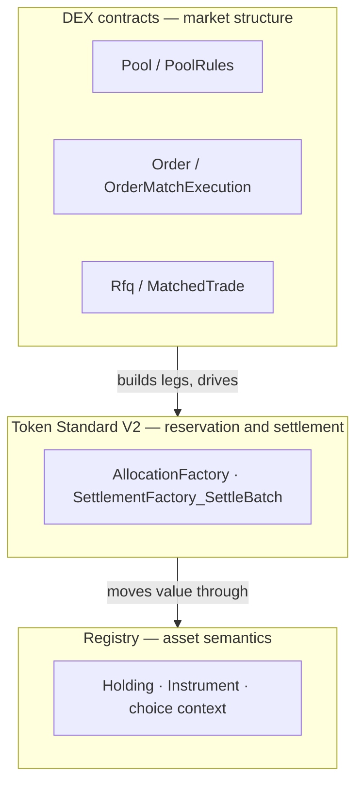

# Builder guide

This is Step 9, the final step in the
[newcomer learning path](../README.md#newcomer-learning-path).
Complete [Make your first AMM code change](../tutorials/make-your-first-amm-change.md)
first. This guide helps you plan a behavior-changing extension without
crossing the DEX, Token Standard, registry, backend, or wallet boundaries by
accident.

## Three layers, one boundary

Every extension lives in one of three layers, and most extensions succeed or fail
on whether they respect the boundary between them.



- **DEX contracts own market structure**: orders, pools, LP issuance, RFQ, trades.
- **Token Standard contracts own reservation and settlement**: a trade is a set of
  holder-authored allocations settled by `SettlementFactory_SettleBatch`, one batch
  per registry admin.
- **Registry contracts own asset semantics**: what a holding is, who may hold it,
  and the choice context a settlement needs.

A DEX choice never moves a holding itself. It builds the transfer legs and asks the
settlement factory to move them, under authority the holder already signed. Any
change that blurs these layers shows up later as duplicated state or authority
confusion; keep them separate and most extensions stay local.

## What this reference is

A runnable Canton DEX that:

- represents every asset (base, quote, and LP) as a Token Standard V2 (CIP-0112)
  `V2.Holding`;
- uses iterated allocations, so pool reserves and resting orders adjust in place
  without a re-funding round trip; commitment is selected separately according
  to each workflow's exit requirements;
- records an operator `PolicyReceipt` on every RFQ accept, so dealer ranking is
  replayable after the fact;
- deploys to a Canton testnet participant with the included tooling
  (`scripts/deploy-testnet.sh`; see [Run on a testnet](run-on-testnet.md)).

It deliberately leaves out a production limit-order-book matcher, order routing,
oracle integration, custody, and a compliance/KYC layer. Those belong in forks or
deployment-specific services, not the shared templates. See
[Non-goals](../concepts/non-goals.md).

## Before extending the AMM

Do not start a second learning route here. Follow the newcomer path through
the tested first-change tutorial, then use the
[Daml proof map — AMM pool](../reference/daml-proof-map.md#amm-pool) to locate
the exact source choice and smallest proof for the behavior you plan to alter.
The [allocation surface](../reference/allocation-surface.md) is the lookup page
for the Token Standard contracts beneath those choices.

## The four workflow families

The Daml test suite exercises four families. Treat the sections below as a
builder's lookup map; the newcomer learning path remains the primary route in the
documentation index.

### A. Pair and instrument listing
Register a tradable pair, and for pool mode its instruments.

- `Dex/DexPair.daml` — the listing: base + quote instrument ids, fee model, trading
  mode (`OrderBook` / `Pool` / `Both`), and an `active` flag. The mode and flag
  guide off-ledger discovery/routing; they are not fetched by `PoolRules` or
  `OrderMatchExecution` and therefore are not on-ledger settlement gates.
- `Registry/V2.daml` — the reference registry's V2 interfaces plus its
  registry-specific `InstrumentConfig` (precision, supply bookkeeping,
  placeholder requirement records, optional ISIN/CUSIP).
- Source and focused checks: [Daml proof map — Pair listing metadata](../reference/daml-proof-map.md#pair-listing-metadata).

### B. OTC and RFQ settlement
A bilateral block trade settles atomically, one batch per registry admin.

- `Dex/MatchedTrade.daml` — `MatchedTrade_RequestAllocations` (one request per
  authorizer), `MatchedTrade_Settle` (groups legs by registry admin, calls
  `SettlementFactory_SettleBatch`), `MatchedTrade_Cancel`.
- `Dex/Rfq.daml` + `PolicyReceipt.daml` — trader RFQ, dealer quotes, then a joint
  `Rfq_Accept` that emits a `MatchedTrade` carrying an operator-signed
  `PolicyReceipt` in `SettlementInfo.meta`.
- Source and focused checks: [Daml proof map — RFQ and OTC](../reference/daml-proof-map.md#rfq-and-otc).

### C. Resting orders backed by a V2 allocation
A limit order rests in the book, funded by the trader's own locked allocation.

- `Dex/OrderFundingRequest.daml` — the trader-signed intent.
- `Dex/Order.daml` — the operator-bound `Order` and its `OrderAllocationRequest`. The
  trader authors the allocation with `AllocationFactory_Allocate`, so their own
  authority locks the holding; the operator is named as its settlement executor and
  can move it only by settling the allocation it is locked into, and that settle is
  constrained by `OrderMatchExecution` when it is the choice used.
- Expiring orders commit funding until their deadline. GTC funding remains
  uncommitted, allowing the trader to withdraw through the standard allocation
  interface if the venue is unavailable; a later match then fails safely.
- `Dex/OrderMatchExecution.daml` — the atomic match (see the matcher section below).
- Source and focused checks: [Daml proof map — Resting orders](../reference/daml-proof-map.md#resting-orders).

### D. Constant-product pool
An AMM whose reserves are committed allocations.

- `Dex/Pool.daml` + `PoolState.daml` + `PoolSlice.daml` — immutable config, the hot
  reserves/supply/status, and one committed allocation per slice (each slice is its
  own contract, passed by cid).
- `Dex/PoolRules.daml` — `PoolRules_RequestSwap`, `PoolRules_Swap`, `PoolRules_Pause`,
  `PoolRules_Resume`.
- `Dex/PoolLiquidityRules.daml` + `LiquidityAllocationRequest.daml` — the DvP
  add/remove path (`_RequestAddLiquidity` / `_SettleAddLiquidity` and the remove
  pair), co-signed by `operator` and `lpRegistrar`.
- `Lp/Policy.daml` + `Lp/Instrument.daml` — the LP token, owned by `lpRegistrar`,
  keyed by a `V2.InstrumentId`, and unaware of pools or orders.
- Source and focused checks: [Daml proof map — AMM pool](../reference/daml-proof-map.md#amm-pool).

## The off-ledger matcher: where a fork does most of its work

The on-ledger `OrderMatchExecution` template settles two opposing orders' allocations
atomically. Everything above it — finding opposing orders and choosing the fill
quantity and price — is operator code, so a fork can rewrite matching without
touching a Daml template.

The operator scans active `Order`s (`/v1/orders`), pairs compatible ones (same pair,
opposite side, `bid.limitPrice >= ask.limitPrice`), sets the fill quantity to
`min(remaining)` and a policy fill price, then runs a read-only settlement preview and
creates and exercises the value-moving match in one submission:

```daml
choice OrderMatchExecution_Execute : OrderMatch_ExecuteResult
  with
    batchesByAdmin : Map Party RegistryBatchInput
      -- one settlement factory + choice context per instrument admin;
      -- a single-admin pair supplies one entry
  controller operator
  do
    ...  -- finalize both allocations with the concrete match legs,
         -- SettleBatch per admin, roll each order onto its
         -- next-iteration allocation, and write a SettledTrade
```

Using one `createAndExercise` keeps funds and orders moving together: the settle
archives both orders' allocations, so an order left pointing at a spent one could
neither be filled nor cancelled. The split is deliberate — matchers change often, settlement
primitives do not.

## Wallet integration

The dApp never signs as the trader. Trader-authority writes (placing an order,
authoring add/remove-liquidity or swap allocations with `AllocationFactory_Allocate`)
go through the connected wallet over the CIP-0103 dApp standard
(prepare → sign → execute): the backend supplies registry context and allocation
specifications, the dApp composes the command, and the wallet signs and submits.
`Rfq_Accept` is jointly controlled by trader and operator; deployments must
provide both authorities through wallet/delegation or an explicitly enabled
co-submission path. The included RFQ page demonstrates the last option with
configured parties; it is not part of the wallet-intent surface or a public
relay service.

Read endpoints are operator-observed: active-state reads (`/v1/pools`, `/v1/orders`)
query the ledger ACS as the operator, while history and stats (`/v1/trades`,
`/v1/stats/24h`) are served from the SQLite indexer. Keep self-custodial allocation
writes on the wallet path; any relay path must name and enforce the parties the
backend may act for.

CIP-0103 does not impose a one-command limit, but supported wallet gateways may.
The DEX therefore composes one top-level command per wallet approval. Where a
flow needs several allocations at once, it uses the token standard's batching
utility (`Splice.Util.Token.Wallet.BatchingUtilityV2`, vendored
under `vendor/splice/daml/splice-util-token-standard-wallet/`): the wallet
`createAndExercise`s `ExecuteBatch`, which accepts the request and authors every
named allocation in one transaction. Deploy that DAR alongside the DEX DAR.

## Extending the reference

| Goal | How |
|---|---|
| Add a trading pair (BTC/EUR, ETH/USDT, …) | Create a `DexPair`; add a `Pool` for pool mode. See [Add a trading pair](add-a-trading-pair.md). |
| Issue a new LP token or lifecycle-rich instrument (vested, dividend-bearing) | See [Add an LP or instrument](add-lp-or-instrument.md). |
| Use a different registry | Keep the DEX services behind `registry-client`, then configure discovery, choice context, disclosures, and metadata for the target registry. `CantonDex.Testing.MockRegistry` appears only in Daml test fixtures and is not the deployed backend. See [Registry integration](registry-integration.md). |
| Add a pricing curve (StableSwap, weighted) | Add curve-specific configuration and rules, then reuse the V2 allocation and settlement pattern. No generic curve interface is defined by this package. |
| Change the executable pool fee | The swap fee is `Pool.feeBps`, read by `constantProductOut` in `PoolRules_Swap`. `Pool` config is immutable and has no update choice, so re-create the pool with the new `feeBps`. `DexPair.feeModel` is separate off-ledger listing policy, changed through `DexPair_UpdateFeeModel`; it does not gate or price `PoolRules_Swap`. |
| Add an RFQ policy (oracle-weighted, multi-tier) | `Rfq.policyCmp` defines the ordering used by `applyPolicyPairs`; bump `policyVersion`/`policyHash` and mirror it in `app/web/src/services/rfq-policy.ts`. |
| Point at a different participant | Set `CANTON_LEDGER_URL`, `CANTON_LEDGER_TOKEN`, `CANTON_SYNCHRONIZER`. See [Run on a testnet](run-on-testnet.md). |

Whatever you change, keep the layer boundary above intact: DEX contracts own market
structure, Token Standard contracts own reservation and settlement, registry
contracts own asset semantics.

## Your first change

Use [Make your first AMM code change](../tutorials/make-your-first-amm-change.md)
for the complete red/green loop: exact edits, focused test, layer-impact check,
full local suite, and live sandbox proof.

For later changes, distinguish a new choice from a new template field. A new
choice can leave existing contract construction sites intact. A new field
changes the serialized template shape and every construction site must supply
it; follow [Upgrade discipline](#upgrade-discipline) before making that edit.

## Upgrade discipline

Keep the templates as small as possible; do not carry compatibility choices "just in
case". If an adopter needs to preserve Daml smart-upgrade lineage, follow the
participant's upload-check rules: new fields `Optional` and at the end of the record,
choices kept rather than removed, input/result field types stable, no field
reordering. To break compatibility on purpose, rename the package and treat it as a
fresh lineage.

## Testing

```bash
cd trading-tests
dpm test                                # every in-script Daml suite
dpm test -p testDexPairLifecycleUpdates # one named design proof
dpm test --files CantonDex/Tests/LifecycleChoiceTests.daml
```

Use `-p <test-name>` while reading one workflow, then run the whole suite before
handoff. Exact source/test links and focused commands are in the
[Daml proof map](../reference/daml-proof-map.md); broader commands and expected
outcomes are in [Getting Started](../getting-started.md).
Testnet smoke test:

```bash
npm --prefix services/operator-backend run live:matched-trade  # real V2-standard trade
```

Keep deployment-specific responsibilities outside the reference core — custody,
KYC/compliance, oracle selection, production routing, market surveillance — so the
shared templates stay small.

---

### Reference: contract surface

```
DexPair                     pair listing, fee model, optional public observers
Pool                        constant-product pool config, slice-local reserves
PoolState / PoolSlice       hot reserves+supply+status; one committed allocation per slice
PoolRules                   swap + pause/resume choices over pool state
PoolLiquidityRules          DvP add/remove-liquidity settle choices
LPTokenPolicy               LP instrument supply ledger, record-mint/burn policy
LiquidityAllocationRequest  operator-issued; carries the add/remove DvP allocation request
Order                       resting limit order backed by a V2 allocation
OrderAllocationRequest      trader-observed allocation request (V2 interface)
OrderMatchExecution         operator-driven match of two opposing orders' allocations
MatchedTrade                bilateral block-trade carrier, optional PolicyReceipt
TradeAllocationRequest      per-authorizer allocation request for a matched trade
Rfq / RfqQuote              trader's request for quotes; dealer's quote
PolicyReceipt               on-ledger record of the operator ranking policy at accept time
Registry.V2.*               reference registry implementing Token Standard V2 interfaces
```

The Daml package is `canton-dex-trading-v2` (current version `1.0.0`).

### Reference: off-ledger layout

```
services/operator-backend/
  src/
    ledger/         JSON LAPI driver, LedgerSubmitter abstraction
    indexer/        SQLite indexer, idempotency cache, operator config kv
    http/           REST endpoints
    admin/          pair / pool / pricing administrative writes
    pool/, rfq/, order/, matched-trade/   per-flow modules
app/web/
  src/
    services/       HTTP client and wallet handoff boundary
    pages/          route-level React pages
    components/     Pool, Trade, Portfolio, Admin, Rfq views
    wallet/         wallet providers (CIP-0103 SDK, WalletConnect, mock, ...)
```

## Where to read next

You have completed the newcomer path. Choose the task that matches
your extension:

- **Reference:** [HTTP API](../reference/http-api.md) · [Allocation surface](../reference/allocation-surface.md) · [Daml proof map](../reference/daml-proof-map.md)
- **Deeper design:** [Liquidity and custody](../concepts/liquidity-and-custody.md) · [Pricing](../concepts/pricing.md) · [Non-goals](../concepts/non-goals.md)
- **Recipes:** [Add a trading pair](add-a-trading-pair.md) · [Add an LP or instrument](add-lp-or-instrument.md)
