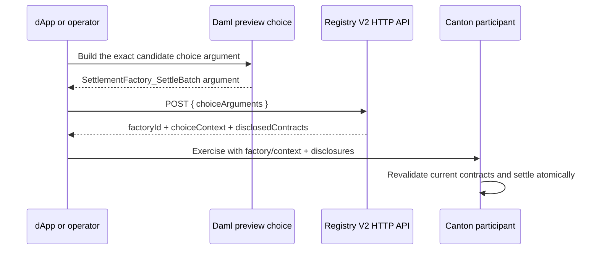
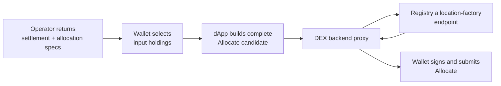
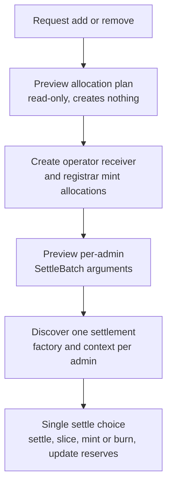

# Choice context and registry discovery

This guide explains how the DEX discovers a Token Standard V2 factory, obtains
the context required for one specific choice, and supplies disclosed contracts
to Canton. Read [Registry integration](registry-integration.md) first if the
registry boundary is new to you.

The important rule is:

> A registry lookup belongs to one concrete operation. Send that operation's
> choice arguments, use the returned factory and context for that operation,
> and do not reuse the response for a later choice.

The repository follows the operation-specific V2 OpenAPI committed under
[`vendor/splice/token-standard`](../../vendor/splice/token-standard/). It does
not invent admin-wide generic factory or context endpoints.

## 1. The problem in one picture

The operator knows what it wants to settle, but it does not own the asset
registry. The registry may require configuration, permissions, or credential
contracts that the operator cannot see.



Allocation creation is slightly different: the dApp already has the allocation
specification, selected holding CIDs, timestamp, and actors, so it constructs
the candidate `AllocationFactory_Allocate` argument directly. Settlement flows
use a Daml preview because Daml, not TypeScript, owns the authoritative batch.

## 2. Three values that must stay together

One factory lookup returns a normalized
[`FactoryChoiceContextRef`](../../services/registry-client/src/types.ts):

```typescript
{
  factoryCid,
  context: { values: { /* registry-defined */ } },
  disclosure: [ /* created-event blobs */ ]
}
```

| Value | Where it goes | Why it is needed |
|---|---|---|
| `factoryCid` | The Daml factory choice | Selects the registry contract that implements allocate or settle. |
| `context.values` | `choiceArgument.extraArgs.context` | Carries registry-defined data for this operation. |
| `disclosure` | The Ledger API submission's `disclosedContracts` | Makes otherwise invisible contracts available for transaction validation. |

The small
[`asChoiceContext`](../../services/operator-backend/src/ledger/choice-context.ts)
helper only converts the normalized response into Daml's `ExtraArgs` shape:

```typescript
export function asChoiceContext(ctx: ChoiceContextRef) {
  return {
    extraArgs: {
      context: ctx.context,
      meta: { values: {} },
    },
    disclosure: ctx.disclosure,
  };
}
```

Discovery remains at each call site. That makes it difficult to accidentally
ask for context without the operation's exact arguments.

## 3. Canonical V2 HTTP endpoints

The client is
[`services/registry-client/src/index.ts`](../../services/registry-client/src/index.ts).
Its source OpenAPI files are
[`allocation-instruction-v2.yaml`](../../vendor/splice/token-standard/splice-api-token-allocation-instruction-v2/openapi/allocation-instruction-v2.yaml)
and
[`allocation-v2.yaml`](../../vendor/splice/token-standard/splice-api-token-allocation-v2/openapi/allocation-v2.yaml).

| Operation | Method and path | Request body |
|---|---|---|
| Find an allocation factory | `POST /registry/allocation-instruction/v2/allocation-factory` | `{ "choiceArguments": <AllocationFactory_Allocate argument> }` |
| Find a settlement factory | `POST /registry/allocation/v2/settlement-factory` | `{ "choiceArguments": <SettlementFactory_SettleBatch argument> }` |
| Cancel one allocation | `POST /registry/allocations/v2/{allocationId}/choice-contexts/cancel` | `{ "meta": { ... } }` |
| Withdraw one allocation | `POST /registry/allocations/v2/{allocationId}/choice-contexts/withdraw` | `{ "meta": { ... } }` |

The factory endpoints return the upstream wire shape:

```json
{
  "factoryId": "#factory-cid",
  "choiceContext": {
    "choiceContextData": { "values": {} },
    "disclosedContracts": []
  }
}
```

The registry client validates this untrusted response and normalizes
`factoryId`, `choiceContextData`, and `disclosedContracts`. A bare TypeScript
cast is not used.

### Why responses are not cached

Choice context may depend on the exact allocation, holdings, actors, deadline,
or current registry state. Two calls with the same admin are not evidence that
the second operation can reuse the first response. The HTTP client performs a
fresh lookup for every operation.

There is also no 404-to-empty fallback. A missing canonical endpoint is an
integration error; silently inserting empty context could turn a registry
policy failure into a confusing ledger rejection.

## 4. Allocation creation: dApp to registry to wallet

For a swap or order request, the operator first returns settlement terms and one
allocation specification per instrument admin: a same-admin pair collapses to one
combined specification, and a cross-admin pair returns one per admin. A liquidity
request is different — it returns a fixed set of three: a base leg, a quote leg,
and an LP-token leg under the LP registrar. Their directions flip with the
operation: adding liquidity locks the base and quote deposits and receives the
minted LP token, while removing liquidity receives the base and quote back and
locks the LP token to burn. The two asset legs stay separate even when base and
quote share one admin, so a liquidity request never collapses to a single
per-admin specification.
The wallet chooses the holdings it will lock. For each specification the dApp
builds the candidate allocation choice — the snippet below shows one, and a
request with more specifications repeats it per specification:

```typescript
const choiceArguments = {
  settlement,
  allocation,
  requestedAt,
  inputHoldingCids,
  actors,
  extraArgs: EMPTY_EXTRA_ARGS,
};

const surface = await operator.getAllocationFactory({
  admin: allocation.admin,
  choiceArguments,
});
```

The dApp calls the backend proxy
`POST /v1/registry/allocation-factory`. The proxy passes the same
`choiceArguments` to `RegistryDiscovery.getAllocationFactory`; it does not
reconstruct or simplify them. The returned context replaces the empty
placeholder when the wallet authors the actual
`AllocationFactory_Allocate` command.



The trader, not the operator, authorizes the wallet submission. The backend
proxy discovers data; it does not grant trader authority.

**Code:** [`app/web/src/services/ledger.ts`](../../app/web/src/services/ledger.ts)
and
[`services/operator-backend/src/http/index.ts`](../../services/operator-backend/src/http/index.ts).

## 5. Settlement: preview, discover, execute

Settlement arguments contain exact transfer legs and allocation CIDs. Building
them independently in TypeScript would duplicate security-sensitive Daml
logic. Each supported settlement flow obtains the candidate
`SettlementFactory_SettleBatch` argument from Daml before querying the registry.

### Pool swap

1. `PoolRules_PreviewSwapSettlement` reads the current pool and returns the
   candidate settlement batch per instrument admin.
2. The backend discovers one settlement factory per instrument admin, calling
   `getSettlementFactory(admin, choiceArgs)` for each — the swap-in admin and
   the swap-out admin, or a single admin for a single-admin pool.
3. `PoolRules_Swap` receives those per-admin factories, their contexts, and
   disclosures.
4. The real choice re-reads current state and enforces quote binding,
   constant-product calculation, allocation binding, and minimum output.

**Code:** [`PoolRules.daml`](../../trading/CantonDex/Dex/PoolRules.daml) and
[`pool/index.ts`](../../services/operator-backend/src/pool/index.ts).

### Matched trade

`MatchedTrade_PreviewSettlement` returns one exact batch argument per registry
admin. The backend performs one settlement-factory lookup per admin, keeps each
context with its own batch, merges disclosures by contract ID, and exercises
`MatchedTrade_Settle`.

**Code:** [`MatchedTrade.daml`](../../trading/CantonDex/Dex/MatchedTrade.daml)
and
[`matched-trade/index.ts`](../../services/operator-backend/src/matched-trade/index.ts).

### Order match

The backend create-and-exercises an ephemeral
`OrderMatchExecution_PreviewSettlement` wrapper. That value-free transaction
leaves no active wrapper contract. It then performs registry discovery and
create-and-exercises a fresh `OrderMatchExecution_Execute` wrapper.

The execute choice does not trust the earlier preview: it revalidates the live
orders and allocations, settles both funding allocations, rolls forward any
remainders, and records the trade in one value-moving transaction.

**Code:**
[`OrderMatchExecution.daml`](../../trading/CantonDex/Dex/OrderMatchExecution.daml)
and [`order/index.ts`](../../services/operator-backend/src/order/index.ts).

## 6. Cancellation and withdrawal are allocation-specific

Cancel and withdraw context is queried with an allocation ID:

```typescript
const context = await registry.getAllocationCancelContext(
  admin,
  allocationCid,
);
```

A matched trade with three allocations performs three lookups, even if two
allocations have the same admin. The resulting `ExtraArgs` values remain paired
with their allocation CIDs. Treating context as one cached value per admin
would lose that binding.

The order cancellation path performs the same lookup for each of the order's
funding allocations — one per pair admin, so a single-admin order cancels one
and a cross-admin order cancels two. When a pending order has no allocations, no
registry allocation is being cancelled, so empty `ExtraArgs` is sufficient for
the app choice.

## 7. Add and remove liquidity: staged but atomic

Add and remove liquidity settle through a staged flow that is still one atomic
settlement transaction. The stages exist only because the operator and
registrar allocation contract IDs do not exist until they are created, and the
standard settlement-factory lookup needs those IDs inside the candidate
`SettleBatch` argument. Staging creates them first so each registry can return
its operation-specific context before the single settle choice runs.

The flow is request, then an optional preview, then one settle choice:

1. `PoolLiquidityRules_PreviewAddAllocations` (or the remove equivalent) is a
   read-only plan that returns the allocation candidates without creating them.
2. The backend creates the operator receiver and registrar mint allocations,
   discovering each admin's allocation-factory context as it goes. Then
   `PoolLiquidityRules_PreviewAddSettlement` returns the exact per-admin
   `SettleBatch` arguments so each registry can return its own settlement
   context.
3. `PoolLiquidityRules_SettleAddLiquidity` receives those per-admin batches and
   contexts, settles the allocations, creates the pool slices, mints or burns
   LP, and updates reserves and LP supply — all in one transaction.

A single-admin pool collapses the base and quote batches into one; a
cross-admin pool settles one batch per instrument admin, plus the LP registrar.



The backend wires this end to end:

- `FixedRegistryClient` supports the configured reference self-registry. Its
  factory CIDs are deployed with the operator, and its required disclosures are
  known before the transaction.
- The generic HTTP `RegistryClient` performs a fresh per-admin lookup for each
  allocation factory and settlement batch. Only the read-only preview plan runs
  before that discovery, so a missing endpoint fails the flow closed before the
  settle submission. It does not send placeholder CIDs and does not pretend a
  404 means empty context.

The Daml tests against a context-requiring registry prove that the Daml choices
thread context correctly when it is supplied.

## 8. Disclosure handling

The backend passes normalized disclosure to the JSON Ledger API as
`disclosedContracts`. When a transaction has several registry operations,
[`mergeDisclosures`](../../services/operator-backend/src/ledger/disclosure.ts)
deduplicates identical entries by contract ID. It rejects two different
payloads claiming the same contract ID.

Disclosure is transaction-wide. Its array position has no relationship to a
settlement batch; batch-to-context association stays in the choice argument.

## 9. Failure behavior

The client raises a typed `RegistryError` and fails closed:

| Kind | Meaning | Expected response |
|---|---|---|
| `not-found` | A canonical endpoint returned 404 | Fix registry routing/deployment; do not submit empty context. |
| `auth` | Registry returned 401 or 403 | Refresh or correct registry credentials. |
| `transport` | Other non-success HTTP response | Retry only according to operator policy; the error is marked retryable. |
| `malformed` | JSON or response shape is invalid | Treat the registry response as untrusted and stop. |
| `factory-stale` | A fixed registry has no mapping for the admin | Correct the deployment's per-admin factory map. |
| `unsupported` | Standards-correct discovery is impossible for this workflow | Redesign or use the documented self-registry path; never substitute placeholders. |

## 10. Executable proofs

| Question | Proof |
|---|---|
| Is the exact request body sent, normalized, and never cached? | [`registry-client.test.ts`](../../services/operator-backend/test/registry-client.test.ts) |
| Does a two-admin trade keep preview arguments, contexts, and disclosures separate? | [`matched-trade.test.ts`](../../services/operator-backend/test/matched-trade.test.ts) |
| Does order matching preview before one atomic value-moving execute? | [`match-leg-shape.test.ts`](../../services/operator-backend/test/match-leg-shape.test.ts) and [`order-fill-recording.test.ts`](../../services/operator-backend/test/order-fill-recording.test.ts) |
| Does the staged add-liquidity flow run only the read-only preview before per-admin registry discovery, and fail closed before the settle submission when an endpoint is missing? | [`pool.test.ts`](../../services/operator-backend/test/pool.test.ts) |
| Are split-admin Daml contexts kept in their correct fields? | `testDvpSettleThreadsBothAdminContexts` in [`ChoiceContextWorkflowTests.daml`](../../trading-tests/CantonDex/Tests/ChoiceContextWorkflowTests.daml) |
| Does a context-requiring registry reject missing context? | `testRealRegistryDvpRejectsMissingContext` in [`RealRegistryDvpTests.daml`](../../trading-tests/CantonDex/Tests/RealRegistryDvpTests.daml) |

## Reference: Daml choice fields

### `AllocationFactory_Allocate`

- `settlement`: settlement identity and executors.
- `allocation`: the exact allocation specification.
- `requestedAt`: the operation timestamp.
- `inputHoldingCids`: holdings selected by the wallet.
- `actors`: parties authorizing allocation creation.
- `extraArgs`: registry context returned for this operation.

### `SettlementFactory_SettleBatch`

- `settlement`: the settlement identity.
- `transferLegs`: exact movements being settled.
- `allocations`: finalized allocations, including extra leg sides and any
  next-iteration funding.
- `actors`: settlement executors.
- `extraArgs`: registry context returned for this batch.

The DEX does not use custom base/quote mint, burn, or balance choices during a
trade. Issuance remains registry administration; the DEX composes allocation
and settlement surfaces.

---

**Where to read next:** [Registry integration](registry-integration.md) ·
[Allocation surface](../reference/allocation-surface.md) ·
[Daml proof map](../reference/daml-proof-map.md)
