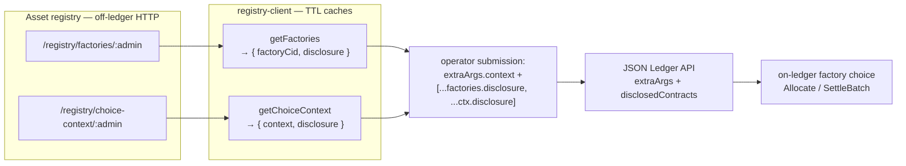

# Choice context and disclosure retrieval

The operator submits every transaction under its own party. But the holdings a
settlement archives are signed `signatory admin, owner` — a registry admin the
operator never sees — and the Token Standard V2 factory choices take a context
argument the operator cannot compute for itself. So each registry-touching
submission carries two riders sourced from the asset registry: a **choice
context** threaded into the choice's `extraArgs.context`, and a set of
**disclosed contracts** threaded into the ledger submission's
`disclosedContracts`. One module — the operator backend's
[`registry-client`](../../services/registry-client/src/index.ts) — is the single
place both come from, so cache invalidation stays correct.

This is the reference registry-client integration contract, not a Token Standard
V2 endpoint specification. It mirrors the Registry Utility guide's "Note: Before
the command is submitted by the UI, an API call is being made (in the
background) to an endpoint to retrieve required additional choice context
(including disclosure)..." pattern.

## The two riders

| Rider | Threaded into | Why the operator needs it |
|---|---|---|
| **Choice context** (`context.values`) | `choiceArgument.extraArgs.context` | The registry computes it (disclosed config, featured-app rights, rate limits). Self-registries return it empty, but the choice's `ExtraArgs` shape still requires the field. |
| **Disclosed contracts** | submission `disclosedContracts` | The factory contracts, registry config, and admin-signed holdings the choice fetches are invisible to the operator's party. Disclosure hands the participant the created-event blobs it needs to validate them without `readAs`. |



## Where the riders are assembled

One helper turns the registry's `ChoiceContextRef` into the `extraArgs` shape the
choices take — [`fetchChoiceContext`](../../services/operator-backend/src/ledger/choice-context.ts),
shared by the pool, order, and matched-trade services:

```typescript
export async function fetchChoiceContext(
  registry: RegistryClient,
  admin: Party,
): Promise<ChoiceContext> {
  const ctx = await registry.getChoiceContext(admin);
  return {
    extraArgs: { context: ctx.context, meta: { values: {} } },
    disclosure: ctx.disclosure,
  };
}
```

At each submit site, the factory disclosure and the choice-context disclosure are
merged into one array and the context is passed through as `extraArgs`. From the
pool swap ([`pool/index.ts`](../../services/operator-backend/src/pool/index.ts),
`PoolRules_Swap`):

```typescript
const factories = await this.registry.getFactories(pool.admin);
const ctx = await this.choiceContext(pool.admin);
// ...
this.ledger.submit({
  actAs: [this.operatorParty],
  readAs: input.swapperAccount.owner ? [input.swapperAccount.owner] : [],
  disclosure: [...factories.disclosure, ...ctx.disclosure],
  command: {
    kind: "exercise",
    choice: "PoolRules_Swap",
    argument: { /* ... */ extraArgs: ctx.extraArgs },
  },
});
```

The submitter's last step drops that `disclosure` verbatim into the JSON Ledger
API command ([`ledger/json-api.ts`](../../services/operator-backend/src/ledger/json-api.ts)):

```typescript
disclosedContracts: req.disclosure ?? [],
```

Each disclosed contract carries a base64 `createdEventBlob` — Canton's
disclosed-contract field — threaded through unchanged; the operator never
inspects or rewrites it.

For a **cross-registry** trade, the merge is per admin: the operator groups legs
by their instrument's admin, fetches each admin's factories and context
separately, and concatenates the disclosure so every batch carries only its own
registry's contracts (see [`matched-trade/index.ts`](../../services/operator-backend/src/matched-trade/index.ts),
`MatchedTrade_Settle`). On-ledger the context rides all the way down: the
registry's `SettlementFactory_SettleBatch` forwards `arg.extraArgs` into each
`Allocation_Settle` it exercises (see
[`Registry/V2.daml`](../../trading/CantonDex/Registry/V2.daml),
`settlementFactory_settleBatchImpl`).

**Proven by:**
[`registry-client.test.ts`](../../services/operator-backend/test/registry-client.test.ts)
— `getChoiceContext` fetches, caches (one HTTP call for two reads), and falls
back to empty context + no disclosure on a 404;
[`matched-trade.test.ts`](../../services/operator-backend/test/matched-trade.test.ts)
— a two-admin settle threads each admin's `extraArgs.context` into its own
`SettlementBatchV2` and emits the disclosure in
`[factory-A, context-A, factory-B, context-B]` order.

## Endpoints the operator queries

Per registry, the operator backend fetches:

| Example lookup                             | Returns                                   | Used by |
|--------------------------------------------|-------------------------------------------|---------|
| `GET /registry/factories/:admin`           | `(AllocationFactory, SettlementFactory)` CIDs + disclosure | `PoolRules_Swap`, matched-trade settle |
| `GET /registry/choice-context/:admin`      | `ChoiceContextRef` (`context` + disclosure) | Pool, MatchedTrade, any registry-touching token-standard choice |

These endpoints are examples for this reference implementation. A production
registry may use different paths, payloads, or discovery mechanisms as long as
the operator backend can produce the disclosed contracts and choice context
required by the registry's Token Standard V2 choices. The operator-backend's
`registry-client` module is the single integration point.

## Disclosure retrieval and caching

The `registry-client` owns two caches:

1. Allocation/Settlement factory CIDs (plus disclosure) per admin. Stale on admin
   re-publish, when the registry archives + recreates.
2. Choice-context refs per admin, honouring `choiceContextTtlMs` when configured.

The factory cache holds entries until it is flushed. The client exposes
`invalidateAll()` for a full flush after a known factory archive or re-publish.
There is no registry-side event stream driving invalidation, so an integration
must explicitly flush the cache when its registry republishes factories.

Registry responses are never trusted via a bare cast: `fetchJson` runs each
payload through a shape validator and raises `RegistryError("malformed", ...)` on
a mismatch (see [`registry-client/src/validate.ts`](../../services/registry-client/src/validate.ts)).

## Failure modes the backend must handle

| Failure | Recovery |
|---|---|
| Factory CID stale | Refetch from `factories/:admin`; backoff on repeated failures |
| Choice-context disclosure stale | Flush the registry client, refetch, and retry once |
| Settlement batch rejected by factory | Cancel the trade, surface to operator monitoring |

The `registry-client` module raises a typed `RegistryError` — with a `kind`
(`factory-stale`, `auth`, `transport`, or `malformed`) and a
`retryable` flag — so the calling code path can recover correctly.

## Reference: choice-context-bearing arguments

Each registry-touching choice the DEX exercises has a context shape the operator
must satisfy. Listed here as `(choice, required context)` pairs.

### Allocation creation

`V2.AllocationFactory.AllocationFactory_Allocate`

Required inputs:
- `actors : [Party]` — the trader (for prefunded order or trade
  allocation) or operator (for committed pool-fund allocation).
- `allocation : V2.AllocationSpecification` — with `admin` set
  correctly; `nextIterationFunding` for prefunded shapes; `committed =
  True` for pool-fund shapes.
- `requestedAt : Time` — current ledger time (operator passes through
  from the request).
- `inputHoldingCids : [ContractId V2.Holding]` — chosen by the
  trader's wallet from their ACS to cover the funding amount.
- `extraArgs.context` — registry-specific context (typically empty for
  test registries; production may carry credential proofs or rate
  limits).

### Allocation request acceptance

`V2.AllocationRequest_Accept` (on `TradeAllocationRequest` or
`OrderAllocationRequest`)

Required inputs:
- `actors : [Party]` — typically `[trader]`. Operator can also accept if
  the implementation allows.
- `extraArgs.context` — empty for the reference self-registry; production
  registries may require their own context fields.

The wallet composes this with `AllocationFactory_Allocate` in the
same submission to avoid creating duplicate allocations.

### Settlement

`V2.SettlementFactory.SettlementFactory_SettleBatch`

Required inputs:
- `settlement : V2.SettlementInfo` — exactly the
  `mkTradeSettlementInfo` output (or `poolSettlement`).
- `transferLegs : [V2.TransferLeg]` — the legs being settled, in the
  order the allocations expect.
- `allocations : [V2.FinalizedAllocation]` — every allocation whose
  authorizer participates in the legs. For iterated settlement, each
  finalized allocation carries any settlement-time
  `extraTransferLegSides` and the desired `nextIterationFunding`.
- `actors : [Party]` — `[venue/operator]`.
- `extraArgs.context` — registry-supplied choice context for the
  allocation admin. Self-registries may return empty context.

### Iterated settlement

`V2.FinalizedAllocation.extraTransferLegSides` and
`V2.FinalizedAllocation.nextIterationFunding` on
`SettlementFactory_SettleBatch`.

Required inputs:
- `extraTransferLegSides` — concrete settlement leg-sides supplied by
  the app choice once the trade or pool action is known.
- `nextIterationFunding` — `Some` when the settlement should create a
  next-iteration allocation for remaining pool/order funding; `None`
  when the allocation terminates at this settlement.
- `extraArgs.context` — registry-supplied choice context for the
  settlement admin. Self-registries may return empty context.

### Registry administration is separate

The DEX does not mint, burn, or transfer base/quote holdings through custom app
choices. The reference registry's `Registry_Mint` and `Registry_Burn` choices
are bootstrap/admin utilities; peer-to-peer transfers use the standard
`V2.TransferFactory` and `V2.TransferInstruction` interfaces. A different
registry may require choice context for those operations, but that context is
not part of a DEX settlement request.

---

**Where to read next:** [Registry Integration](registry-integration.md) · [Allocation Surface](../reference/allocation-surface.md) · [All docs](../README.md)
