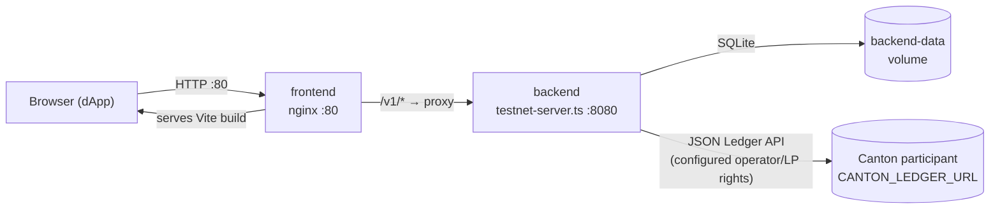

# Deployment guide

Five ways to run the reference DEX, ordered by how much infrastructure you
bring. **Local dev** is an in-memory UI/read-model demo; the **DPM sandbox** is
the default reproducible live-ledger learning path; **DevKit LocalNet** is an
optional persistent Splice environment; **Docker Compose** packages the edge
in front of a remote participant; and **direct testnet** runs that backend
under your own process supervisor. Pick the mode that proves the boundary you
care about.

In the packaged topology the participant credential is server-side; it is
never compiled into the dApp. Use separate least-privilege credentials where
your participant supports them: registry bootstrap needs the registry admins,
while runtime pool administration/settlement needs the operator and LP
registrar (plus the read rights described below). Trader allocations are
authored by a wallet. The arbitrary token-standard command relay is
development-only and is hard-disabled in `testnet-server.ts`. A narrower
hosted-RFQ authority relay exists as an explicit opt-in for custodial demos; it
is not self-custody and requires per-caller binding. See the
[authorization boundaries](run-on-testnet.md#6-wallet-and-http-authorization-boundaries).

## 1. Local dev (no Canton)

For UI work. `npm run dev` boots the backend on an
[`InMemoryLedger`](../../services/operator-backend/src/ledger/in-memory.ts) and
seeds an Amulet/USDCx pair under a demo admin, a funded pool, and a
demo trader — no participant, no token.

```bash
# backend
cd services/operator-backend
npm install
npm run dev                # in-memory ledger, listens on :8080

# frontend (separate terminal)
cd app/web
npm install
cp .env.example .env.local # VITE_API_BASE defaults to http://localhost:8080
npm run dev                # Vite dev server on :5173
```

Read paths work immediately. State-changing routes are auth-gated and return
`401` in the demo unless you set `DEX_DEV_OPEN=1`. The full local walkthrough —
write-gate flags, wallet options, and the test suites — is in
[Local Setup & Testing](../getting-started.md); this page covers the real-Canton
paths.

## 2. DPM sandbox (default live Canton proof)

This is the recommended learning and ledger-integration path. It requires the
pinned DPM SDK and Java 17, but it does **not** require Canton DevKit, Docker, a
pre-existing participant, or an external wallet:

```bash
bash scripts/run-dpm-sandbox-proof.sh
```

The wrapper builds the current DAR, starts a throwaway SDK sandbox on six
reserved loopback ports, allocates a bootstrap operator/admin/LP-registrar
party plus distinct LP/trader and swapper parties, uploads the package closure,
and proves add liquidity → quote-bound
swap → half-LP removal through the JSON Ledger API. It asserts exact balances,
reserves, slice reconciliation, LP supply, `x*y`, reserve-per-LP, and total
value conservation, then tears the sandbox down after a pass.

This is a direct-ledger integration proof. It deliberately bypasses the
operator HTTP server, React dApp, and wallet transport. See [Local Canton from
a clean clone](localnet.md#path-a-portable-dpm-sandbox-proof) for the phase log,
party model, failure artifacts, and exact proof boundary.

## 3. DevKit LocalNet (optional persistent Canton)

Use this only when your environment already provides the separately
distributed `canton-devkit` executable and Docker. The adapter starts or reuses
a named Splice/Canton LocalNet, maps its credential without printing the JWT,
allocates distinct live roles when overrides are absent, builds/uploads the
package closure, and runs the same DvP round trip:

```bash
bash scripts/run-localnet-roundtrip.sh canton-dex
```

The instance remains available for contract inspection. Stop its containers
while preserving ledger volumes with:

```bash
canton-devkit localnet down --name canton-dex
```

DevKit is a network lifecycle and credential adapter here; neither the DEX
application nor its DAR has a runtime dependency on it. See [Local Canton from
a clean clone](localnet.md#path-b-optional-persistent-devkit-localnet) for the
prerequisite check, role allocation, inspection commands, and destructive
cleanup warning.

## 4. Docker Compose

The packaged edge, for running against a remote Canton testnet or MainNet. Two
containers come up:

- **backend** — [`Dockerfile.backend`](../../Dockerfile.backend) runs
  [`testnet-server.ts`](../../services/operator-backend/src/testnet-server.ts) on
  `:8080`, persisting the indexer DB to the `backend-data` volume.
- **frontend** — nginx on `:80` serves the Vite build and reverse-proxies
  `/v1/*` to the backend, per [`nginx.conf`](../../nginx.conf).



nginx is the only published ingress: Compose uses `expose: 8080` for the
backend's private service-network port and publishes only frontend `:80`.
Operator-API traffic takes the path above; production wallet calls use the
selected wallet adapter rather than a participant token embedded in the
browser.

```bash
cp services/operator-backend/.env.example .env
# Edit .env: ledger URL/token, party ids, package/synchronizer ids, asset and
# (when distinct) LP registry factory cids, and both HTTP write tokens.

# Also add one production wallet configuration to .env, or export it for this
# Compose invocation. Example:
export VITE_ENABLE_PARTYLAYER=1
export VITE_PARTYLAYER_NETWORK=canton:testnet
export VITE_PARTYLAYER_WALLET_IDS=console,nightly,send

docker compose build
docker compose up -d
```

Compose reads the repo-root `.env` for **both** the backend environment and the
frontend's explicitly declared safe/public `VITE_*` build args. Rebuild the
frontend to change them. HTTP API bearer tokens are backend runtime variables,
never Vite build arguments. See [`docker-compose.yml`](../../docker-compose.yml)
for the exact wiring. Persistent state lives in the `backend-data` volume (the
SQLite indexer DB).

The following command destroys the `backend-data` Docker volume, including the
local index and idempotency records. It does not roll back Canton ledger state:

```bash
docker compose down -v && docker compose up -d
```

## 5. Testnet deployment (no containers)

Run the same backend directly and manage the Node process yourself (systemd,
pm2, fly.io, …). Two ways in.

### Automated: `deploy-testnet.sh`

[`scripts/deploy-testnet.sh`](../../scripts/deploy-testnet.sh) runs only the
phases it can prove: build DARs → upload the package closure → run the registry
bootstrap. It does not allocate parties, start the backend, mint holdings, or
fund a pool. Exact allocated party ids must already exist and the participant
JWT must hold their rights.

```bash
export CANTON_LEDGER_URL=...
export CANTON_LEDGER_TOKEN=...
export CANTON_OPERATOR=...
export CANTON_LP_REGISTRAR=...
export CANTON_ADMIN=...
export CANTON_DEX_PACKAGE_ID=...

bash scripts/deploy-testnet.sh
```

Each default stage is skippable once proved: `DEPLOY_SKIP_BUILD=1`,
`DEPLOY_SKIP_UPLOAD=1`, `DEPLOY_SKIP_BOOTSTRAP=1`. The script stops on upload or
bootstrap failure and prints no success line for a suppressed error.

After starting the backend, opt into pair plus **unfunded** pool creation:

```bash
DEPLOY_SKIP_BUILD=1 \
DEPLOY_SKIP_UPLOAD=1 \
DEPLOY_SKIP_BOOTSTRAP=1 \
DEPLOY_SEED_MARKETS=1 \
bash scripts/deploy-testnet.sh
```

That phase requires `OPERATOR_ADMIN_TOKEN`, checks backend health first, and
queries existing contracts before creating missing market metadata.

### Manual: run the backend

```bash
cd services/operator-backend
npm install
export CANTON_LEDGER_URL=...
export CANTON_LEDGER_TOKEN=...
# ... (see Environment variables below)
npm run testnet                        # runs testnet-server.ts
```

The full walkthrough — smoke checks, package-hash alignment, and the PartyLayer
live probe — is in [Run on a Testnet](run-on-testnet.md).

### One-time bootstrap

Before the backend can serve trades, the registry must have the right contracts
on-ledger. `deploy-testnet.sh` runs this for you; run it standalone with
[`scripts/bootstrap-registry.ts`](../../scripts/bootstrap-registry.ts):

```bash
export CANTON_LEDGER_URL=...
export CANTON_LEDGER_TOKEN=...
export CANTON_ADMIN=...
export CANTON_LP_REGISTRAR=...
export CANTON_OPERATOR=...
export CANTON_DEX_PACKAGE_ID=...

cd services/operator-backend
node --import tsx ../../scripts/bootstrap-registry.ts
```

The script is idempotent: running it twice is a no-op. See
[Registry Integration](registry-integration.md) for what contracts are created
and why.

Among them is a `Registry.V2` under the **lpRegistrar**. That one is not
optional: the pool's LP token is issued by this repository, and its allocation
specs name the lpRegistrar as admin, which `Registry.V2` asserts against its own.
Without it, add- and remove-liquidity cannot allocate, whatever the pool trades.

A second registry under `CANTON_ADMIN` is always created when the admin differs
from the LP registrar. The optional `registryV2` config block overrides its
users and instrument list; otherwise the top-level `instruments` list is used.
When both roles are the same party, bootstrap reuses the single registry.

The testnet server has an explicit per-admin map for the two reference
registrars. `CANTON_ALLOC_FACTORY_CID` / `CANTON_SETTLE_FACTORY_CID` identify
the asset admin's registry. When `CANTON_LP_REGISTRAR != CANTON_ADMIN`, the
separate `CANTON_LP_ALLOC_FACTORY_CID` /
`CANTON_LP_SETTLE_FACTORY_CID` pair identifies the LP registry. In the
reference `Registry.V2`, the same registry cid implements both interfaces, so
the two values within each pair are equal. Full/write mode refuses to start if
a required mapping is absent; explicit `DEX_READ_ONLY=1` may use display-only
`PENDING_*` placeholders. Setting `DEX_AMULET_SCAN_URL` adds one more registry —
a live Amulet leg whose admin is the DSO party resolved from the Scan node's
`/v0/dso-party-id`, served under the Scan token-standard mount (overridable via
`DEX_AMULET_REGISTRY_BASE`). Third-party instrument admins beyond these are
routed by `DEX_EXTERNAL_REGISTRIES`, a JSON map of instrument-admin party to
CIP-112 registry base URL; the backend discovers each admin's factories and
choice contexts from that registry API at runtime, using
`DEX_EXTERNAL_REGISTRY_TOKEN` as the optional bearer for those calls.

## Environment variables

[`services/operator-backend/.env.example`](../../services/operator-backend/.env.example)
and [`app/web/.env.example`](../../app/web/.env.example) are the complete lists
(including the wallet-provider flags). The backend variables that matter for a
real deployment:

**Always required** — both full and intentional read-only modes exit at boot if
any is missing:

| Var | Purpose |
|-----|---------|
| `CANTON_LEDGER_URL` | JSON Ledger API base URL |
| `CANTON_LEDGER_TOKEN` | Server-side participant JWT with the read/actAs rights needed by the enabled runtime flows |
| `CANTON_OPERATOR` | Operator party id |
| `CANTON_LP_REGISTRAR` | LP registrar party id |
| `CANTON_ADMIN` | Asset admin party id |
| `CANTON_DEX_PACKAGE_ID` | Vetted DEX package hash or package-name prefix used to qualify every template id |

**Required in full/write mode:**

| Var | Purpose |
|-----|---------|
| `CANTON_ALLOC_FACTORY_CID` | Asset-admin AllocationFactory cid |
| `CANTON_SETTLE_FACTORY_CID` | Asset-admin SettlementFactory cid |
| `CANTON_LP_ALLOC_FACTORY_CID` | LP-registry AllocationFactory cid when LP registrar differs from asset admin |
| `CANTON_LP_SETTLE_FACTORY_CID` | LP-registry SettlementFactory cid when LP registrar differs from asset admin |
| `OPERATOR_ADMIN_TOKEN` | Bearer token for `/v1/admin/*` writes |
| `DEX_OPERATOR_API_TOKEN` | Bearer token for every other state-changing HTTP route |

**Defaulted / optional:**

| Var | Default | Purpose |
|-----|---------|---------|
| `CANTON_SYNCHRONIZER` | — | Synchronizer id for command submission |
| `CANTON_USER_ID` | `ledger-api-user` | JSON Ledger API user id |
| `CANTON_NETWORK` | `canton:devnet` | Display label for the network |
| `PORT` | `8080` | HTTP server port |
| `HOST` | `127.0.0.1` (`0.0.0.0` in the container) | HTTP bind address; keep loopback for a directly proxied process, bind all interfaces inside a container |
| `DB_PATH` | `./data/operator.db` | SQLite indexer DB path (`/app/data/operator.db` in the container) |
| `INDEXER_INTERVAL_MS` | `5000` | Indexer polling interval |
| `DEX_READ_ONLY` | `0` | Set `1` to start intentionally without write tokens or factory cids; state-changing routes return 401 while read-only `POST /v1/swaps/quote` remains available. |
| `DEX_CALLER_JWT_SECRET` / `DEX_CALLER_JWT_AUDIENCE` | — | Optional party binding for private reads and trader-subject writes using `X-Caller-Token`. |
| `DEX_HOSTED_RFQ_RELAY` | `0` | Custodial opt-in for RFQ create/cancel/accept under hosted trader authority; requires caller JWT binding and participant rights for those traders. |
| `ALLOWED_ORIGINS` | — (`http://localhost` under Compose) | Exact CSV CORS allowlist; the backend default-denies when unset (no allow-origin header), but `docker-compose.yml` supplies a `http://localhost` default. |
| `DEX_AMULET_SCAN_URL` | — | Splice Scan base URL. When set, registers the live Amulet registry (admin resolved from `/v0/dso-party-id`, mount overridable via `DEX_AMULET_REGISTRY_BASE`) and makes `/v1/status` report `slot` as the latest open Amulet mining round instead of the participant ledger-end offset. |
| `DEX_AMULET_REGISTRY_BASE` | `<scan>/api/scan` | Overrides the token-standard mount used for the Amulet registry when `DEX_AMULET_SCAN_URL` is set. |
| `DEX_EXTERNAL_REGISTRIES` | — | JSON map of instrument-admin party to CIP-112 registry base URL. Extends routing with these additional admins, each served from its external registry HTTP API; the base two-admin (base/quote) configuration is not replaced. Unset routes every instrument through the bootstrap-configured registrars. |
| `DEX_EXTERNAL_REGISTRY_TOKEN` | — | Optional bearer token sent with calls to the `DEX_EXTERNAL_REGISTRIES` (and Amulet) registry APIs. |

**Frontend build args** are public and baked into the static assets. Compose
declares the complete supported set under its `frontend.build.args`, including
API/docs/network metadata plus WalletConnect, dApp SDK, gateway, and PartyLayer
configuration. The complete descriptions and safe defaults are in
[`app/web/.env.example`](../../app/web/.env.example); no participant or HTTP
API bearer token is an accepted production build argument.

## Production checklist

- [ ] Separate strong `OPERATOR_ADMIN_TOKEN` and `DEX_OPERATOR_API_TOKEN` values set
- [ ] Tokens delivered through a trusted session/BFF or short-lived validator tab—not compiled as `VITE_*`
- [ ] `ALLOWED_ORIGINS` contains only the exact dApp host — the backend denies all cross-origin browsers when it is unset, but `docker-compose.yml` supplies a `http://localhost` default, so set it explicitly under Compose
- [ ] Multi-user deployments enable caller binding so account/history reads and trader-subject writes are party-scoped
- [ ] `CANTON_DEX_PACKAGE_ID` and `CANTON_SYNCHRONIZER` pinned to the vetted values
- [ ] Asset factory pair set to the live asset registry cid; LP factory pair also set when the registrar differs
- [ ] `/v1/status` reports `synced: true` from a genuine probe — a participant ledger-end probe, or, when `DEX_AMULET_SCAN_URL` is set, a successful Amulet mining-round poll (which sets `synced` before the participant probe runs), not merely HTTP 200
- [ ] Exactly one tested production wallet path enabled; no DEV-only provider or relay relied upon
- [ ] Hosted RFQ is either off on both tiers, or deliberately enabled with both `DEX_HOSTED_RFQ_RELAY=1` and `VITE_ENABLE_HOSTED_RFQ=1`, mandatory caller binding, and scoped trader rights
- [ ] Backend is private behind ingress and runs as the image's non-root `node` user
- [ ] Indexer DB on a persistent volume (`backend-data` under Compose; `DB_PATH=/var/lib/dex/operator.db` bare)
- [ ] Process supervisor restarts on crash (systemd / pm2 / `restart: unless-stopped`)
- [ ] TLS terminated at your ingress in front of `:80` (Compose) or `:8080` (bare)
- [ ] Backups for the indexer DB (it holds accumulated trade/swap/pool/RFQ
      history, the `dealers` whitelist, the `operator_kv` admin store, and the
      idempotency keys — none of it rebuildable from the ledger)
- [ ] Registry bootstrap run once per ledger
- [ ] Monitoring: scrape stdout/stderr; alert on `level: error` lines

---

**Where to read next:** [Operator Guide](operator-guide.md) · [Run on a Testnet](run-on-testnet.md) · [All docs](../README.md)
