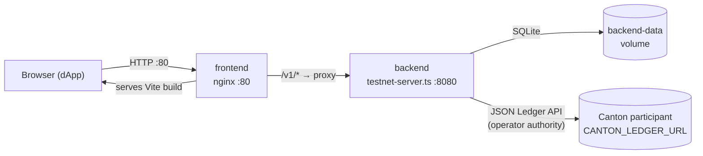

# Deployment guide

Three ways to run the reference DEX, ordered by how much Canton you bring.
**Local dev** needs no participant at all; **Docker Compose** packages the whole
edge — backend plus nginx — in front of a remote Canton participant; **direct
testnet** runs that same backend under your own process supervisor. Pick one.

Two invariants hold across all three: only the operator backend holds
`CANTON_LEDGER_TOKEN` and submits with operator authority, and it never signs as
a trader — add/remove liquidity, swaps, and order funding are authored by a
wallet. See the [wallet boundary](run-on-testnet.md#wallet-boundary).

## 1. Local dev (no Canton)

For UI work. `npm run dev` boots the backend on an
[`InMemoryLedger`](../../services/operator-backend/src/ledger/in-memory.ts) and
seeds a BTC/USDC pair, a funded pool, and a demo trader — no participant, no
token.

```bash
# backend
cd services/operator-backend
npm install
npm run dev                # in-memory ledger, listens on :8080

# frontend (separate terminal)
cd app/web
npm install
cp .env.example .env.local # VITE_API_BASE defaults to http://localhost:8080
npm run dev                # Vite dev server on :5173
```

Read paths work immediately. State-changing routes are auth-gated and return
`401` in the demo unless you set `DEX_DEV_OPEN=1`. The full local walkthrough —
write-gate flags, wallet options, and the test suites — is in
[Local Setup & Testing](../getting-started.md); this page covers the real-Canton
paths.

## 2. Docker Compose

The packaged edge, for running against a remote Canton testnet or MainNet. Two
containers come up:

- **backend** — [`Dockerfile.backend`](../../Dockerfile.backend) runs
  [`testnet-server.ts`](../../services/operator-backend/src/testnet-server.ts) on
  `:8080`, persisting the indexer DB to the `backend-data` volume.
- **frontend** — nginx on `:80` serves the Vite build and reverse-proxies
  `/v1/*` to the backend, per [`nginx.conf`](../../nginx.conf).



nginx is the only ingress. Operator-API traffic takes the path above; trader
wallet calls reach Canton directly from the browser and do not pass through the
backend.

```bash
cp services/operator-backend/.env.example .env
# Edit .env: CANTON_LEDGER_URL, CANTON_LEDGER_TOKEN, party ids, synchronizer,
# package id — see Environment variables below.

docker compose build
docker compose up -d
```

Compose reads the repo-root `.env` for **both** the backend environment and the
frontend `VITE_*` build args (baked at build time — rebuild the frontend to
change them). See [`docker-compose.yml`](../../docker-compose.yml) for the exact
wiring. Persistent state lives in the `backend-data` volume (the SQLite indexer
DB). To wipe and restart fresh:

```bash
docker compose down -v && docker compose up -d
```

## 3. Testnet deployment (no containers)

Run the same backend directly and manage the Node process yourself (systemd,
pm2, fly.io, …). Two ways in.

### Automated: `deploy-testnet.sh`

[`scripts/deploy-testnet.sh`](../../scripts/deploy-testnet.sh) drives the full
first-time sequence against a participant: build DARs → upload → allocate the
operator / lpRegistrar / admin / demo-trader parties → run the registry
bootstrap → seed a BTC/USDC pair → health-check.

```bash
export CANTON_LEDGER_URL=...
export CANTON_LEDGER_TOKEN=...
export CANTON_OPERATOR=...
export CANTON_LP_REGISTRAR=...
export CANTON_ADMIN=...
export OPERATOR_ADMIN_TOKEN=...        # for the seed step

bash scripts/deploy-testnet.sh
```

Each stage is skippable once done: `DEPLOY_SKIP_BUILD=1`, `DEPLOY_SKIP_UPLOAD=1`,
`DEPLOY_SKIP_PARTIES=1`, `DEPLOY_SKIP_SEED=1`. Party allocation is idempotent, so
re-runs are safe. The script does not start the backend — do that separately.

### Manual: run the backend

```bash
cd services/operator-backend
npm install
export CANTON_LEDGER_URL=...
export CANTON_LEDGER_TOKEN=...
# ... (see Environment variables below)
npm start                              # runs testnet-server.ts
```

The full walkthrough — smoke checks, package-hash alignment, and the PartyLayer
live probe — is in [Run on a Testnet](run-on-testnet.md).

### One-time bootstrap

Before the backend can serve trades, the registry must have the right contracts
on-ledger. `deploy-testnet.sh` runs this for you; run it standalone with
[`scripts/bootstrap-registry.ts`](../../scripts/bootstrap-registry.ts):

```bash
export CANTON_LEDGER_URL=...
export CANTON_LEDGER_TOKEN=...
export CANTON_ADMIN=...
export CANTON_LP_REGISTRAR=...
export CANTON_OPERATOR=...
node --import tsx scripts/bootstrap-registry.ts
```

The script is idempotent: running it twice is a no-op. See
[Registry Integration](registry-integration.md) for what contracts are created
and why.

Among them is a `Registry.V2` under the **lpRegistrar**. That one is not
optional: the pool's LP token is issued by this repository, and its allocation
specs name the lpRegistrar as admin, which `Registry.V2` asserts against its own.
Without it, add- and remove-liquidity cannot allocate, whatever the pool trades.

A second registry, under `CANTON_ADMIN`, is created only if you add a
`registryV2` block to
[`scripts/bootstrap-registry.json`](../../scripts/bootstrap-registry.json) (the
committed config has none). That one is for instruments a deployment mints
itself; a deployment whose users bring their own Token Standard V2 assets does
not need it.

`CANTON_ALLOC_FACTORY_CID` and `CANTON_SETTLE_FACTORY_CID` are a single-registry
stopgap — the `FixedRegistry` in
[`testnet-server.ts`](../../services/operator-backend/src/testnet-server.ts)
returns them for every admin, standing in for the per-admin registry lookup the
design calls for. Unset, they default to `PENDING_*` placeholders. In a
deployment serving foreign tokens, each admin's factory cid comes from that
admin's own registry API, not from these variables.

## Environment variables

[`services/operator-backend/.env.example`](../../services/operator-backend/.env.example)
and [`app/web/.env.example`](../../app/web/.env.example) are the canonical lists
(including the wallet-provider flags). The backend variables that matter for a
real deployment:

**Required** — the backend exits at boot if any is missing:

| Var | Purpose |
|-----|---------|
| `CANTON_LEDGER_URL` | JSON Ledger API base URL |
| `CANTON_LEDGER_TOKEN` | Bearer JWT for the participant (operator authority) |
| `CANTON_OPERATOR` | Operator party id |
| `CANTON_LP_REGISTRAR` | LP registrar party id |
| `CANTON_ADMIN` | Asset admin party id |

**Defaulted / optional:**

| Var | Default | Purpose |
|-----|---------|---------|
| `CANTON_SYNCHRONIZER` | — | Synchronizer id for command submission |
| `CANTON_DEX_PACKAGE_ID` | — | Package hash prefix for template ids |
| `CANTON_ALLOC_FACTORY_CID` | `PENDING_ALLOC_FACTORY` | `FixedRegistry` AllocationFactory cid |
| `CANTON_SETTLE_FACTORY_CID` | `PENDING_SETTLE_FACTORY` | `FixedRegistry` SettlementFactory cid |
| `CANTON_USER_ID` | `ledger-api-user` | JSON Ledger API user id |
| `CANTON_NETWORK` | `canton:devnet` | Display label for the network |
| `PORT` | `8080` | HTTP server port |
| `DB_PATH` | `./data/operator.db` | SQLite indexer DB path (`/app/data/operator.db` in the container) |
| `INDEXER_INTERVAL_MS` | `5000` | Indexer polling interval |
| `OPERATOR_ADMIN_TOKEN` | — | Bearer token for `/v1/admin/*`; unset leaves admin routes unprotected |
| `ALLOWED_ORIGINS` | — | CSV of CORS origins; unset allows all |

**Frontend build args** (baked into the static build; see
[`docker-compose.yml`](../../docker-compose.yml) `args:`): `VITE_API_BASE`,
`VITE_CANTON_NETWORK_ID`, `VITE_CANTON_LEDGER_URL`, `VITE_WC_PROJECT_ID`.

## Production checklist

- [ ] `OPERATOR_ADMIN_TOKEN` set to a strong random value
- [ ] `ALLOWED_ORIGINS` narrowed to your dApp host (not unset / `*`)
- [ ] `CANTON_DEX_PACKAGE_ID` and `CANTON_SYNCHRONIZER` pinned to the vetted values
- [ ] `CANTON_ALLOC_FACTORY_CID` / `CANTON_SETTLE_FACTORY_CID` set to real cids (not the `PENDING_*` defaults)
- [ ] Indexer DB on a persistent volume (`backend-data` under Compose; `DB_PATH=/var/lib/dex/operator.db` bare)
- [ ] Process supervisor restarts on crash (systemd / pm2 / `restart: unless-stopped`)
- [ ] TLS terminated at your ingress in front of `:80` (Compose) or `:8080` (bare)
- [ ] Backups for the indexer DB (it carries trade history and idempotency keys)
- [ ] Registry bootstrap run once per ledger
- [ ] Monitoring: scrape stdout/stderr; alert on `level: error` lines

---

**Where to read next:** [Operator Guide](operator-guide.md) · [Run on a Testnet](run-on-testnet.md) · [All docs](../README.md)
