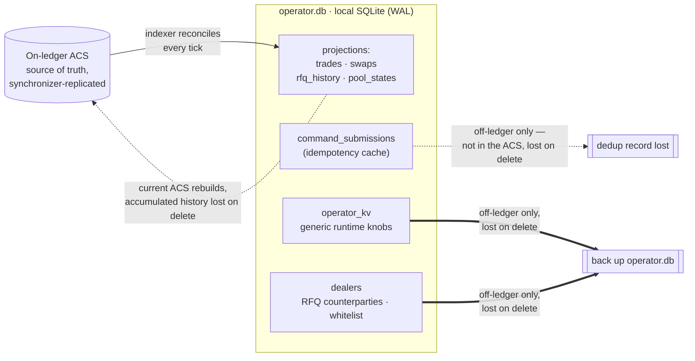

# Operator Runbook

How to deploy, observe, and recover the off-ledger operator services that run
the reference DEX. The through-line for every recovery decision below: **the
ledger is the source of truth.** Nearly every fact an operator needs to explain
a trade or rebuild a service lives on-ledger, replicated by the synchronizer;
the operator backend's own SQLite is mostly a projection over it. The
exceptions are off-ledger runtime records the ACS cannot rebuild — the
`operator_kv` runtime knobs, the `dealers` registry (which carries the dealer
whitelist), the local idempotency cache, and the accumulated polling history
(archived trades, the swap / pool-transition feed, RFQ lifecycle history) the
indexer wrote tick by tick. That property is why most recovery here is "rebuild
a cache", not "restore a database".

Specific cluster topology (cantond / participants / synchronizer config) is a
Canton operational concern, not a DEX one — see [Out of scope](#out-of-scope-for-this-document).

## Roles and party model

The reference uses four logical roles and can involve many trader, LP, and
asset-admin parties. Keeping control roles separate is the recommended
production posture; a local learning instance may intentionally share a party
where the setup guide says so.

| Party         | Owns                                                                          | Signs                                                               |
| ------------- | ----------------------------------------------------------------------------- | ------------------------------------------------------------------- |
| `operator`    | `DexPair`, `Order`, `MatchedTrade`, `SettledTrade`, `Pool`, `PoolState`, `PoolSlice`, `PoolRules`, `OrderMatchExecution` | All DEX-side market state                                          |
| `lpRegistrar` | `LPTokenPolicy`, LP registry config (reference: `InstrumentConfig`) | Mint/burn supply and LP-token policy                               |
| `admin`       | Base/quote registry config (reference: `InstrumentConfig`), `AllocationFactory`, `SettlementFactory` | Allocations, settlement batches, registry-side mint/burn/transfer |
| `trader` / `lp` | `OrderFundingRequest`, `Rfq`, and the deposit/receipt/burn allocations they author against a `LiquidityAllocationRequest` | Their own intents and allocation accepts                          |

The traffic-cost split (called out in module headers) follows the role
ownership: each role pays for the transactions it submits. The party wiring is
read from env at boot (`CANTON_OPERATOR`, `CANTON_LP_REGISTRAR`, `CANTON_ADMIN`);
see [`.env.example`](../../services/operator-backend/.env.example).

## Deployment checklist

In rough order of dependency:

1. **Allocate parties.** `operator`, `lpRegistrar`, base-asset `admin`,
   quote-asset `admin`, and any traders / LPs you want to onboard.
2. **Bring up real registries.** Run the idempotent
   [`bootstrap-registry.ts`](../../scripts/bootstrap-registry.ts) path to create
   `Registry.V2` plus each `InstrumentConfig`, or configure a conforming
   external Token Standard V2 registry. `MockAllocationFactory` and
   `MockSettlementFactory` are Daml-test fixtures only: they do not create or
   move holdings and must not be used as a deployment recipe. When asset admin
   and LP registrar differ, record both registry cids for the backend's
   per-admin factory mapping.
3. **List trading pairs.** Operator creates a `DexPair` per pair with the
   chosen `tradingMode` and `feeModel`. These fields are listing metadata in
   this revision; they do not independently gate pool/order terminal choices.
4. **Create LP infrastructure (per pool).**
   - `lpRegistrar` creates the LP token's registry-specific instrument
     definition. In the reference registry this is one `InstrumentConfig`
     per pool
   - `lpRegistrar` creates the `LPTokenPolicy` for the full
     `{ admin = lpRegistrar, id = lpInstrumentId }` instrument identity
5. **Create pools.** Operator creates the immutable `Pool`, the hot
   `PoolState` in `PS_Unfunded`, and the operator-side `PoolRules` /
   co-controlled `PoolLiquidityRules`. The first LP uses the same
   add-liquidity DvP request/allocate/settle flow as later LPs; the settle
   creates the first `PoolSlice` contracts and transitions the state to
   `PS_Active`.
6. **Open the order book / swap surface.** Once registries and holdings are
   live, pools are funded, `PoolRules` is active, and the operator's off-ledger
   routing policy allows the market, traders may submit `OrderFundingRequest`,
   liquidity adds/removes via the DvP `/request` flow, `Rfq`, etc.

The focused [`PoolWorkflowTests.daml`](../../trading-tests/CantonDex/Tests/PoolWorkflowTests.daml),
[`OrderWorkflowTests.daml`](../../trading-tests/CantonDex/Tests/OrderWorkflowTests.daml),
[`TradeWorkflowTests.daml`](../../trading-tests/CantonDex/Tests/TradeWorkflowTests.daml),
and [`ChoiceContextWorkflowTests.daml`](../../trading-tests/CantonDex/Tests/ChoiceContextWorkflowTests.daml)
walk DEX choices against mock factories, but those fixtures do not hold value.
They are not deployment validators. Use the [testnet guide](run-on-testnet.md)
for bring-up and the [Daml proof map](../reference/daml-proof-map.md) plus the
self-contained live AMM round trip for value movement.

## Operator-driven cleanup (on-ledger)

Iterated allocations put settlement authority in the executor's hands, so the
DEX application layer must constrain every permitted use. The choices below are
app-owned cleanup hooks on the ledger that an operator service can drive. None
of them fabricate state — each is a real contract choice, so
the cleanup surface is auditable in one place.

### Stale or expired orders

- `Order_Cancel` (operator-driven,
  [`Order.daml`](../../trading/CantonDex/Dex/Order.daml)): cancels the bound
  allocation via `Allocation_Cancel`, releasing the trader's locked holdings
  back to their authorizer account. It is an operator-invocable choice with no
  automatic trigger, not a wired schedule: an operator service can drive it both
  for orders past `expiry` (checked off-ledger before invoking the cancel) and
  for operator-initiated takedowns (compliance, fat-finger cancels, pair
  de-listing), but nothing runs it automatically.
- This cancel is not the trader's only custody exit. GTC order allocations are
  uncommitted and authorizer-withdrawable at any time; expiring order
  allocations become authorizer-withdrawable after their deadline. A withdraw
  may leave stale order state for the operator to clean, but settlement against
  the consumed allocation fails safely.

### Stale swaps

- A swap allocation is terminal and uncommitted. If its bound pool-state or
  slice contract becomes stale before settlement, the trader can exercise
  `Allocation_Withdraw`; the operator must not retry with altered trader legs.

### Stale RFQs and quotes

- An RFQ past `expiresAt` is inert:
  [`Rfq_Accept`](../../trading/CantonDex/Dex/Rfq.daml) asserts
  `currentTime < expiresAt`, so nothing can settle against it. The operator can
  archive an expired RFQ with `Rfq_Expire` (operator-controlled, asserts
  `currentTime >= expiresAt`) — an operator-invocable choice with no automatic
  trigger, not a wired schedule.
- Quote contracts stay until their own `expiresAt`, which is a validity bound
  and does not archive them. Only the dealer can retract its own quote, via
  `RfqQuote_Withdraw` (dealer-controlled); the operator does not withdraw dealer
  quotes.
- `Rfq_Cancel` (trader-driven): the trader retracts before any quote
  acceptance.

### Stuck matched trades

- `MatchedTrade_Cancel` (venue-driven,
  [`MatchedTrade.daml`](../../trading/CantonDex/Dex/MatchedTrade.daml)):
  archives outstanding `TradeAllocationRequest` contracts and exercises
  `Allocation_Cancel` on any allocations that have already been created. Use
  when one leg's authorizer rejects or times out before settlement.

### Pool maintenance

- `PoolRules_Pause` (operator,
  [`PoolRules.daml`](../../trading/CantonDex/Dex/PoolRules.daml)): halts new
  swaps and liquidity actions while leaving reserve allocations in place.
  Useful for upgrades and incident response.
- `PoolRules_Resume` (operator): exits Paused back to Active.
- Remove-liquidity is slice-local: the `PoolLiquidityRules_SettleRemoveLiquidity`
  settle sources a routine withdrawal from at most one boundary
  re-allocation per side. The architecture and workflows docs describe the
  invariant;
  [`PoolLiquidityRulesTests.daml`](../../trading-tests/CantonDex/Tests/PoolLiquidityRulesTests.daml)
  exercises the multi-slice boundary case (`testDvpMultiSliceRemove`).
- LP redemption requires both operator and LP registrar availability. This
  reference has no holder-only emergency redemption path; see
  [Liquidity and custody](../concepts/liquidity-and-custody.md#availability-and-the-lp-exit-boundary).

### LP supply reconciliation

- `PoolState_RecordLPSupply` (lpRegistrar,
  [`PoolState.daml`](../../trading/CantonDex/Dex/PoolState.daml)): an
  unconstrained setter for the pool's recorded LP supply (it asserts only
  `newSupply >= 0`). Do **not** call it as part of a normal mint or burn — the
  liquidity settle choices already update `totalLpSupply` atomically and assert
  it stays in lock-step with `LPTokenPolicy.totalSupply`, so a manual call after
  a settle can de-sync the two and block the next settle. Use it only as a
  drift-repair valve, with `newSupply = policy.totalSupply`.

## Observability

The contract surface deliberately puts the audit-relevant facts on-ledger so
operators do not need a parallel database to explain a trade.

| Question                                              | Where to look on-ledger                                                                                |
| ----------------------------------------------------- | ------------------------------------------------------------------------------------------------------ |
| Why did this RFQ accept go to this dealer?            | `MatchedTrade.policyReceipt`, also folded into `SettlementInfo.meta` via `dex.policy.*` keys           |
| What pool fee was executed?                           | The immutable `Pool.feeBps` used by `PoolRules`; `DexPair.feeModel` is listing metadata and is not consumed by that choice |
| Where did this pool's reserves come from?             | Each `PoolSlice` holds an `Allocation` CID (via `allocationCid`), carrying that allocation's admin, authorizer, and committed funding |
| What's the current head slice / boundary candidate?   | each active `PoolSlice` for the pool (query the ACS by `poolId`); the aggregate is `PoolState.reserves.baseAmount`/`quoteAmount`                                            |
| Did this trader's funding accept?                     | The `OrderAllocationRequest` archive event plus the corresponding `Allocation` create event           |
| Why is this `PoolRules_Swap` failing slippage?        | Call the quote endpoint before swap; the on-ledger choice re-validates against current reserves and `minOutputAmount` |
| Did this LP mint actually run?                        | `PoolLiquidityRules_SettleAddLiquidity` mints against the LP receipt allocation and records the resulting supply on `LPTokenPolicy` |

Off-ledger telemetry the operator should also collect:

- **Latency** per explicitly named workflow boundary
  (`OrderFundingRequest_Bind` → `Order_Fund`, `Rfq_Accept` →
  `MatchedTrade_Settle`, or request → settlement around `PoolRules_Swap`).
- **Failure counts** per choice, especially slippage rejections, allocation
  conservation failures, and registry choice-context rejections.
- **Slice-count distributions** per pool side, to flag when consolidation
  maintenance would help reduce the slice list's length.
- **Pending request age**: how long `OrderAllocationRequest`,
  `LiquidityAllocationRequest` and registry instruction records have been open
  without a downstream accept.

Every HTTP request carries an `X-Request-Id` (echoed back and stamped on each
log line) and emits a structured, one-JSON-object-per-line record via
[`lib/logger.ts`](../../services/operator-backend/src/lib/logger.ts) — set
`LOG_LEVEL` to tune verbosity. Errors and warnings go to stderr, everything
else to stdout.

### Indexer-backed endpoints

The operator backend ships with a polling indexer
([`indexer/index.ts`](../../services/operator-backend/src/indexer/index.ts))
that projects ledger state into a local SQLite database (`data/operator.db` by
default). These endpoints exist only when the server was started with a `db`
handle; without one they return `503 indexer disabled`.

| Endpoint | Returns |
|---|---|
| `GET /v1/trades?trader=&pair=&limit=` | Matched-trade history including archived contracts (unscoped view is admin-only) |
| `GET /v1/swaps?pair=&kind=&limit=` | Per-rotation base/quote deltas + price after; `kind` ∈ `swap` (default) / `add_liquidity` / `remove_liquidity` / `state_change` |
| `GET /v1/rfq/history?trader=&limit=` | RFQ lifecycle events (open / accepted / closed) |
| `GET /v1/price-history?pair=&hours=` · `GET /v1/stats/24h?pair=` | Price points and derived 24h volume / change from the `swaps` table |
| `GET /v1/admin/config` | Operator KV (read open by default) |
| `PUT /v1/admin/config` (Bearer auth) | Set a KV key |

A `swaps` row is not necessarily a swap: five different choices rotate a
`PoolState`. The indexer polls the ACS and never sees a choice name, so it uses
`totalLpSupply` as the discriminator (only an add or a remove moves it), in
exact scaled-integer arithmetic so an LP mint that float subtraction would
collapse to zero is never misclassified as a swap. Proven in
[`indexer-pool-kind.test.ts`](../../services/operator-backend/test/indexer-pool-kind.test.ts)
("sees an LP mint that float subtraction would lose entirely") and
[`indexer-projection-exactness.test.ts`](../../services/operator-backend/test/indexer-projection-exactness.test.ts)
(the served magnitudes are the stored strings, digit for digit).

The indexer is single-flight and tolerant of restarts. Its own header states
the guarantee:

```ts
// Crash safety: state is reconciled from current ACS on every tick,
// so a crash just means a missed poll, not a corrupt DB.
```

Set `INDEXER_INTERVAL_MS` to tune polling cadence (default 5s). Read scoping is
enforced at the route: an unfiltered `/v1/trades` or `/v1/rfq/history` sweep
names both counterparties, so it requires the admin token — proven in
[`read-exposure.test.ts`](../../services/operator-backend/test/read-exposure.test.ts)
(refuses an unscoped read without the admin token).

### Idempotency cache

Every command submission is wrapped by `IdempotentLedger`
([`indexer/idempotency.ts`](../../services/operator-backend/src/indexer/idempotency.ts)),
keyed by `commandId` and stored in:

```sql
CREATE TABLE IF NOT EXISTS command_submissions (
  commandId TEXT PRIMARY KEY,
  submittedAt INTEGER NOT NULL,
  completedAt INTEGER,
  status TEXT NOT NULL,         -- 'pending' | 'ok' | 'error'
  resultJson TEXT,
  argsHash TEXT                 -- v5: replay-detection hash of the request args
);
```

A retry with the same `commandId` returns the cached result if `status='ok'`,
rejects if it is still `pending` and younger than `PENDING_STALE_MS` (60s), and
overwrites if the row is stale-pending or `error`. Replay detection compares the
stored `argsHash`: a same-`commandId` submit carrying *different* args is a
conflict and is rejected rather than served a stale result — proven in
[`idempotency.test.ts`](../../services/operator-backend/test/idempotency.test.ts)
("rejects a replay: same commandId, different args"). Not every changed-arg
retry conflicts, though: an errored `error` row for an `exercise` is
deliberately allowed changed args, because its `commandId` derives from the
contract acted on and refusing the retry would strand that contract (a legacy
row predating the column carries `argsHash = null` and is treated as unknown, so
it proceeds). The cache survives
operator restarts and is the recommended defence against double-fire across
crash/replay boundaries. `testnet-server` sweeps rows past the 24h TTL once an
hour.

## Recovery procedures

Recovery starts from one distinction: what is authoritative versus what is a
rebuildable projection. The on-ledger ACS is authoritative and replicated by
the synchronizer. The operator backend's `operator.db` holds mostly projections
of it, with three off-ledger exceptions the ACS cannot rebuild: `operator_kv`,
a generic operator-set key-value store (fee-bps overrides, feature flags) that
is settable through the admin API but is not currently read by any runtime code
and is never written on-ledger, the `dealers` registry (RFQ counterparties and the
`whitelisted` flag, managed via `/v1/admin/dealers`), which is not an ACS
projection, and the `command_submissions` idempotency cache, whose dedup records
are local-only and lost if the file is deleted. (The RFQ policy version is a code
constant — `POLICY_VERSION = "v2.0"` — not a stored record, so it is not among
these.)



Ledger errors are classified once, in the JSON-API driver's `errorFor`
([`json-api.ts`](../../services/operator-backend/src/ledger/json-api.ts)), into
the `LedgerErrorKind` the rest of the backend reacts to. Only `contention` is
retryable:

```ts
if (lower.includes("contention") || lower.includes("inconsistent")) {
  kind = "contention";
  retryable = true;
} else if (lower.includes("authoriz") || res.status === 401 || res.status === 403) {
  kind = "authorization";
} else if (res.status === 400) {
  kind = "validation";
}
```

Every operator write runs inside `retryOnContention`
([`submit-with-retry.ts`](../../services/operator-backend/src/ledger/submit-with-retry.ts)),
which retries only that class, with exponential backoff, up to five attempts:

```ts
if (e instanceof LedgerError && e.kind === "contention") {
  await sleep(delay);
  delay = Math.min(maxDelay, Math.floor(delay * 2));
  continue;
}
throw e;
```

### Failure modes and recovery

Operational (infrastructure- and process-level) failures. For contract-choice
rejections a trader or LP hits, see [Contract-level rejections](#contract-level-rejections).

| Symptom | Likely cause | Action |
| --- | --- | --- |
| Operator backend crashed / was restarted | Process died; WAL keeps `operator.db` intact | None required. `Indexer.start()` reconciles from the current ACS on the first tick; the idempotency cache absorbs the dApp's retry-on-restart. |
| Indexer endpoints stall; logs show `[indexer] tick failed` | Participant / JSON LAPI unreachable | Transient: the tick retries next interval — no corruption. Persistent: check the participant and `CANTON_LEDGER_URL` / token. |
| Operator writes fail with a `transport` `LedgerError` | Participant or synchronizer outage | The idempotency row is marked `error`; retry from the dApp once the participant recovers. |
| A write fails with a `contention` error after retrying | Two commands raced the same input UTXO and the five backoff attempts were exhausted | Resubmit; the on-ledger choice is safe to re-run once the contending commit lands. |
| `operator.db` corrupted / unreadable | Disk fault or partial write | Delete it and restart; the next tick rebuilds the current-ACS projections only. Deletion permanently loses everything that lived only in the DB — accumulated trade/swap history, pool-transition and RFQ history — plus the off-ledger records (`operator_kv` runtime knobs, the `dealers` registry with its whitelist, and the `command_submissions` dedup cache). Restore from backup. See [Reference](#reference-multi-step-procedures). |
| `NOT_VALID_UPGRADE_PACKAGE` on DAR upload | Smart-upgrade lineage broken | Revert the incompatible change or rename the package. See [Reference](#reference-multi-step-procedures). |
| A liquidity settle aborts on its supply-sync guard | `LPTokenPolicy.totalSupply` drifted from `PoolState.totalLpSupply` | Re-run `PoolState_RecordLPSupply` with `newSupply = policy.totalSupply`. See [Reference](#reference-multi-step-procedures). |
| Trader reports a missing holding | Query-scope / observer issue — the holding exists on-ledger but is not in the party's read set | Widen the query party set or observer scope; do **not** re-mint. `Registry_Mint` is value-creating and non-idempotent (it bumps `circulatingSupply` and creates a new `Holding`), so replaying it double-mints, and the `EventLog` instance is a no-op stub with no mint-event stream to replay. |

### Reference: multi-step procedures

The table cells above are one-liners for the failures that resolve in a step or
two. These three need more.

**`operator.db` corruption — rebuild from the ledger.** SQLite runs in WAL mode
([`db.ts`](../../services/operator-backend/src/indexer/db.ts)), so an ordinary
crash leaves the file intact and nothing is needed. If the file is genuinely
corrupt, delete it and restart: the indexer reconciles the current-ACS
projections from the live ACS on the next tick. What does *not* come back is
everything that lived only in the DB. The indexer is polling-based and writes
history tick by tick as contracts pass through the ACS; the ACS holds only the
current contracts, not the sequence that produced them, so the accumulated
history is gone — archived trades past the ACS-archive cutoff, the swap /
pool-transition feed, and RFQ lifecycle history. Gone with them are the
off-ledger records in the same file: `operator_kv`, the `dealers` registry, and
the `command_submissions` dedup cache. Restore `operator.db` from backup after the rebuild (see
[Backup](#backup)). Schema migrations are append-only and
tolerant of a hand-repaired database, proven in
[`indexer-migrations.test.ts`](../../services/operator-backend/test/indexer-migrations.test.ts)
("a hand-repaired database can still advance").

**Smart-upgrade lineage break.** Symptom: `NOT_VALID_UPGRADE_PACKAGE` on DAR
upload. Either:

- Revert the offending change — add removed choices back as deprecated stubs,
  make new fields `Optional`, move new fields to the end of the record.
- Rename the package (e.g. `canton-dex-trading-v2` → `canton-dex`). All existing
  contracts from the old name remain queryable but cannot be upgraded.

See [Upgrade discipline](builder-guide.md#upgrade-discipline) for the lineage
rules and the CI gate that catches a break before upload.

**LP supply drift.** `LPTokenPolicy.totalSupply` and `PoolState.totalLpSupply`
are kept in lock-step: the DvP liquidity settles
(`PoolLiquidityRules_SettleAddLiquidity` / `_SettleRemoveLiquidity`) rewrite
both inline and assert they match on entry, so a divergence aborts the settle
rather than corrupting reserves. Recovery: query the policy supply and re-run
`PoolState_RecordLPSupply` with `newSupply = policy.totalSupply`.

## Backup

The on-ledger state is the source of truth and is replicated by the
synchronizer. Only the *current-ACS* projections in `operator.db` rebuild from
the ledger; the accumulated history the polling indexer wrote tick by tick
(archived trades, the swap / pool-transition feed, RFQ lifecycle history) and
the off-ledger records (`operator_kv` runtime knobs, the `dealers` registry of
RFQ counterparties with its `whitelisted` flag, plus the `command_submissions`
dedup cache) do not. Back up `operator.db` if you need any of that history or
those records to survive a delete-and-rebuild. At a minimum back up the
`operator_kv` and `dealers` tables, whose runtime records are not encoded
on-ledger and cannot be reconstructed from the ACS. (The RFQ policy version is a
code constant, `POLICY_VERSION = "v2.0"`, not a backed-up record.)

## Contract-level rejections

Rejections a trader, LP, or dealer hits at a contract choice — business-logic
guards, not infrastructure faults. Each surfaces to the caller as the assert
message shown; the operator's job is to route the fix, not to override the
guard.

| Symptom                                                   | Likely cause                                                                                       | Remediation                                                                                  |
| --------------------------------------------------------- | -------------------------------------------------------------------------------------------------- | -------------------------------------------------------------------------------------------- |
| `FinalizedAllocation extra leg-sides exceed funding budget` | Operator tried to settle more than the authorizer pre-committed                                | Re-quote: the swap or match math drifted from the budget. Fix off-ledger quoting state         |
| `Pool has no base slices` / `... no quote slices`         | Pool drained to empty by Remove without entering Unfunded state                                    | Inspect the slice list and reserves; if mismatched, escalate (the contract should prevent this) |
| `LP tokens below minimum`                                 | LP's `minLpTokens` slippage bound too tight                                                        | LP resubmits with a looser bound or smaller deposit                                          |
| `Output below slippage minimum`                           | Reserve drift between quote time and submit                                                        | Trader resubmits with a looser bound, or operator routes through a different pool             |
| `Head output slice cannot cover swap`                     | Head slice on the output side is smaller than `amountOut`                                          | Operator should run consolidation, or split the swap across multiple smaller swaps            |
| `Pool must be Active`                                     | Pool was Paused (planned) or Unfunded (last LP exited)                                             | If Paused: `PoolRules_Resume` after maintenance. If Unfunded: a new LP needs to complete add-liquidity request/allocate/settle |

## Single-operator dev shortcut

For local exploration, the control roles `operator` / `lpRegistrar` / `admin`
may share one party, and the in-memory dev server may use `DEX_DEV_OPEN=1` to
bypass the operator-token gate. Do not collapse a value-moving counterparty
into that party: a real registry rejects the self-transfer created when the LP
or swapper equals the operator. The portable sandbox proof therefore allocates
distinct LP/trader and swapper parties even though its three control roles
share the bootstrap party. Production should normally separate the control
roles too so audit-trail and key-management responsibilities stay decoupled,
and must set
`DEX_OPERATOR_API_TOKEN` / `OPERATOR_ADMIN_TOKEN` — both gates fail closed
otherwise, proven in
[`auth.test.ts`](../../services/operator-backend/test/auth.test.ts)
("fails closed when no token and no devOpen").

## Out of scope for this document

- Cluster topology (cantond, participants, synchronizers, sequencers)
- Backup, key custody, and HSM policy
- KMS / secrets management for the operator submission key
- Network ingress and rate limiting

These are operational concerns inherited from the underlying Canton
deployment and are not constrained by the DEX contract surface.

---

**Where to read next:** [Operator Guide](operator-guide.md) · [Deployment](deployment.md) · [All docs](../README.md)
