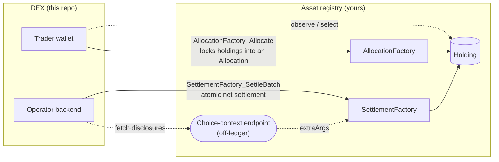

# Registry Prerequisites

What the DEX assumes from an asset registry. Token Standard V2 standardizes the
holding/allocation/settlement interfaces; it does not standardize a particular
instrument-configuration or lifecycle template. This document therefore
separates hard V2 interface requirements from the reference registry's optional
`InstrumentConfig` model in `trading/CantonDex/Registry/V2.daml`.

## The registry boundary

The DEX touches a registry through exactly four surfaces. Everything else about
your asset — issuance policy, precision, lifecycle, credential rules — stays
behind that line, and the DEX never reaches across it.



Solid arrows are on-ledger interface choices; dashed arrows are off-ledger
reads. The two choices are the whole on-ledger contract the DEX depends on:

```daml
-- AllocationInstructionV2.daml -- the trader locks funds under their own authority
nonconsuming choice AllocationFactory_Allocate : AllocationInstructionResult
  with
    settlement : SettlementInfo
    allocation : AllocationSpecification
    requestedAt : Time
    inputHoldingCids : [ContractId Holding]
    extraArgs : ExtraArgs
    actors : [Party]
  ...

-- AllocationV2.daml -- the operator settles a batch of allocations atomically
nonconsuming choice SettlementFactory_SettleBatch : SettlementFactory_SettleBatchResult
  with
    settlement : SettlementInfo
    transferLegs : [TransferLeg]
    allocations : [FinalizedAllocation]
    actors : [Party]
    extraArgs : ExtraArgs
  ...
```

The trader exercises `AllocationFactory_Allocate` under their own authority to
lock holdings into a `V2.Allocation`; the operator exercises
`SettlementFactory_SettleBatch` to move the net amounts atomically. `extraArgs`
on both choices is where the registry's [choice context](choice-context.md) —
disclosed config and credential contracts — rides along. The DEX only ever
*reads* a holding through the `V2.Holding` interface (`account`, `instrumentId`,
`amount`, `lock`); the registry alone mints, locks, splits, and merges it. For
the exact allocation-surface fields the DEX sets and reads on these choices, see
[Allocation Surface](../reference/allocation-surface.md).

## What the registry guarantees

Those surfaces rest on a small set of guarantees. For every instrument the DEX
trades, the registry must provide:

1. **A stable `InstrumentId` and admin.** The DEX keys orders, pools, RFQs, and
   matched trades by `InstrumentId`. In the reference registry this information
   lives on `InstrumentConfig`; another registry may expose it through
   metadata, discovery APIs, or disclosed config contracts.

2. **Holdings** as registry-side templates implementing the V2 holding
   interface. The DEX never mints or burns its own holdings (except LP
   tokens, which have their own `lpRegistrar`); it observes the
   registry's holdings.

3. **An allocation factory** implementing `V2.AllocationFactory` for
   the admin's instruments. The trader exercises
   `AllocationFactory_Allocate` under their own authority to lock
   their holdings into a `V2.Allocation`.

4. **A settlement factory** implementing `V2.SettlementFactory` for
   the admin's instruments. The DEX operator exercises
   `SettlementFactory_SettleBatch` to atomically settle batches of
   allocations.

## What the DEX assumes from those guarantees

| Assumption | Where it shows up |
|---|---|
| `instrumentId` is stable across the instrument's lifetime | Order, Pool, MatchedTrade, Rfq all key on it |
| Factory and choice-context discovery is admin-controlled | The operator fetches these off-ledger and flushes its registry-client cache after a registry republishes factories or disclosures |
| Allocation creation can consume one or more holdings and return change | The trader's wallet selects holdings; the registry factory validates and locks them |
| Allocation factory accepts arbitrary `AllocationSpecification` shapes (prefunded, with-legs, committed or uncommitted, with `nextIterationFunding`) | Orders require both deadline-committed and trader-withdrawable GTC shapes; pools require committed inventory |
| Settlement factory enforces transfer-leg consistency with allocations | OTC / matched-trade settlement and `PoolRules_Swap` rely on the factory to validate, not the DEX |

## Allocation lifetime caps

Registries may bound how long an allocation or instruction can live. This
matters because pool slices are long-lived committed allocations and expiring
orders may also outlive a registry's cap. An integration must discover the
registry's current limit, keep requested settlement deadlines inside it, and
rotate pool slices before they expire. The reference registry does not impose a
TTL; that does not imply another registry will accept the same lifetime.

## Registry API surface (Daml + OpenAPI)

Token Standard V2 registries are expected to expose both the Daml
interfaces and the standard OpenAPI endpoints (the specs ship alongside
each API package in `canton-network/splice` under `token-standard/`). The
reference registry implements the Daml surfaces used by this DEX; its
off-ledger integration is represented by the factory and choice-context
endpoints the backend's registry-client consumes
(see [Choice Context](choice-context.md)). A production registry should
implement the standard OpenAPI so V2-compliant wallets and apps can discover
factories and context without bespoke integration.

The DEX's own flows are exercised against a standard-shaped registry, not only
its reference one. `testMatchedTradeViaTokenStandardRegistry` in
[`TokenStandardHarnessTests.daml`](../../trading-tests/CantonDex/Tests/TokenStandardHarnessTests.daml)
drives the matched-trade flow through the upstream `RegistryApiV2`
factory-discovery path — proving the DEX composes over a standard registry, not
a bespoke one. `testRealRegistryDvpAddSettles` and `testRealRegistryDvpSwapSettles`
in [`RealRegistryDvpTests.daml`](../../trading-tests/CantonDex/Tests/RealRegistryDvpTests.daml)
settle add-liquidity and swap DvPs against a genuinely context-requiring
registry, and `testRealRegistryDvpRejectsMissingContext` proves the settle
aborts when that registry's disclosed context is dropped.

## Mint / Burn / Transfer prerequisites

The active reference registry keeps these surfaces distinct:

- `Registry_RegisterInstrument`, `Registry_Mint`, and `Registry_Burn` are
  registry-specific administration choices. Token Standard V2 does not define
  instrument registration or issuance policy.
- Peer-to-peer transfers use the standard `V2.TransferFactory` and
  `V2.TransferInstruction` interfaces implemented by `Registry.V2`.
- DEX trades do not call the mint/burn administration choices for base or quote
  assets. They consume V2 holdings through allocation and settlement choices.
- LP mint and burn are DvP legs under `lpRegistrar`, recorded by
  `LPTokenPolicy`; they do not use a parallel holding template.

## What the registry MUST enforce for iterated settlement

The DEX uses iterated settlement: the authorizer opts in by creating an
allocation with `nextIterationFunding = Some ...`, and the settlement
executor supplies concrete trade leg-sides in
`FinalizedAllocation.extraTransferLegSides` when calling
`SettlementFactory_SettleBatch`.

This pattern places funds under executor control between iterations. To
keep the executor from misusing those funds, the registry's settlement
implementation MUST enforce funding conservation **in Daml**, not in
operator code:

1. **Reject extra settlement leg-sides when the allocation was not
   iterated-enabled.** Iterated settlement is opt-in by the authorizer.
2. **Every extra leg-side must involve the authorizer** as sender or
   receiver. Legs between unrelated parties cannot be smuggled into the
   authorizer's allocation.
3. **Per-instrument net outflow from the authorizer must not exceed the
   current `nextIterationFunding[instrumentId]`.** Self-transfer legs
   (sender == receiver == authorizer) net to zero.
4. **Any next-iteration allocation produced by settlement must carry an
   updated `nextIterationFunding` reduced by the consumed amount per
   instrument.** This is the double-spend guard for follow-on iterations.
5. **The DEX operator (settlement executors) must be able to observe
   the allocation lifecycle** so each settlement iteration is visible to
   them and to anyone monitoring the operator's stream.

When these are enforced in Daml, a malicious operator attempting to
spend funds the authorizer never granted has to submit an invalid
Daml transaction, which the engine rejects regardless of operator
intent.

The reference registry
[`Registry.V2`](../../trading/CantonDex/Registry/V2.daml) enforces all five in
Daml, inside `allocation_settleImpl` and `settlementFactory_settleBatchImpl`.
[`RegistryConservationTests.daml`](../../trading-tests/CantonDex/Tests/RegistryConservationTests.daml)
proves them against that implementation:

- `testExtraLegBeyondBackingRejected` — executor-supplied extra leg-sides
  cannot draw more than the allocation's locked backing.
- `testNextFundingBeyondBackingRejected` — `sent + nextIterationFunding` is
  bounded by that backing.
- `testRollForwardCarriesLockedBacking` / `testSecondIterationCannotExceedFunding`
  — each roll-forward is backed by freshly locked holdings worth its funding, so
  a follow-on iteration can spend only what was reserved (the double-spend guard).
- `testBatchRejectsMissingAuthorization` / `testBatchRejectsSuperfluousAuthorization`
  / `testBatchRejectsUnbalancedReceiverLeg` — the batch settles every leg-side
  with exactly one allocation and balances per instrument.

The testing-only
[`MockRegistry.daml`](../../trading/CantonDex/Testing/MockRegistry.daml)
deliberately skips these checks: it tracks no holdings and exists to exercise
flows that *compose* the V2 calls, not the authorization model. Production
registries are expected to enforce at least what `Registry.V2` does.

## Choice-context retrieval the DEX needs

When the operator or trader builds a transaction that touches a registry
contract, the registry may require extra disclosed contracts or context. In the
reference registry this context is empty. External registries may return
disclosed configuration, rights, or credential contracts. The DEX
operator backend's **registry-client** module is responsible for fetching the
registry-specific context and attaching it to the choice arguments.

See [Choice Context](choice-context.md) for the exact
inputs each registry choice expects.

## Registry-specific lifecycle changes

Token Standard V2 does not standardize instrument lifecycle or force-upgrade
workflows. The DEX therefore makes no claim that holdings automatically migrate
when a registry changes an instrument. A registry integration must document
whether it preserves the same `InstrumentId`, replaces holdings, or requires a
new instrument identity.

The safe DEX behavior is deliberately small: do not persist holding contract
ids in UI state, refresh holdings before authoring an allocation, and cancel or
relist market objects when the registry says their instrument version is no
longer tradable. Any automatic upgrade-on-use or issuer-driven migration is a
custom registry feature outside this reference.

## Known limitation: one registry admin per pair

Both instruments of a pair share a single registry `admin`. `DexPair`,
`Order`, `Pool` and `MatchedTrade` each declare one `admin : Party`, and
`baseInstrumentId` / `quoteInstrumentId` are bare `Text` interpreted under it.

This follows the standard: `TransferLeg.instrumentId` is `Text`, so a leg
carries no admin of its own and one cannot be recovered from a settled trade.
`MatchedTrade_RequestAllocations` emits one `AllocationSpecification` per
authorizer under that one admin.

`MatchedTrade_Settle` does take `batchesByAdmin : Map Party SettlementBatchV2`
and is shaped for multiple admins, inherited from the upstream batching
utility. Each `SettlementBatchV2` carries its own `transferLegs`: the standard
requires a batch's allocations to cover exactly the legs the batch is handed,
so the caller partitions the trade's legs by the instrument admin of each leg
(`groupLegsByAdmin` in the operator backend). `splitLegsByAuthorizer`
splits by authorizer, not by admin, so the request path still emits one
specification per authorizer under the trade's single admin.

Pairing instruments from two different registries needs a second admin field
on those four templates and one specification per `(authorizer, admin)`. That
is a schema change, not a configuration option.

The per-admin batching this describes is load-bearing and tested:
`testMatchedTradeSettlesPerAdminLegSubsets` in
[`RealRegistryDvpTests.daml`](../../trading-tests/CantonDex/Tests/RealRegistryDvpTests.daml)
settles a trade's legs across two real registries in one transaction when they
are partitioned by admin, and proves a batch handed the full leg list — or no
legs — is rejected rather than settled.

## What the DEX does not assume

- It does not require the reference registry for base or quote assets. An
  alternative must implement the V2 holding, allocation, and settlement APIs
  used by the workflow and provide compatible factory/context discovery. The
  included LP path still uses the concrete `LPTokenPolicy` component.
- It does not assume holding precision is uniform. Each registry may expose its
  own display scale or amount constraints; the DEX treats amounts as `Decimal`
  and lets the registry enforce its own limits.
- It does not implement deployment-grade credential verification. The
  `Registry.V2` credential record is an explicit placeholder; a production
  registry must resolve and verify issuer-authorized evidence itself.

---

**Where to read next:** [Choice Context](choice-context.md) · [Allocation Surface](../reference/allocation-surface.md) · [All docs](../README.md)
