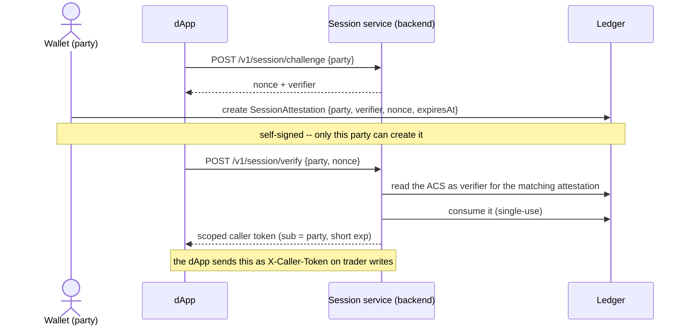

# Session service (public multi-user writes)

Every state-changing route on the operator backend is fail-closed: it needs the
venue's operator token. That is correct for an operator-run venue, but it means
a public visitor cannot swap or add liquidity as themselves — and you must never
hand the venue's long-lived operator token to ordinary traders.

The session service is the small backend-for-frontend (BFF) that closes that gap.
It lets a connected wallet prove control of its own party and receive a short,
party-scoped token that authorizes only that party's own trader-flow writes. The
operator secret stays on the server.

## Why a proof-of-control step

The connected wallets (PartyLayer, the dApp SDK) sign ledger transactions, not
arbitrary messages. So a party proves it controls its key the Canton-native way:
it self-authors a contract only it can create. That is
[`SessionAttestation`](../../trading/CantonDex/Session/Attestation.daml) — the
party is its sole signatory, and the operator is an observer so the backend can
read it. The contract carries no value and is consumed as soon as the token is
minted, so a proof is single-use.

Forging a token for a party you do not control **cannot move that party's
funds** — settlement still needs the party's own wallet to author the
allocations (CIP-0103). The proof-of-control protects the party-scoped reads and
stops a caller acting as anyone else; it is not the fund-safety boundary.

## The flow

The dApp runs this on connect, stores the token, and attaches it as
`X-Caller-Token` on the trader-flow writes. On disconnect the token is dropped.

## What the token authorizes

A valid caller token authorizes the trader-flow routes **in place of** the
operator token — swap, add/remove liquidity, and RFQ create. The backend still
enforces the per-caller binding: the route's subject party must equal the token's
`sub`, so a caller can only ever act for its own party. Operator- and
admin-authority routes (create pool, matched-trade settlement, order matching)
still require the operator or admin token. The backend performs the operator and
LP-registrar ledger steps with its own server-side credential either way.

## Configuration

The session service is enabled only when the per-caller JWT secret is set. It is
absent (routes return `501`) on a plain operator-token deployment, which keeps
that mode unchanged.

| Variable | Purpose |
| --- | --- |
| `DEX_CALLER_JWT_SECRET` | HS256 secret the caller tokens are signed and verified with. Enables the session service and the per-caller binding. |
| `DEX_CALLER_JWT_AUDIENCE` | Optional `aud` stamped on the token and required on verification, so a token minted for another service cannot be replayed here. |

The token is short-lived and covers a work session; a leaked one expires on its
own and cannot move funds. A production deployment can issue the same scoped
tokens from its own identity/session service instead of this one.
