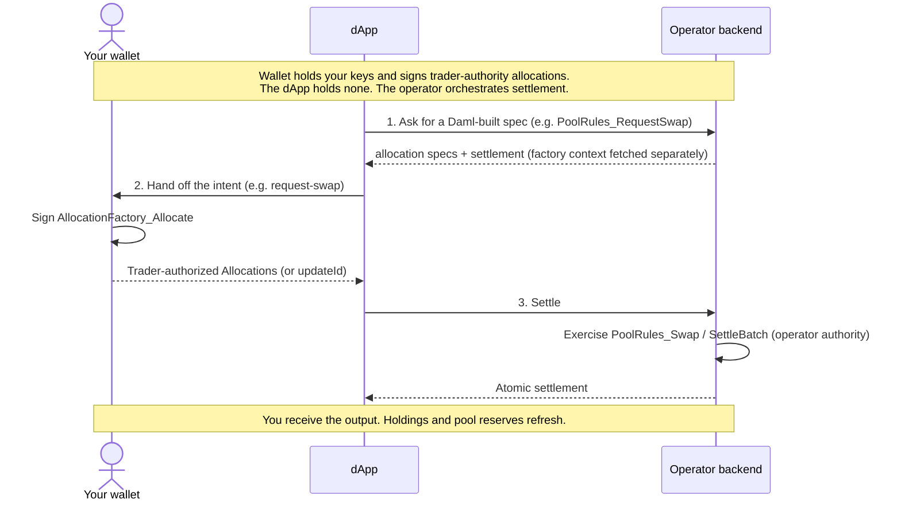

# User guide

How traders, LPs, and RFQ counterparties use the Canton DEX. Every action
below is task-oriented: connect once, then swap, provide liquidity, place an
order, or trade an RFQ block. The external-wallet authority boundary — the dApp
does not hold your key or submit with your ledger authority — is explained in
[How a trade is authorised](#how-a-trade-is-authorised).

Audience: someone who already has a Canton party id (or is willing to use the
mock wallet locally) and wants to trade.

---

## Connecting a wallet

The **Connect Wallet** button opens one combined picker. It asks each enabled
integration what it can reach — a dapp-sdk gateway, injected or announced
browser wallets, and PartyLayer's catalog — then adds any enabled
single-provider rows. Picking a row routes the connection back to the adapter
that discovered it. The dApp never connects a wallet automatically.

### External-wallet integrations

These adapters keep user authority in an external wallet. “Production-facing”
means that the architecture has the correct authority boundary; it does not
replace live validation of the particular wallet, participant, packages, and
network you deploy.

| Picker integration | Current scope | Enable with |
|---|---|---|
| **Canton wallet (dapp SDK / CIP-0103)** | Composes the Daml commands and delegates authorization and submission to a CIP-0103 wallet. The current capability table marks its update-id discovery path DvP-ready. | `VITE_ENABLE_SDK=1`; optionally set `VITE_WALLET_GATEWAY_URL` and `VITE_WALLET_GATEWAY_NAME` |
| **PartyLayer** | Opens PartyLayer's configured wallet catalog. Its update-id discovery path is implemented, but deliberately marked **unproven** until the selected wallet and deployment pass the live validator plan. | `VITE_ENABLE_PARTYLAYER=1` plus the PartyLayer variables in `.env.example` |
| **WalletConnect** | Connects an external wallet through Reown. The current adapter is marked **no DvP** and explicitly rejects LP add/remove, so enable it only for wallet/intent combinations you have validated. | `VITE_WC_PROJECT_ID` and `VITE_CANTON_NETWORK_ID` |

When more than one is enabled, the picker adds a single **recommended** badge
using the capability order: dapp SDK (DvP-ready), PartyLayer (unproven pending
live validation), then WalletConnect (currently no-DvP). That badge is only a
UI hint; the user still chooses and approves the connection. If none is
configured in a production build, no development relay is silently substituted.

### Development-only adapters

| Picker integration | What it actually proves | Required env |
|---|---|---|
| **Operator Relay (dev only)** | Uses the `token-standard` provider id, but is not a Token Standard wallet. The browser composes commands and `/v1/wallet/submit` submits them with the backend's configured ledger authority. This tests orchestration, not self-custody. | Frontend: `VITE_API_BASE`, `VITE_CANTON_DEFAULT_PARTY`. Backend: `DEX_DEV_WALLET_RELAY=1` and an exact `DEX_DEV_RELAY_PARTIES` allowlist. |
| **Mock Wallet (dev)** | Returns deterministic placeholder contract ids so the UI can be explored. It submits no ledger transaction. | none |

`CantonDirectProvider` is intentionally **not registered**. Its former path sent
a DEX intent to `/v1/wallet/execute`, but a Canton participant exposes a command
API rather than that DEX-specific endpoint. Shipping a participant bearer token
in browser storage would also be unsafe. Use the dapp SDK, PartyLayer, or
WalletConnect for external authorization; use the operator relay only for an
explicit local development exercise.

Once connected, the active party appears in the top bar and clicking the
connected pill disconnects. Reconnection and persistence belong to the chosen
external wallet/SDK; do not assume every provider stores or restores the same
session. The development relay stores only its configured demo party and ledger
user id. It never stores a participant JWT.

For a testnet or public deployment, use a submit-capable external wallet. Do not
compile participant, operator, or admin bearer credentials into the browser
bundle.

This repository does not provision a public DEX hostname, party faucet, or
browser custody service. An operator deploying it must supply the Canton
participant, parties, assets, API origin, and wallet/onboarding design. The
development-only signing relay is explained under
[Non-goals](../concepts/non-goals.md#the-development-relay-is-not-a-wallet).

---

## How a trade is authorised

Read this once and the pool/order screens follow. With an external-wallet
adapter, **the dApp holds no keys**. A DvP action is a three-step handshake: the
dApp asks the operator for a Daml-built spec, your wallet authorizes that spec
(locking the named funds), and the operator settles against it. The wallet
carries *your* authority; the operator carries *its own*. The development
operator relay does not satisfy this self-custody boundary: its backend submits
using configured ledger rights. The included operator-mediated RFQ screen uses
a separate authority flow described below.



For a swap, the specifications carry the exact input and output sides for a
specific pool snapshot — one per instrument admin, so a cross-admin pair yields
two and a same-admin pair collapses to one. The wallet signs those sides, and the
settle step re-derives the same numbers on the ledger. The operator therefore
cannot alter
the output after authorization. The exact template and choice names behind each
action are in
[Reference: what the wallet signs](#reference-what-the-wallet-signs-and-what-settles).

---

## Swap (Trade page)

Swap two assets at the pool mid-price plus fee, through the constant-product
pool. Use this when you want immediate execution at the pool's current rate.

1. Open **Trade** → pick the input + output asset.
2. Enter an amount. The output, rate, fee, price impact, and minimum received
   update live.
3. Set slippage tolerance via the ⚙ settings button (default 0.5 %).
4. Click **Review Swap** → confirm the on-ledger sequence.
5. Click **Approve & Submit**. The dApp has already asked the operator for the
   Daml-built swap allocation specs (`PoolRules_RequestSwap`) — one per
   instrument admin, so a cross-admin swap returns two; your wallet signs an
   `AllocationFactory_Allocate` for each spec, batched into a single approval
   (`BatchingUtility_ExecuteBatch`), locking only the input leg. The operator
   then settles with `PoolRules_Swap`.
6. A toast banner shows each on-ledger phase as it completes. When the final
   phase ("Pool roll-forward") goes green, your holdings and the pool reserves
   refresh automatically.

**Failure modes you might hit**:

- *"Connect wallet to swap"* → use the top-bar Connect button first.
- *"Insufficient balance"* → your unlocked holdings of the input instrument are
  below the amount entered.
- *Toast stuck at phase 2 with a red dot* → the operator rejected the swap
  (price impact > slippage, factory mismatch, etc.). Check the toast message.

---

## Add liquidity (Pools page)

Provide both sides of a pool at its current ratio and earn LP tokens that accrue
a share of swap fees.

1. Open **Pools** → click a pool → enter the base amount.
2. The quote amount auto-fills at the current pool ratio. The card shows your
   expected LP tokens and post-add pool share %.
3. Click **Add liquidity**. The operator opens the request
   (`POST /v1/pools/add-liquidity/request`), creating a
   `LiquidityAllocationRequest`.
4. Your wallet authors the base-deposit, quote-deposit, and LP-receipt
   allocations via `AllocationFactory_Allocate`.
5. The operator and lpRegistrar settle
   (`POST /v1/pools/add-liquidity/settle`,
   `PoolLiquidityRules_SettleAddLiquidity`): your funds enter the pool and LP
   tokens are minted to you, atomically.
6. Your LP balance appears under **Your LP position** once settled.

LP tokens are **unversioned**: any holder of `Amulet-USDCx-LP` holds the same
instrument regardless of when they minted. See
[LP tokens](../concepts/lp-tokens.md) for why.

---

## Remove liquidity (Pools page)

A delivery-versus-payment flow, because the LP holding lives in the registry,
not the DEX: the underlying and the LP burn move in a single atomic settlement.

1. Pool detail → scroll to **Your LP position**.
2. Use the 25 / 50 / 75 / 100 % buttons or the slider to pick how much to
   redeem. The card shows what you'll receive, with a slippage floor.
3. Click **Remove liquidity**. The toast walks three steps:
   - **Request** — the operator creates a `LiquidityAllocationRequest`
     (`POST /v1/pools/remove-liquidity/request`).
   - **Allocate** — your wallet authors the base-receipt, quote-receipt, and LP
     burn-sender allocations via `AllocationFactory_Allocate`.
   - **Settle** — `PoolLiquidityRules_SettleRemoveLiquidity` (co-signed by the
     operator and lpRegistrar) delivers base + quote to you and burns the LP
     tokens, atomically.

---

## Place an order (Orders page)

Limit orders for traders who want execution at a chosen price, not the pool mid.
Collateral is locked up front in a prefunded `Order` allocation.

1. Open **Orders** → pick BUY or SELL.
2. Set the limit price and amount. Orders are placed with no expiry.
3. Click **Place order**. This takes **two wallet approvals**: the first creates
   the order's funding request (`OrderFundingRequest`), which the operator binds
   into a live `Order`; the second locks the collateral that funds it.
4. The toast walks four phases: **Submitted → Bound → Funded → Open** (in book).
5. Your open orders appear under **My open orders**. Click ✕ to cancel; cancel
   releases the funding allocation back to available balance.

If the second approval fails, the order is *bound but unfunded* — the dApp names
the stuck order and best-effort cancels it, so no collateral is stranded.

The order book on the left shows depth aggregated across all parties (but not
which counterparty holds which order). Status colours: green = funded,
amber = partially filled.

---

## Trade an RFQ block (RFQ page)

Bilateral block trades. You publish a request, whitelisted dealers quote, and
you accept one. Acceptance creates a `MatchedTrade` and policy receipt; token
funding and settlement are separate steps.

This screen's writes use the explicitly custodial hosted-RFQ mode, not the
connected wallet. Production builds disable its New / Accept / Cancel controls
unless `VITE_ENABLE_HOSTED_RFQ=1`; the backend independently requires
`DEX_HOSTED_RFQ_RELAY=1` and `DEX_CALLER_JWT_SECRET`. Enable both only for a
deployment that deliberately provisions trader `actAs` rights and issues a
short-lived caller JWT bound to the connected party. Reads remain usable while
writes are disabled.

1. Open **RFQ** → click **+ New RFQ**.
2. Pick pair, side, size, and validity window. Select dealers from the whitelist
   on the right.
3. Send. The included operator-mediated screen creates the RFQ. A dealer
   integration must observe that contract and create `RfqQuote` contracts;
   this reference does not include a dealer quote-entry screen. Visible quotes
   stream into the expanded row.
4. Keep the default **Operator policy** ranking, or re-sort with the Best price /
   Earliest / Trusted only buttons. Under policy `v2.0` the ranking chain is
   **trusted tier first → later expiry first → earlier posting time first →
   dealer id** as the tiebreaker — price is *not* part of the policy chain; you
   choose from the policy-ranked candidates. The policy modal shows the exact
   ranking that was applied.
5. Click **Accept** on the dealer you want. In this reference flow, the backend
   submits `Rfq_Accept` with its configured trader and operator authorities; a
   `PolicyReceipt` records the ranking applied. This is not a self-custodial
   wallet approval flow.
6. The accepted trade appears in the RFQ page's **Accepted** tab. Open its
   receipt to see the policy version, the selected quote's rank, and how many
   quotes were considered.

Accepted RFQs move to the **Accepted** tab; those that expire with no acceptance
(or no quotes) move to **Expired**. Acceptance itself does not move balances — it
creates the `MatchedTrade`. Once the accept returns, the screen drives that
trade's settlement (`POST /v1/matched-trades/settle`), and the Accepted tab shows
a per-row settlement status (Settling → Settled, or an error). Settlement funds
the connected party's own side: the screen finds this party's
`TradeAllocationRequest`, selects its input holdings, and hands it to the wallet
(`fund-matched-trade`), which accepts the request and authors this party's
allocations self-custodially. The operator then settles the per-admin batches.
The wallet accept archives this party's request, so no request cid is consumed at
settle.

The screen completes only the case where the connected party is the **sole
non-venue funder** — it authors every allocation the trade needs and no separate
counterparty request exists. That case can be cross-admin: a single request whose
sender leg the party locks on one registry while it merely receives on the other
settles in one pass (the frontend covers exactly this cross-admin, single-request
path). What decides completion is whether a second party's `TradeAllocationRequest`
is outstanding, not how many admins the pair spans — so this is **not** a
"single-admin only" limitation.

A genuine two-party RFQ (the operator returns both parties' requests) is not
supported end-to-end from the dApp: each session can author only its own side, and
no path aggregates both parties' allocations into one settlement. Note the order of
operations — the screen funds this party's side **first** (the wallet authors and
locks its allocations) and only **then** discovers the counterparty is unfunded and
aborts. The trader's allocations are already created and locked at that point, and
the dApp offers no button to release them — but the funds are recoverable two ways.
The holder can withdraw their own allocations out-of-band (an `Allocation_Withdraw`
as the allocation's authorizer, via their wallet or a direct ledger client;
permitted because these allocations are uncommitted and carry a settlement
deadline). Or the venue can release them: `MatchedTrade_Cancel` (controller: the
venue) exercises `Allocation_Cancel` on each locked allocation — and since the
venue is the trade's sole settlement executor, and cancellation is the executor's
choice, the operator backend exposes exactly this as `POST /v1/matched-trades/cancel`.
The only real gap is that the screen surfaces neither action.

---

## Portfolio (Portfolio page)

A snapshot of everything visible to your party:

- **Holdings** — every instrument you hold, with available / locked. Locked =
  currently backing an open order, swap, or RFQ allocation.
- **LP positions** — shown separately with pool-share % and underlying value.
- **Allocation breakdown** — funded orders currently locking your holdings,
  identified by allocation.
- **Activity** — pool-wide settled swap activity from the operator indexer. The
  current page does not yet combine order, RFQ, and LP history into this feed.

---

## Reference: what the wallet signs, and what settles

The allocation-backed actions use the handshake from
[How a trade is authorised](#how-a-trade-is-authorised): the operator builds a
spec, your wallet authors it, and the operator settles. The wallet provider knows
the disclosed factory CIDs, the package hash, and the holding CIDs to lock; the
dApp passes only the intent verb.

| UI action | Wallet intent | On-ledger result |
|---|---|---|
| Swap | `request-swap` | Terminal `Allocation` with exact input and output sides, then [`PoolRules_Swap`](../../trading/CantonDex/Dex/PoolRules.daml) |
| Add liquidity | `add-liquidity` | Base-deposit + quote-deposit + LP-receipt `Allocation`s, settled by [`PoolLiquidityRules_SettleAddLiquidity`](../../trading/CantonDex/Dex/PoolLiquidityRules.daml) |
| Remove liquidity | `remove-liquidity` | Base-receipt + quote-receipt + LP burn-sender `Allocation`s, settled by [`PoolLiquidityRules_SettleRemoveLiquidity`](../../trading/CantonDex/Dex/PoolLiquidityRules.daml) |
| Place order | `place-order` + `fund-order` | [`OrderFundingRequest`](../../trading/CantonDex/Dex/OrderFundingRequest.daml) → funded [`Order`](../../trading/CantonDex/Dex/Order.daml) |

RFQ create, cancel, and accept are not wallet intents in this app. The
operator-mediated RFQ page calls the operator API, whose ledger user must be
authorized for the configured parties involved. This is an implementation
example, not a public relay service supplied by the repository.

The split that makes the "operator can't rewrite your price" guarantee is one
pair of choices: the request choice builds a spec and creates nothing, and the
settle choice consumes the wallet-authored allocation directly. From
[`PoolRules.daml`](../../trading/CantonDex/Dex/PoolRules.daml):

```daml
nonconsuming choice PoolRules_RequestSwap : PoolRules_RequestSwapResult
  with
    poolCid : ContractId Pool
    swapper : Party
    inputInstrumentId : V2.InstrumentId
    inputAmount : Decimal
    quoteBinding : Optional SwapQuoteBinding
  ...
nonconsuming choice PoolRules_Swap : PoolRules_SwapResult
  ...
```

Every allocation-backed action authors its holdings through one command: a
single `BatchingUtility_ExecuteBatch` exercise that accepts the operator's
request and authors each allocation the request named, in one atomic Daml
transaction. Holdings are threaded through the utility's holding map, and the
registry locks only what each allocation needs, returning the rest as change
([`commands.ts`](../../app/web/src/wallet/commands.ts)):

```ts
choice: "BatchingUtility_ExecuteBatch",
choiceArgument: {
  inputHoldingMap,
  actions: [
    { tag: "TSA_AllocationRequest_AcceptV2", value: { cid: requestCid, arg: { actors: [party], extraArgs } } },
    { tag: "TSA_AllocationFactory_AllocateV2", value: { cid: factoryCid, arg: { settlement, allocation: spec, requestedAt, inputHoldingCids: [], actors: [party], extraArgs } } },
    // ...one AllocateV2 action per allocation the request names
  ],
  archiveAfterExecution: true,
},
```

The number of allocations a request names depends on the flow: a swap or order
funding authors one per instrument admin (one for a single-admin pair, two across
a cross-admin pair), while add and remove liquidity author three — a base leg, a
quote leg, and the LP-token leg (base/quote deposits plus the minted LP receipt
for add; base/quote receipts plus the LP burn-sender for remove). The utility
keeps the wallet approval to one top-level command while preserving one atomic
Daml transaction.

**Proven on-ledger** (each line links the choice and the test that pins it):

- A swap re-derives its output from live reserves inside `PoolRules_Swap`, and
  the pool's recorded reserves always equal the real slices —
  [`PoolStateInvariantTests.daml`](../../trading-tests/CantonDex/Tests/PoolStateInvariantTests.daml).
- Add / remove liquidity move funds and mint / burn LP tokens in one atomic,
  co-controlled (operator + lpRegistrar) settlement —
  [`PoolLiquidityRulesTests.daml`](../../trading-tests/CantonDex/Tests/PoolLiquidityRulesTests.daml).
- The RFQ settlement workflow moves each side's real funds after both parties
  author allocations —
  [`RfqSettlementTests.daml`](../../trading-tests/CantonDex/Tests/RfqSettlementTests.daml).
- The `PolicyReceipt` records the ranking honestly, and a trade signed by anyone
  but the venue is rejected —
  [`PolicyReceiptTests.daml`](../../trading-tests/CantonDex/Tests/PolicyReceiptTests.daml).

For how each of the four price surfaces is set and signed, see
[Pricing and price sources](../concepts/pricing.md).

---

**Where to read next:** [Getting Started](../getting-started.md) · [Overview](../concepts/overview.md) · [Pricing](../concepts/pricing.md) · [All docs](../README.md)
