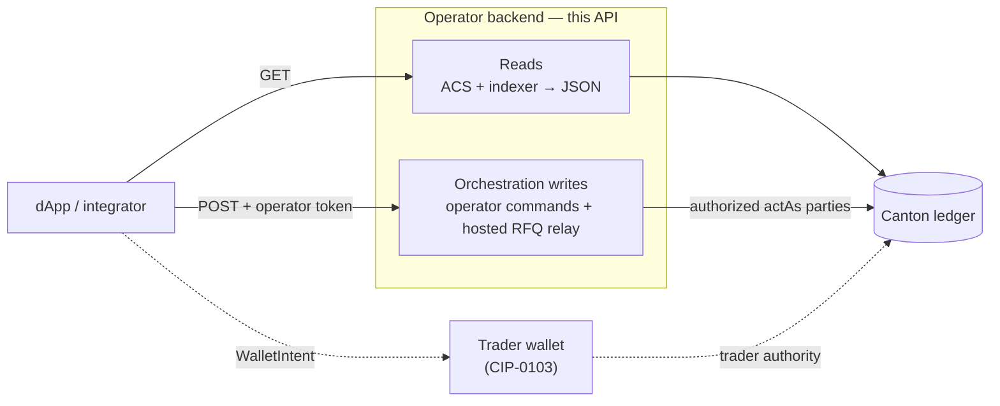

# Operator backend HTTP API

The operator backend exposes a small REST surface over its view of the ledger.
It does exactly two kinds of work, and the split is the thing to understand
before reading the endpoint tables:

1. **Operator-observed reads.** The operator's active-contract-set view and its
   indexer, projected into JSON the dApp renders — pairs, pools, order books,
   a party's holdings, trade and swap history. Reads never move value and, with
   two scoping exceptions below, need no authorization.
2. **Orchestration writes.** Administrative and settlement commands the
   operator is authorized to submit, plus explicitly documented hosted-party
   RFQ relay routes. These are gated by a bearer token.

Order funding, holding allocation, swaps, and LP actions preserve a
self-custodial boundary: a trader wallet authors the allocation and this API
only requests or settles it. The RFQ endpoints are the exception. They submit
as hosted trader parties, and RFQ acceptance also submits as the operator, so
the backend ledger user must hold those act-as rights. Do not expose those
routes as a self-custodial production API without replacing that authority
model.



A DvP flow crosses both lanes: the operator `POST …/request` returns an
allocation spec, the **wallet** authors the allocations that lock the trader's
funds, and the operator `POST …/settle` invokes the atomic value transfer. The
wallet-authored lock is the step the backend cannot perform for a self-custodial
trader.

## Conventions

- **Base URL.** Served on the configured port (default `8080`); examples use
  `http://localhost:8080`.
- **Versioning.** Every route is under `/v1`.
- **JSON everywhere.** Amounts are Daml `Decimal` **strings** at scale 10, never
  JSON numbers — the API never round-trips a value through a float. (Derived
  ratios that are not amounts — a 24h price change — are the one exception, and
  are documented as such.)
- **Request id.** Every response carries `X-Request-Id`, echoed from the request
  if supplied, otherwise generated.
- **Body limit.** POST bodies over 1 MiB are rejected with **413**.
- **CORS.** Default-deny: no `Access-Control-Allow-Origin` is emitted unless the
  request origin is on the `ALLOWED_ORIGINS` allowlist.

The error envelope:

```json
{
  "error": "human-readable message",
  "code": "machine-readable code",
  "details": { "...optional context": "..." },
  "requestId": "uuid"
}
```

A handful of store-gated routes (see
[indexer-backed reads](#reads--history-stats-indexer-backed)) answer with a bare
`{ "error": "…" }` and **503** when their backing store is absent, rather than
the full envelope.

## Authorization

Three fail-closed gates, applied in this order:

| Gate | Applies to | Requirement |
|---|---|---|
| **Admin token** | `/v1/admin/*` writes | `Authorization: Bearer $OPERATOR_ADMIN_TOKEN` |
| **Operator token** | every other state-changing route (pool swap/LP, order, RFQ, matched-trade, wallet relay) | `Authorization: Bearer $DEX_OPERATOR_API_TOKEN` |
| **Per-caller binding** *(optional)* | trader-subject writes | `X-Caller-Token` JWT whose `sub` is the caller's own party |

Reads are open, except the *unfiltered* forms of `/v1/trades`, `/v1/rfq`, and
`/v1/rfq/history`, whose rows name both parties and so require the admin token.
On the in-memory dev server, `DEX_DEV_OPEN=1` opens the operator-write gate
without a token; see
[Local Setup → Exercising write paths](../getting-started.md#exercising-write-paths-in-demo-mode).

When the operator token is unset and the dev bypass is off, an operator write
returns **401**. When per-caller binding is configured
(`callerJwtSecret`), a write whose subject party is not the caller's own — or
that carries no valid `X-Caller-Token` — returns **403**. Binding is off by
default (a single trusted backend); turn it on when the backend fronts
mutually-distrusting callers.

---

## Read endpoints

Auth is **open** for every read below unless the row says otherwise.

### Reads — context and market

| Method · Path | Purpose |
|---|---|
| `GET /v1/context` | Static parties and factory CIDs the dApp needs to build wallet intents |
| `GET /v1/status` | Network id, ledger slot (offset), sync flag, server time |
| `GET /v1/pairs` | All `DexPair` contracts (whether or not they have a pool) |
| `GET /v1/pools` | All active pools |
| `GET /v1/instruments` | Instrument metadata, merged from the registry configs; `?ids=BTC,USDC` filters |
| `GET /v1/prices?pairs=` | Advisory pool mid-prices for fiat display |

`GET /v1/context` returns the `DexContext` — the operator holds the knowledge of
which admin governs which instrument and which factory to allocate against, so
it surfaces it here rather than making the dApp guess:

```json
{
  "operator": "...", "lpRegistrar": "...", "admin": "...",
  "allocationFactoryCid": "...", "settlementFactoryCid": "...",
  "allocationFactoryExtraArgs": { "context": { "values": {} }, "meta": { "values": {} } },
  "allocationFactoryDisclosure": [ /* DisclosedContract[] for the wallet */ ],
  "network": "canton:devnet"
}
```

`GET /v1/status` reports `slot` as the participant's latest offset (polled every
2s, with a local counter fallback so the UI's liveness pill keeps moving if the
poll fails):

```json
{ "network": "canton:devnet", "slot": 1234567, "synced": true, "serverTime": "2026-05-17T..." }
```

`GET /v1/instruments` merges `decimals` from Registry.V2 `InstrumentConfig` with
`decimals`/`isin`/`cusip` from the reference registry's `InstrumentConfig`, keyed by
`instrumentId`, then unions in the instruments referenced by active pools so the
list is populated even before any config is registered. Both config templates
are `signatory admin`, so the endpoint reads as `admin` and `lpRegistrar`, not
as the operator. Metadata therefore exists only for instruments issued by a
registry this deployment hosts; a foreign registry's instrument reports `null`
fields until `registry-client` implements the standard's off-ledger
`metadata-v1` API.

```json
[ { "instrumentId": "BTC", "symbol": "BTC", "decimals": 8, "isin": null, "cusip": null, "description": null } ]
```

### Reads — order book

| Method · Path | Purpose |
|---|---|
| `GET /v1/orders?trader=` | Open orders for one trader (**400** without `?trader=`) |
| `GET /v1/orders/book?pair=BASE/QUOTE` | Resting bids and asks for one market |
| `GET /v1/orders/matches?pair=BASE/QUOTE` | Crossable pairs — a read-only preview |

Both pair-scoped reads also accept `?base=&quote=`, and return **400** if
neither form resolves. `/v1/orders/matches` projects each cross down to its
terms — `price`, `quantity`, `buyOrderCid`, `sellOrderCid`. The `Order`
contracts themselves name their traders and allocations and are not served here;
the operator route that *acts* on a match
([`POST /v1/orders/match`](#order-lifecycle)) sits behind the operator token.

### Reads — account

| Method · Path | Purpose |
|---|---|
| `GET /v1/holdings?owner=` | Per-contract (UTXO-style) holding rows (**400** without `?owner=`) |
| `GET /v1/balances?owner=` | The holding rows summed per instrument, `available` vs `locked` |

`/v1/balances` saves every client re-deriving a balance from the UTXO-style
rows. `locked` is the portion committed to open orders, swaps, or allocations;
the split is exact decimal math:

```json
[
  { "instrumentId": "BTC",  "total": "0.2500000000", "available": "0.2500000000", "locked": "0.0000000000" },
  { "instrumentId": "USDC", "total": "5000.0000000000", "available": "5000.0000000000", "locked": "0.0000000000" }
]
```

### Reads — history, stats, indexer-backed

These read the SQLite indexer and return **503** when the server was started
without a `db` handle.

| Method · Path | Purpose | Auth |
|---|---|---|
| `GET /v1/trades?trader=&pair=&limit=` | accepted RFQ `MatchedTrade`s + the `SettledTrade` each order-book fill writes | open / **admin** unfiltered |
| `GET /v1/swaps?pair=&kind=&limit=` | Pool history; `kind` ∈ `swap`,`add_liquidity`,`remove_liquidity`,`state_change` (default `swap`) | open |
| `GET /v1/rfq/history?trader=&limit=` | RFQ lifecycle rows, including accepted quotes (trader, pair, winning dealer, rank) | open / **admin** unfiltered |
| `GET /v1/price-history?pair=&hours=` | Price points from the swaps feed (`hours` 1–720, default 24) | open |
| `GET /v1/stats/24h?pair=` | 24h price change, volume, swap count | open |
| `GET /v1/dealers` | Dealer registry — public list | open |

`/v1/trades` matches `?trader=` on either side: a party is `trader` on the
trades it initiated and `counterparty` on those it was matched into. `dealer` is
a role, set only where a signed policy receipt names one, so it is `null` on
order-book fills. On `/v1/swaps`, `inputAmount`/`outputAmount` are derived
textually from the signed reserve deltas the indexer stores — a positive
`baseDelta` means the pool gained base, i.e. the swapper sent base and received
quote — so the stored scale survives. `/v1/stats/24h`'s `priceChange24h` is the
one genuinely float-valued field on the API: it is a ratio, not an amount.

### Reads — RFQ

| Method · Path | Purpose | Auth |
|---|---|---|
| `GET /v1/rfq?owner=` | RFQs and quotes scoped to one party | open / **admin** unfiltered |

A trader sees the RFQs they raised or were whitelisted for; a dealer sees the
quotes they posted or received. The operator observes *every* RFQ and quote — who
is asking, on what, in what size, and the price each dealer answered — so the
unscoped sweep is admin-only:

```json
{ "rfqs": [ /* Rfq[] */ ], "quotes": [ /* RfqQuote[] */ ] }
```

The `Pool`, `DexPair`, `Order`, `Holding`, `Balance`, and `Instrument` shapes are
defined in
[`services/operator-backend/src/types.ts`](../../services/operator-backend/src/types.ts).

---

## Quote

| Method · Path | Purpose | Auth |
|---|---|---|
| `POST /v1/swaps/quote` | Exact off-ledger swap quote | open |

A quote is advisory — the on-ledger `PoolRules_Swap` choice re-derives the output
from the current reserves and settles against that value, so the operator cannot
quote one number and settle another. Because the endpoint runs the *same*
function off-ledger, preview and settlement agree to the last digit (see
[Pricing](../concepts/pricing.md)). Supply `poolCid`; `poolId` is also accepted
and resolves either the ContractId or the logical id (e.g. `"BTC-USDC"`).

```json
// request
{ "poolCid": "#2:0", "inputInstrumentId": "BTC", "inputAmount": "0.5" }
// response — the output plus the fields a client would otherwise recompute
{
  "outputAmount": "9496.5947516312",
  "inputInstrumentId": "BTC", "outputInstrumentId": "USDC",
  "feeBps": 30,
  "feeAmount": "0.0015000000",     // fee applied to the input
  "executionPrice": "18993.18...", // output per unit input
  "spotPrice": "20000.00...",      // pre-trade reserve mid
  "priceImpact": "0.0503...",      // (spot − execution) / spot
  "poolCid": "#2:0", "poolId": "BTC-USDC"
}
```

---

## Write endpoints

All writes below return **400** for malformed JSON or a missing/invalid field
(amounts must be `Decimal` strings, parties canonical `hint::fingerprint`, cids
non-empty), **413** over 1 MiB, and require the **operator** token unless noted.
Field-level specs live in
[`services/operator-backend/src/http/validate.ts`](../../services/operator-backend/src/http/validate.ts).

### The two-call DvP pattern

Every pool swap and LP move is a delivery-versus-payment settlement, and the
operator holds only one side of it. So each runs as two operator calls around one
wallet step:

1. **`POST …/request`** — the operator opens the flow (for LP, by creating a
   `LiquidityAllocationRequest`) and returns the allocation specs, factories,
   choice contexts, and disclosures the wallet needs, alongside a quote.
2. The trader's **wallet** authors the allocations via
   `AllocationFactory_Allocate`, locking the trader's funds under the trader's own
   authority.
3. **`POST …/settle`** (or `POST /v1/pools/swap` for a swap) — the operator, and
   the `lpRegistrar` on LP moves, exercises the settle choice: funds enter or
   leave the pool and LP tokens mint or burn, atomically.

If a wallet returns only an `updateId` (no created-event tree),
`POST /v1/pools/recover-dvp-allocations` recovers the created allocation cids
from the transaction tree so the settle can still be assembled.

### Pool — swap and liquidity

| Method · Path | Purpose |
|---|---|
| `POST /v1/pools/swap/request` | Open a swap; returns the allocation spec + choice context |
| `POST /v1/pools/swap` | Settle with the wallet-created allocation (`PoolRules_Swap`) |
| `POST /v1/pools/add-liquidity/request` | Open add-LP; create `LiquidityAllocationRequest`, return quote + specs |
| `POST /v1/pools/add-liquidity/settle` | `PoolLiquidityRules_SettleAddLiquidity` (operator + lpRegistrar) |
| `POST /v1/pools/remove-liquidity/request` | Open remove-LP |
| `POST /v1/pools/remove-liquidity/settle` | `PoolLiquidityRules_SettleRemoveLiquidity` (operator + lpRegistrar) |
| `POST /v1/pools/recover-dvp-allocations` | Recover created allocation cids from an `updateId`-only receipt |

**An add off the reserve ratio is only partly taken.** LP tokens are minted
against whichever leg is short relative to the pool's ratio
(`min((base·S)/rb, (quote·S)/rq)`), and only the matching part of the other leg
enters the reserves. The `add-liquidity/request` response reports both parts, so
the receipt reflects what actually settled rather than what was asked:

```json
{
  "requestCid": "...",
  "lpAmount": "29.6531048680",
  "matchedBaseAmount": "0.1000000000",  "matchedQuoteAmount": "8847.7436669408",
  "refundedBaseAmount": "0.0000000000", "refundedQuoteAmount": "1152.2563330592",
  "offRatioBps": "1152.2563330592",
  "knownTotalLpSupply": "1581.0163443902",
  "baseAmount": "0.1", "quoteAmount": "10000.0"
}
```

`matchedBaseAmount`/`matchedQuoteAmount` are the parts the minted LP tokens
represent and that reach the pool; `refundedBaseAmount`/`refundedQuoteAmount` are
the remainder, which `PoolLiquidityRules_SettleAddLiquidity` returns to the
depositor in the same transaction. At the reserve ratio both remainders are
zero, and the first deposit into an unfunded pool sets the ratio.

The optional `maxOffRatioBps` (`0`..`10000`) refuses the request with **400**
when `offRatioBps` exceeds it, before any contract is created — use it when a
partly-filled add is not what you want. Decimal rounding alone can leave a
sub-bps remainder on an otherwise on-ratio deposit, so `0` is stricter than it
looks; `1` is the usual "on ratio" check.

### Order lifecycle

| Method · Path | Purpose |
|---|---|
| `POST /v1/orders/bind` | Bind a funded order to a settlement ref (full-tree or `updateId` recovery) |
| `POST /v1/orders/fund` | Fund a bound order |
| `POST /v1/orders/:cid/cancel` | Cancel an open order (**204**) |
| `POST /v1/orders/match` | Discover crossing orders and settle each atomically |

`POST /v1/orders/match` catches per match so one bad pair cannot stop the rest,
and reports the outcome in its status: **200** when all settled, **207** when
some failed, **502** when every one did.

```json
{ "matches": [ /* per-match results */ ], "settled": 3, "failed": 0 }
```

### Matched-trade (OTC) settlement

| Method · Path | Purpose |
|---|---|
| `POST /v1/matched-trades/request-allocations` | `MatchedTrade_RequestAllocations` |
| `POST /v1/matched-trades/settle` | `MatchedTrade_Settle` — one allocation batch per admin |
| `POST /v1/matched-trades/cancel` | `MatchedTrade_Cancel` — release allocations |

`settle` and `cancel` carry a `batchesByAdmin` / `allocationsByAdmin` object
keyed by admin party; each admin's batch must cover exactly its own legs, or the
request is rejected with **400** before it reaches the ledger.

### RFQ

| Method · Path | Purpose |
|---|---|
| `POST /v1/rfq` | Create an RFQ on a trader's behalf |
| `POST /v1/rfq/:cid/cancel` | Cancel an open RFQ (**204**) |
| `POST /v1/rfq/accept` | Operator + trader co-sign the accept → `{ tradeCid, receipt }` |

```json
// POST /v1/rfq
{ "trader": "...", "rfqId": "...", "pair": "BTC/USDC", "side": "RFQ_Buy",
  "size": "0.5", "expiresAt": "2026-...", "whitelist": [], "createdAt": "..." }
```

`cancel` and `accept` act as the *fetched* RFQ's `trader`, which a body-field
binding cannot reach. With per-caller binding on, both resolve the caller from
the `X-Caller-Token` and reject a mismatch (**403**), so an operator-token holder
cannot cancel or accept on another trader's behalf.

### Admin

The admin routes require the **admin** token, except the config *read*, which is
open. The dealer routes additionally require the indexer (**503** without it).

| Method · Path | Purpose |
|---|---|
| `POST /v1/admin/pairs` | Create a `DexPair` → `{ pairCid }` |
| `POST /v1/admin/pairs/:cid/fee-model` | Update the pair's fee model |
| `POST /v1/admin/pairs/:cid/active` | Activate / deactivate a pair |
| `POST /v1/admin/pairs/:cid/trading-mode` | Set the pair's trading mode |
| `POST /v1/admin/pools` | Create a pool → `{ poolCid }` |
| `GET /v1/admin/config` | Dump operator config (open read) |
| `PUT /v1/admin/config` | Set a key `{ key, value }` |
| `DELETE /v1/admin/config/:key` | Delete a key |
| `PUT /v1/admin/dealers` | Upsert a dealer |
| `DELETE /v1/admin/dealers/:party` | Remove a dealer |

The pass-through bodies for the pair/pool routes are the service inputs in
[`services/operator-backend/src/admin/index.ts`](../../services/operator-backend/src/admin/index.ts).

### Wallet relay — dev only

| Method · Path | Purpose | Auth |
|---|---|---|
| `POST /v1/wallet/submit` | Forward shaped ledger commands under the operator JWT | operator + flag |

Off by default: it returns **404** unless `DEX_DEV_WALLET_RELAY=1`. When on, the
forwarded `actAs` parties must be on the `DEX_DEV_RELAY_PARTIES` allowlist (else
**403**), the `commands` array and `commandId` are shape-checked, and the relay
follows the committed transaction tree to return the created allocation cids the
DvP settle path needs. It is a convenience for the walletless demo, not a
production authority path.

---

## Wallet intent shapes

For self-custodial allocation writes, the frontend hands an intent to the active
`WalletProvider` rather than calling the ledger. Shapes are in
[`app/web/src/wallet/types.ts`](../../app/web/src/wallet/types.ts):

| Intent | When |
|---|---|
| `FundOrderIntent` | Trader locks holdings for a pending order |
| `PlaceOrderIntent` | Trader places a new order |
| `RequestSwapIntent` | Trader initiates a pool swap |
| `AddLiquidityIntent` | Trader authors the base / quote / LP-receipt allocations for an add |
| `RemoveLiquidityIntent` | Trader authors the base / quote-receipt and LP burn-sender allocations for a remove |
The wallet also exposes `SplitHoldingIntent` / `MergeHoldingsIntent` for holding
management; those are a wallet concern and have no operator endpoint.

---

## Status and error codes

| `code` | HTTP | Meaning |
|---|---|---|
| `bad_request` | 400 | malformed JSON, missing field, invalid amount / party / cid |
| `unauthorized` | 401 | missing or invalid operator / admin token |
| `forbidden` | 403 | per-caller party mismatch, or wallet-relay `actAs` not allowlisted |
| `not_found` | 404 | route or resource not found (also the disabled wallet relay) |
| `payload_too_large` | 413 | body > 1 MiB |
| `not_supported` | 501 | a demo-mode limitation surfaced cleanly, not a server fault |
| `internal_error` | 500 | unexpected server error |

Beyond the enveloped codes, `POST /v1/orders/match` returns **207** / **502** for
partial / total settlement failure, the wallet relay returns **502**
(`tree_fetch_failed`) when a committed transaction's tree cannot be fetched, and
indexer- or config-gated routes return a bare-`{ error }` **503** when their
store is absent.

### On-ledger assertions

The codes above wrap the backend's own validation. A write can also fail inside
the Daml settlement, where the ledger returns the choice's assertion message.
The most common ones and how a client should handle them:

| On-ledger assertion | Triggering condition | Suggested handling |
|---|---|---|
| `Output below slippage minimum` | the pool price moved against the taker between quote and settle, below the swap's `minOutputAmount` | re-quote and retry, or widen slippage tolerance |
| `expectedPoolId mismatch (pool config swapped?)` | the referenced pool contract is no longer the active one for the pair | refresh the client's pool cache and rebuild the request |
| `add: base reserve delta must equal created base slice amount` | reserve and slice arithmetic disagree during a liquidity settle (should be unreachable) | operator alert; run `PoolRules_ReconcileState` |
| `Allocation_Settle: settlement deadline has passed` | an order or RFQ allocation was settled after its deadline | release the reserved funds with the cancel / withdraw choice |
| `LP tokens below minimum` | ratio drift on add left the minted LP below the caller's floor | re-quote the deposit at the current pool ratio |

These are the on-ledger messages; the backend surfaces them under a
`bad_request` or `internal_error` envelope depending on the route.

---

## Examples

Reads need no auth; `/v1/admin/*` writes need `Authorization: Bearer
$OPERATOR_ADMIN_TOKEN`, other writes `Authorization: Bearer
$DEX_OPERATOR_API_TOKEN` (or `DEX_DEV_OPEN=1` on the dev server).

```bash
# Reads: pairs, pools, a trader's aggregated balance
curl -s http://localhost:8080/v1/pairs                       | python3 -m json.tool
curl -s http://localhost:8080/v1/pools                       | python3 -m json.tool
curl -s "http://localhost:8080/v1/balances?owner=$TRADER"    | python3 -m json.tool

# Advisory swap quote (re-validated on-ledger by PoolRules_Swap)
curl -s -X POST http://localhost:8080/v1/swaps/quote \
  -H 'content-type: application/json' \
  -d '{"poolCid":"#2:0","inputInstrumentId":"BTC","inputAmount":"0.5"}'
# -> {"outputAmount":"9496.59...", ...}

# Create an RFQ on a trader's behalf (operator token)
curl -s -X POST http://localhost:8080/v1/rfq \
  -H "authorization: Bearer $DEX_OPERATOR_API_TOKEN" -H 'content-type: application/json' \
  -d '{"trader":"'"$TRADER"'","rfqId":"rfq-1","pair":"BTC/USDC","side":"RFQ_Buy",
       "size":"0.5","expiresAt":"2026-12-31T00:00:00Z","whitelist":[],"createdAt":"2026-07-01T00:00:00Z"}'
```

> **Existing projection rows.** Reindex after deploying a version that changes
> derived amount or party fields; rows already stored in SQLite retain their
> original values until rebuilt.
> [`services/operator-backend/scripts/reindex-derived.ts`](../../services/operator-backend/scripts/reindex-derived.ts)
> recomputes both in place (idempotent, `--dry-run` first) with no ledger read.

---

**Where to read next:** [Builder Guide](../guides/builder-guide.md) · [Choice Context](../guides/choice-context.md) · [Allocation surface](allocation-surface.md) · [Pricing](../concepts/pricing.md)
