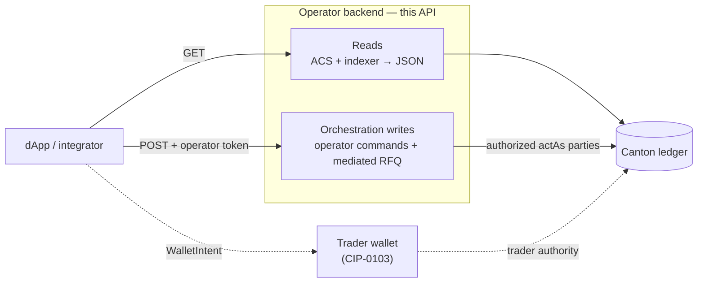

# Operator backend HTTP API

The operator backend exposes a small REST surface over its view of the ledger.
It does exactly two kinds of work, and the split is the thing to understand
before reading the endpoint tables:

1. **Operator-observed reads.** The operator's active-contract-set view and its
   indexer, projected into JSON the dApp renders — pairs, pools, order books,
   a party's holdings, trade and swap history. Reads never move value and, with
   two scoping exceptions below, need no authorization.
2. **Orchestration writes.** Administrative and settlement commands the
   operator is authorized to submit, plus the explicitly documented
   operator-mediated RFQ routes. These are gated by a bearer token.

Order funding, holding allocation, swaps, and LP actions preserve a
self-custodial boundary: a trader wallet authors the allocations each request
needs (one per instrument admin for a swap or order; a fixed base, quote, and
LP-token set for liquidity) and this API only requests or settles them. The RFQ
write endpoints are a custodial exception.
They submit as configured trader parties, and acceptance also submits as the
operator, so the backend ledger user must hold those act-as rights.
`testnet-server.ts` disables that relay by default; opting in requires
per-caller JWT binding. Do not describe or expose that authority model as
self-custodial.

The server in this repository has no `/v1/testnet/*` namespace, party faucet,
or public-host provisioning. Those are deployment concerns, not hidden API
routes. The only generic signing relay is the development-only endpoint
documented below.



A DvP flow crosses both lanes: the operator `POST …/request` returns the
allocation specs, the **wallet** authors the allocations that lock the trader's
funds, and the operator `POST …/settle` invokes the atomic value transfer. The
wallet-authored lock is the step the backend cannot perform for a self-custodial
trader.

## Conventions

- **Base URL.** Served on the configured port (default `8080`); examples use
  `http://localhost:8080`.
- **Versioning.** Every route is under `/v1`.
- **JSON everywhere.** Monetary amounts are Daml `Decimal` **strings** at scale
  10, never JSON numbers — the API never round-trips a value through a float. A
  few fields are genuine JSON numbers: `slot`, `feeBps`, and the `/v1/stats/24h`
  trio. Two of that trio are non-amounts — `priceChange24h` (a ratio) and
  `swapCount24h` (a count) — but `volume24h` is the one exception to the strings
  rule: a monetary (summed base-asset) amount emitted as a number.
- **Request id.** Every response carries `X-Request-Id`, echoed from the request
  if supplied, otherwise generated.
- **Body limit.** POST bodies over 1 MiB are rejected with **413**.
- **CORS.** Default-deny: no `Access-Control-Allow-Origin` is emitted unless the
  request origin is on the `ALLOWED_ORIGINS` allowlist.

The error envelope:

```json
{
  "error": "human-readable message",
  "code": "machine-readable code",
  "details": { "...optional context": "..." },
  "requestId": "uuid"
}
```

Only the central error handler emits that full envelope. `X-Request-Id` is set
on every response, but many inline responses — validation and auth rejections,
and the store-gated **503**s (see
[indexer-backed reads](#reads--history-stats-indexer-backed)) — answer with a
bare `{ "error": "…" }` (sometimes `{ "error": "…", "code": "…" }`) and no
`requestId` field.

## Authorization

Three fail-closed gates, applied in this order:

| Gate | Applies to | Requirement |
|---|---|---|
| **Admin token** | `/v1/admin/*` writes | `Authorization: Bearer $OPERATOR_ADMIN_TOKEN` |
| **Operator token** | every other state-changing route (pool swap/LP, order, RFQ, matched-trade, wallet relay) | `Authorization: Bearer $DEX_OPERATOR_API_TOKEN` |
| **Per-caller binding** *(optional)* | party-scoped reads and trader-subject writes | `X-Caller-Token` JWT whose `sub` is the caller's own party |

Market reads are open. Account and party-history reads require an explicit
`owner` or `trader`; when per-caller binding is enabled, that party must match a
valid `X-Caller-Token` (**401** missing/invalid, **403** mismatch). An admin token
may read any party. The *unfiltered* forms of `/v1/trades`, `/v1/rfq`, and
`/v1/rfq/history` require the admin token because their rows name both parties.
On the in-memory dev server, `DEX_DEV_OPEN=1` opens the operator-write gate
without a token; see
[Local Setup → Exercising write paths](../getting-started.md#what-is-safe-to-explore-in-this-mode).

When the operator token is unset and the dev bypass is off, an operator write
returns **401**. When per-caller binding is configured
(`callerJwtSecret`), a party-scoped read or trader-subject write with no valid
`X-Caller-Token` returns **401**; a valid token for a different party returns
**403**. Binding is off by
default (a single trusted backend); turn it on when the backend fronts
mutually-distrusting callers.

The optional custodial RFQ mode is stricter: `testnet-server.ts` refuses to
enable `DEX_HOSTED_RFQ_RELAY=1` unless `DEX_CALLER_JWT_SECRET` is present. For
that mode, per-caller binding is mandatory rather than optional.

---

## Read endpoints

Auth is **open** for market reads unless the row says otherwise. Rows marked
*caller-bound* require the party token only when per-caller binding is enabled.

### Reads — context and market

| Method · Path | Purpose |
|---|---|
| `GET /v1/context` | Static venue parties (operator, lpRegistrar, admin) and network id |
| `GET /v1/status` | Network id, `slot` (ledger offset or Amulet round — see below), sync flag, server time |
| `GET /v1/pairs` | All `DexPair` contracts (whether or not they have a pool) |
| `GET /v1/pools` | Every pool that is not `Paused` (includes `Unfunded` pools) |
| `GET /v1/instruments` | Instrument metadata, merged from the registry configs; `?ids=BTC,USDC` filters |
| `GET /v1/prices?pairs=` | Advisory pool mid-prices for fiat display |

`GET /v1/context` returns the `DexContext` — the static venue parties and the
network id, nothing more. Factory CIDs, choice contexts, and disclosures are
**not** here; they are discovered per operation from the relevant registry once
the exact choice arguments exist (see
[factory discovery](#factory-discovery)):

```json
{ "operator": "...", "lpRegistrar": "...", "admin": "...", "network": "canton:devnet" }
```

`GET /v1/status` reports `slot` as the participant's latest ledger-end offset by
default, polled every two seconds; when `DEX_AMULET_SCAN_URL` is set it instead
reports the latest open Amulet mining-round number. `synced` reflects the
**most recent** probe. A failed configured-participant probe keeps the last real
offset and returns `synced:false`; the no-Canton in-memory dev server uses a
local counter. When the Amulet scan is configured, a successful mining-round
poll sets `synced:true` and returns before the poll reaches the participant
offset probe, so `synced:true` can reflect a healthy scan without a successful
participant probe:

```json
{ "network": "canton:devnet", "slot": 1234567, "synced": true, "serverTime": "2026-05-17T..." }
```

`GET /v1/instruments` merges `decimals` from Registry.V2 `InstrumentConfig` with
`decimals`/`isin`/`cusip` from the reference registry's `InstrumentConfig`, keyed by
`instrumentId`, then unions in the instruments referenced by active pools so the
list is populated even before any config is registered. Both config templates
are `signatory admin`, so the endpoint reads as `admin` and `lpRegistrar`, not
as the operator. Metadata therefore exists only for instruments issued by a
registry this deployment hosts; a foreign registry's instrument reports `null`
fields until `registry-client` implements the standard's off-ledger
`metadata-v1` API.

```json
[ { "instrumentId": "BTC", "symbol": "BTC", "decimals": 8, "isin": null, "cusip": null, "description": null } ]
```

### Factory discovery

| Method · Path | Purpose | Auth |
|---|---|---|
| `POST /v1/registry/allocation-factory` | Resolve the Token Standard V2 allocation factory for one registry admin | open |

Wallet intents allocate against a registry's `AllocationFactory`, whose CID and
choice context are discovered per operation once the exact
`AllocationFactory_Allocate` argument exists — not baked into `/v1/context`. The
caller supplies the registry `admin` and the exact Daml-JSON `choiceArguments`;
the response carries the factory to exercise, its extra choice arguments, and
the disclosed contracts the wallet needs:

```json
// request
{ "admin": "...", "choiceArguments": { /* AllocationFactory_Allocate arg */ } }
// response
{
  "factoryCid": "...",
  "extraArgs": { "context": { "values": {} }, "meta": { "values": {} } },
  "disclosure": [ /* DisclosedContract[] for the wallet */ ]
}
```

### Reads — order book

| Method · Path | Purpose |
|---|---|
| `GET /v1/orders?trader=` | Open orders for one trader; caller-bound (**400** without `?trader=`) |
| `GET /v1/orders/book?pair=BASE/QUOTE` | Resting bids and asks for one market |
| `GET /v1/orders/matches?pair=BASE/QUOTE` | Crossable pairs — a read-only preview |

Both pair-scoped reads also accept `?base=&quote=`, and return **400** if
neither form resolves. `/v1/orders/matches` projects each cross down to its
terms — `price`, `quantity`, `buyOrderCid`, `sellOrderCid`. The `Order`
contracts themselves name their traders and allocations and are not served here;
the operator route that *acts* on a match
([`POST /v1/orders/match`](#order-lifecycle)) sits behind the operator token.

### Reads — account

| Method · Path | Purpose |
|---|---|
| `GET /v1/holdings?owner=` | Per-contract (UTXO-style) holding rows; caller-bound (**400** without `?owner=`) |
| `GET /v1/balances?owner=` | Caller-bound holding totals per instrument, `available` vs `locked` |

`/v1/balances` saves every client re-deriving a balance from the UTXO-style
rows. `locked` is the portion committed to open orders, swaps, or allocations;
the split is exact decimal math:

```json
[
  { "instrumentId": "BTC",  "total": "0.2500000000", "available": "0.2500000000", "locked": "0.0000000000" },
  { "instrumentId": "USDC", "total": "5000.0000000000", "available": "5000.0000000000", "locked": "0.0000000000" }
]
```

### Reads — history, stats, indexer-backed

These read the SQLite indexer and return **503** when the server was started
without a `db` handle.

| Method · Path | Purpose | Auth |
|---|---|---|
| `GET /v1/trades?trader=&pair=&limit=` | accepted RFQ `MatchedTrade`s + the `SettledTrade` each order-book fill writes | caller-bound / **admin** unfiltered |
| `GET /v1/swaps?pair=&kind=&limit=` | Pool history; `kind` ∈ `swap`,`add_liquidity`,`remove_liquidity`,`state_change` (default `swap`) | open |
| `GET /v1/rfq/history?trader=&limit=` | RFQ lifecycle rows, including accepted quotes (trader, pair, winning dealer, rank) | caller-bound / **admin** unfiltered |
| `GET /v1/price-history?pair=&hours=` | Price points from the swaps feed (`hours` 1–720, default 24) | open |
| `GET /v1/stats/24h?pair=` | 24h price change, volume, swap count | open |
| `GET /v1/dealers` | Dealer registry — public list | open |

`/v1/trades` matches `?trader=` on either side: a party is `trader` on the
trades it initiated and `counterparty` on those it was matched into. `dealer` is
a role, set only where a signed policy receipt names one, so it is `null` on
order-book fills. On `/v1/swaps`, `inputAmount`/`outputAmount` are derived
textually from the signed reserve deltas the indexer stores — a positive
`baseDelta` means the pool gained base, i.e. the swapper sent base and received
quote — so the stored scale survives. `/v1/stats/24h` answers with JSON numbers, not
decimal strings — `priceChange24h` (a ratio), `volume24h` (a summed base
amount, the one monetary value this API emits as a number rather than a
string), and `swapCount24h` (a count); `priceChange24h` and `volume24h` are
`null` until the window holds enough data.

### Reads — RFQ

| Method · Path | Purpose | Auth |
|---|---|---|
| `GET /v1/rfq?owner=` | RFQs and quotes scoped to one party | caller-bound / **admin** unfiltered |

A trader sees the RFQs they raised or were whitelisted for; a dealer sees the
quotes they posted or received. The operator observes *every* RFQ and quote — who
is asking, on what, in what size, and the price each dealer answered — so the
unscoped sweep is admin-only:

```json
{ "rfqs": [ /* Rfq[] */ ], "quotes": [ /* RfqQuote[] */ ] }
```

The `Pool`, `DexPair`, `Order`, `Holding`, `Balance`, and `Instrument` shapes are
defined in
[`services/operator-backend/src/types.ts`](../../services/operator-backend/src/types.ts).

---

## Quote

| Method · Path | Purpose | Auth |
|---|---|---|
| `POST /v1/swaps/quote` | Exact off-ledger swap quote | open |

A quote is advisory. The authoritative `/v1/pools/swap/request` call accepts the
trader's minimum, binds a pool-state snapshot and slice set on-ledger, and
returns the allocation specifications — one per instrument admin — with the exact
input and output leg sides.
The dApp verifies that response before the wallet signs it. `PoolRules_Swap`
then re-derives the output and rejects any snapshot or allocation whose legs no
longer match, so the operator cannot quote one number and settle another.
Because the quote endpoint runs the same function off-ledger, preview and
settlement agree to the last digit (see [Pricing](../concepts/pricing.md)).
Supply `poolCid`; `poolId` is also accepted and resolves either the ContractId
or the logical id (e.g. `"BTC-USDC"`).

```json
// request
{ "poolCid": "#2:0", "inputInstrumentId": "BTC", "inputAmount": "0.5" }
// response — the output plus the fields a client would otherwise recompute
{
  "outputAmount": "9496.5947516312",
  "inputInstrumentId": "BTC", "outputInstrumentId": "USDC",
  "feeBps": 30,
  "feeAmount": "0.0015000000",     // fee applied to the input
  "executionPrice": "18993.18...", // output per unit input
  "spotPrice": "20000.00...",      // pre-trade reserve mid
  "priceImpact": "0.0503...",      // (spot − execution) / spot
  "poolCid": "#2:0", "poolId": "BTC-USDC"
}
```

---

## Write endpoints

Most writes below return **400** for malformed JSON or a missing/invalid field
(amounts must be `Decimal` strings, parties canonical `hint::fingerprint`, cids
non-empty) and **413** over 1 MiB, and require the **operator** token unless
noted. Some inline handlers answer with a different status instead — a
store-gated **503**, a disabled-route **404** — carrying a bare `{ "error": "…" }`.
Field-level specs live in
[`services/operator-backend/src/http/validate.ts`](../../services/operator-backend/src/http/validate.ts).

### The two-call DvP pattern

Every pool swap and LP move is a delivery-versus-payment settlement, and the
operator holds only one side of it. So each runs as two operator calls around one
wallet step:

1. **`POST …/request`** — the operator opens the flow (for LP, by creating a
   `LiquidityAllocationRequest`) and returns the on-ledger allocation specs and
   settlement info, alongside a quote. The factory CID, choice context, and
   disclosures the wallet allocates against are fetched separately from
   [`POST /v1/registry/allocation-factory`](#factory-discovery).
2. The trader's **wallet** authors the allocations via
   `AllocationFactory_Allocate`, locking the trader's funds under the trader's own
   authority.
3. **`POST …/settle`** (or `POST /v1/pools/swap` for a swap) — the operator, and
   the `lpRegistrar` on LP moves, exercises the settle choice: funds enter or
   leave the pool and LP tokens mint or burn, atomically.

If a wallet returns only an `updateId` (no created-event tree),
`POST /v1/pools/recover-dvp-allocations` recovers the created allocation cids
from the transaction tree so the settle can still be assembled.

### Pool — swap and liquidity

| Method · Path | Purpose |
|---|---|
| `POST /v1/pools/swap/request` | Open a swap; returns the allocation specs, swap-request cid, settlement, and quote binding |
| `POST /v1/pools/swap` | Settle with the wallet-created allocations (`PoolRules_Swap`) |
| `POST /v1/pools/add-liquidity/request` | Open add-LP; create `LiquidityAllocationRequest`, return quote + specs |
| `POST /v1/pools/add-liquidity/settle` | `PoolLiquidityRules_SettleAddLiquidity` (operator + lpRegistrar) |
| `POST /v1/pools/remove-liquidity/request` | Open remove-LP |
| `POST /v1/pools/remove-liquidity/settle` | `PoolLiquidityRules_SettleRemoveLiquidity` (operator + lpRegistrar) |
| `POST /v1/pools/recover-dvp-allocations` | Recover created allocation cids from an `updateId`-only receipt |

`POST /v1/pools/swap/request` requires `poolCid`, `swapper`,
`inputInstrumentId`, `inputAmount`, and `minOutputAmount`. Its response is a
`PoolRequestSwapResult` — `allocationSpecs` (one per admin), the
`swapRequestCid`, the `settlement`, and a `quoteBinding` containing the pool id,
state cid, selected slice cids, and minimum. Pass that binding unchanged to
`POST /v1/pools/swap` along with the wallet-authored allocations — the per-admin
`swapperAllocationCids` (one per admin: single-admin swaps supply one,
cross-admin two), or an `updateId` the operator recovers them from. If the state
or slices have moved, settlement fails and
the terminal, uncommitted swap allocation(s) remain withdrawable by their trader.

**An add off the reserve ratio is only partly taken.** LP tokens are minted
against whichever leg is short relative to the pool's ratio
(`min((base·S)/rb, (quote·S)/rq)`), and only the matching part of the other leg
enters the reserves. The `add-liquidity/request` response reports both parts, so
the receipt reflects what actually settled rather than what was asked:

```json
{
  "requestCid": "...",
  "lpAmount": "29.6531048680",
  "matchedBaseAmount": "0.1000000000",  "matchedQuoteAmount": "8847.7436669408",
  "refundedBaseAmount": "0.0000000000", "refundedQuoteAmount": "1152.2563330592",
  "offRatioBps": "1152.2563330592",
  "knownTotalLpSupply": "1581.0163443902",
  "baseAmount": "0.1", "quoteAmount": "10000.0"
}
```

`matchedBaseAmount`/`matchedQuoteAmount` are the parts the minted LP tokens
represent and that reach the pool; `refundedBaseAmount`/`refundedQuoteAmount` are
the remainder, which `PoolLiquidityRules_SettleAddLiquidity` returns to the
depositor in the same transaction. At the reserve ratio both remainders are
zero, and the first deposit into an unfunded pool sets the ratio.

The optional `maxOffRatioBps` (`0`..`10000`) refuses the request with **400**
when `offRatioBps` exceeds it, before any contract is created — use it when a
partly-filled add is not what you want. Decimal rounding alone can leave a
sub-bps remainder on an otherwise on-ratio deposit, so `0` is stricter than it
looks; `1` is the usual "on ratio" check.

### Order lifecycle

| Method · Path | Purpose |
|---|---|
| `POST /v1/orders/bind` | Bind a funded order to a settlement ref (full-tree or `updateId` recovery) |
| `POST /v1/orders/fund` | Fund a bound order |
| `POST /v1/orders/:cid/cancel` | Cancel an open order (**204**) |
| `POST /v1/orders/match` | Discover crossing orders and settle each atomically |

`POST /v1/orders/match` catches per match so one bad pair cannot stop the rest,
and reports the outcome in its status: **200** when all settled, **207** when
some failed, **502** when every one did.

```json
{ "matches": [ /* per-match results */ ], "settled": 3, "failed": 0 }
```

### Matched-trade (OTC) settlement

| Method · Path | Purpose |
|---|---|
| `POST /v1/matched-trades/request-allocations` | `MatchedTrade_RequestAllocations` |
| `POST /v1/matched-trades/settle` | `MatchedTrade_Settle` — one allocation batch per admin |
| `POST /v1/matched-trades/cancel` | `MatchedTrade_Cancel` — release allocations |

`settle` takes `tradeCid` plus either an `allocationCidsByAdmin` object keyed by
admin party or an `updateId` the operator recovers the cids from; `cancel` takes
`tradeCid`, `allocationsByAdmin` (the `Allocation` cids to cancel, per admin), and
`allocationRequestCids` (the outstanding `TradeAllocationRequest` cids to archive)
— all three required. A **400** covers only missing or malformed fields — a
`settle` body that supplies neither `allocationCidsByAdmin` nor `updateId`, or an
empty per-admin array, is rejected up front. Whether each admin's allocations
cover exactly that admin's legs is validated **on-ledger** by the settling (or
cancelling) choice, which rejects a mismatch at settlement, not before.
(`batchesByAdmin` is settle's internal Daml choice argument, not a public request
field.)

### RFQ

| Method · Path | Purpose |
|---|---|
| `POST /v1/rfq` | Create an RFQ on a trader's behalf |
| `POST /v1/rfq/:cid/cancel` | Cancel an open RFQ (**204**) |
| `POST /v1/rfq/accept` | Operator + trader co-sign the accept → `{ tradeCid, receipt }` |

These three writes are disabled (`404`) by default in `testnet-server.ts`.
`DEX_HOSTED_RFQ_RELAY=1` enables the custodial mode only when
`DEX_CALLER_JWT_SECRET` is also configured; the participant user must have
`actAs` rights for every configured trader. This flag does not provision
parties or make the server a public service. Reads remain available when the
mode is disabled.

```json
// POST /v1/rfq
{ "trader": "...", "rfqId": "...",
  "baseInstrumentId": { "admin": "...", "id": "BTC" },
  "quoteInstrumentId": { "admin": "...", "id": "USDC" },
  "side": "RFQ_Buy",
  "size": "0.5", "expiresAt": "2026-...", "whitelist": [], "createdAt": "..." }
```

`cancel` and `accept` act as the *fetched* RFQ's `trader`, which a body-field
binding cannot reach. With per-caller binding on, both resolve the caller from
the `X-Caller-Token` and reject a mismatch (**403**), so an operator-token holder
cannot cancel or accept on another trader's behalf.

### Admin

The admin routes require the **admin** token, except the config *read*, which is
open. The dealer routes additionally require the indexer (**503** without it).

| Method · Path | Purpose |
|---|---|
| `POST /v1/admin/pairs` | Create a `DexPair` → `{ pairCid }` |
| `POST /v1/admin/pairs/:cid/fee-model` | Update the pair's fee model |
| `POST /v1/admin/pairs/:cid/active` | Activate / deactivate a pair |
| `POST /v1/admin/pairs/:cid/trading-mode` | Set the pair's trading mode |
| `POST /v1/admin/pools` | Create a pool → `{ poolCid }` |
| `GET /v1/admin/config` | Dump operator config (open read) |
| `PUT /v1/admin/config` | Set a key `{ key, value }` |
| `DELETE /v1/admin/config/:key` | Delete a key |
| `PUT /v1/admin/dealers` | Upsert a dealer |
| `DELETE /v1/admin/dealers/:party` | Remove a dealer |

The pass-through bodies for the pair/pool routes are the service inputs in
[`services/operator-backend/src/admin/index.ts`](../../services/operator-backend/src/admin/index.ts).

### Wallet relay — dev only

| Method · Path | Purpose | Auth |
|---|---|---|
| `POST /v1/wallet/submit` | Forward shaped ledger commands under the operator JWT | operator + flag |

Only the in-memory `dev-server.ts` can enable this route with
`DEX_DEV_WALLET_RELAY=1`; `testnet-server.ts` hard-disables it even if that
variable leaks into a deployment environment. In dev, forwarded `actAs`
parties must be on `DEX_DEV_RELAY_PARTIES` (else **403**), the `commands` array
and `commandId` are shape-checked, and the relay follows the committed
transaction tree to return created allocation cids. It is a walletless local
diagnostic, not a public faucet, hosted-party service, or production authority
path.

---

## Wallet intent shapes

For self-custodial allocation writes, the frontend hands an intent to the active
`WalletProvider` rather than calling the ledger. Shapes are in
[`app/web/src/wallet/types.ts`](../../app/web/src/wallet/types.ts):

| Intent | When |
|---|---|
| `FundOrderIntent` | Trader locks holdings for a pending order |
| `PlaceOrderIntent` | Trader places a new order |
| `RequestSwapIntent` | Trader initiates a pool swap |
| `AddLiquidityIntent` | Trader authors the base-deposit, quote-deposit, and LP-receipt allocations for an add |
| `RemoveLiquidityIntent` | Trader authors the base-receipt, quote-receipt, and LP burn-sender allocations for a remove |
The wallet also exposes `SplitHoldingIntent` / `MergeHoldingsIntent` for holding
management; those are a wallet concern and have no operator endpoint.

---

## Status and error codes

| `code` | HTTP | Meaning |
|---|---|---|
| `bad_request` | 400 | malformed JSON, missing field, invalid amount / party / cid |
| `unauthorized` | 401 | missing or invalid operator / admin token |
| `forbidden` | 403 | per-caller party mismatch, or wallet-relay `actAs` not allowlisted |
| `not_found` | 404 | route or resource not found (also the disabled wallet relay) |
| `payload_too_large` | 413 | body > 1 MiB |
| `not_supported` | 501 | a demo-mode limitation surfaced cleanly, not a server fault |
| `internal_error` | 500 | unexpected server error |

Beyond the enveloped codes, `POST /v1/orders/match` returns **207** / **502** for
partial / total settlement failure, the wallet relay returns **502**
(`tree_fetch_failed`) when a committed transaction's tree cannot be fetched, and
indexer- or config-gated routes return a bare-`{ error }` **503** when their
store is absent.

### On-ledger assertions

The codes above wrap the backend's own validation. A write can also fail inside
the Daml settlement, where the ledger returns the choice's assertion message.
The most common ones and how a client should handle them:

| On-ledger assertion | Triggering condition | Suggested handling |
|---|---|---|
| `Output below slippage minimum` | the request-time quote is below the trader's `minOutputAmount`, so no allocation specification is issued | refresh the quote or widen the slippage tolerance before signing |
| `stale swap quote binding` | the bound pool state or reserve slices changed before settlement | withdraw the uncommitted allocation, request a fresh signed specification, and retry |
| `expectedPoolId mismatch (pool config swapped?)` | the referenced pool contract is no longer the active one for the pair | refresh the client's pool cache and rebuild the request |
| `add: base reserve delta must equal created base slice amount` | reserve and slice arithmetic disagree during a liquidity settle (should be unreachable) | operator alert; run `PoolRules_ReconcileState` |
| `Allocation_Settle: settlement deadline has passed` | an order or RFQ allocation was settled after its deadline | release the reserved funds with the cancel / withdraw choice |
| `LP tokens below minimum` | ratio drift on add left the minted LP below the caller's floor | re-quote the deposit at the current pool ratio |

These are the on-ledger messages; the backend surfaces them under a
`bad_request` or `internal_error` envelope depending on the route.

---

## Examples

Reads need no auth; `/v1/admin/*` writes need `Authorization: Bearer
$OPERATOR_ADMIN_TOKEN`, other writes `Authorization: Bearer
$DEX_OPERATOR_API_TOKEN` (or `DEX_DEV_OPEN=1` on the dev server).

```bash
# Reads: pairs, pools, a trader's aggregated balance
curl -s http://localhost:8080/v1/pairs                       | python3 -m json.tool
curl -s http://localhost:8080/v1/pools                       | python3 -m json.tool
curl -s "http://localhost:8080/v1/balances?owner=$TRADER"    | python3 -m json.tool

# Advisory swap quote (re-validated on-ledger by PoolRules_Swap)
curl -s -X POST http://localhost:8080/v1/swaps/quote \
  -H 'content-type: application/json' \
  -d '{"poolCid":"#2:0","inputInstrumentId":"BTC","inputAmount":"0.5"}'
# -> {"outputAmount":"9496.59...", ...}

# Create an RFQ on a trader's behalf (operator token)
curl -s -X POST http://localhost:8080/v1/rfq \
  -H "authorization: Bearer $DEX_OPERATOR_API_TOKEN" -H 'content-type: application/json' \
  -d '{"trader":"'"$TRADER"'","rfqId":"rfq-1",
       "baseInstrumentId":{"admin":"'"$BASE_ADMIN"'","id":"BTC"},
       "quoteInstrumentId":{"admin":"'"$QUOTE_ADMIN"'","id":"USDC"},"side":"RFQ_Buy",
       "size":"0.5","expiresAt":"2026-12-31T00:00:00Z","whitelist":[],"createdAt":"2026-07-01T00:00:00Z"}'
```

> **Existing projection rows.** Reindex after deploying a version that changes
> derived amount or party fields; rows already stored in SQLite retain their
> original values until rebuilt.
> [`services/operator-backend/scripts/reindex-derived.ts`](../../services/operator-backend/scripts/reindex-derived.ts)
> recomputes both in place with no ledger read: it re-derives parties from each
> row's retained payload — the current `tradeLegs` shape, and the legacy flat
> `transferLegs` shape for older rows — and rewrites only the rows whose derived
> values changed, so a re-run is idempotent. Run it with `--dry-run` first to see
> what would change.

---

**Where to read next:** [Builder Guide](../guides/builder-guide.md) · [Choice Context](../guides/choice-context.md) · [Allocation surface](allocation-surface.md) · [Pricing](../concepts/pricing.md)
