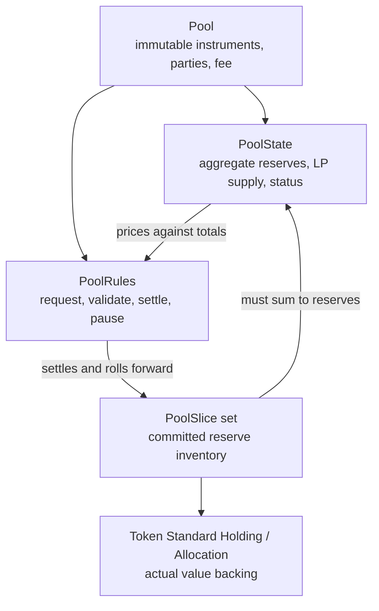

# Trace one AMM swap from formula to Daml settlement

This tutorial is for an AMM developer who knows `x*y=k` but is new to Canton
and Daml. You will trace one exact-input swap through the repository, run three
focused Daml tests, and learn what each test does—and does not—prove.

This is a code-reading tutorial, not a live-network deployment. It uses the
Daml Script runner so you can focus on contract state, authority, and value
movement before adding a participant, wallet, or HTTP backend.

## Before you begin

Read the [Canton and Daml primer](../concepts/canton-daml-primer.md), then install
the Daml prerequisites from [Getting started](../getting-started.md#additional-tools-for-daml-builds-tests-and-the-live-proof).

From the repository root, build the trading DAR once:

```bash
dpm install 3.5.2
bash scripts/build-trading-surface.sh
```

A successful build ends with:

```text
canton-dex-trading-v2 built successfully.
```

You will work with these files:

| Question | File |
|---|---|
| Where is the constant-product formula? | [`PoolModel.daml`](../../trading/CantonDex/Dex/PoolModel.daml) |
| Where are quote binding and swap settlement enforced? | [`PoolRules.daml`](../../trading/CantonDex/Dex/PoolRules.daml) |
| What is pool configuration versus mutable state? | [`Pool.daml`](../../trading/CantonDex/Dex/Pool.daml), [`PoolState.daml`](../../trading/CantonDex/Dex/PoolState.daml) |
| Where is reserve value represented? | [`PoolSlice.daml`](../../trading/CantonDex/Dex/PoolSlice.daml) and [`Registry/V2.daml`](../../trading/CantonDex/Registry/V2.daml) |
| Which tests should I read first? | [`PoolRoundingTests.daml`](../../trading-tests/CantonDex/Tests/PoolRoundingTests.daml), [`PoolWorkflowTests.daml`](../../trading-tests/CantonDex/Tests/PoolWorkflowTests.daml), [`RealRegistryDvpTests.daml`](../../trading-tests/CantonDex/Tests/RealRegistryDvpTests.daml) |

## 1. Start from the familiar formula

For reserve-in `x`, reserve-out `y`, exact input `dx`, and fee `f`, the usual
constant-product output is:

```text
dxAfterFee = dx × (1 - f)
dy         = y × dxAfterFee / (x + dxAfterFee)
```

The repository implements that in
[`constantProductOut`](../../trading/CantonDex/Dex/PoolModel.daml):

```daml
constantProductOut reserveIn reserveOut feeBps inputAmount =
  let amountInAfterFee =
        floorDiv (floorMul inputAmount (intToDecimal (10000 - feeBps))) 10000.0
  in floorDiv (floorMul amountInAfterFee reserveOut)
       (reserveIn + amountInAfterFee)
```

Two details matter:

- fees use basis points, so 30 means 0.30%;
- multiplication and division round down on pool payouts so fixed-scale
  decimal rounding cannot make the pool pay more than the exact result.

The full input—not only `amountInAfterFee`—is later added to the input reserve.
That is how the fee remains in the pool and accrues to LPs.

### Run the arithmetic proof

From the repository root, move into the tests package (you stay here through
section 6):

```bash
cd trading-tests
dpm test -p testSwapOutputRoundsDownToKeepConstantProduct
```

Expected result:

```text
testSwapOutputRoundsDownToKeepConstantProduct: ok
```

Read that test in
[`PoolRoundingTests.daml`](../../trading-tests/CantonDex/Tests/PoolRoundingTests.daml).
It creates a zero-fee 1000/1000 pool, swaps 7 units, and asserts that the
post-swap product is not lower than the pre-swap product. Zero fees remove the
usual fee cushion, exposing a one-unit-of-precision overpayment.

This test proves arithmetic plus real Daml settlement in its fixture. It does
not exercise the backend or browser.

## 2. Replace one “pool contract” with four responsibilities

An EVM AMM often places configuration, reserves, and swap functions on one pair
contract. This reference separates them:



Open the files and identify these fields:

- `Pool.poolId`, the two instrument IDs, `lpInstrumentId`, and `feeBps` are
  stable configuration.
- `PoolState.reserves`, `totalLpSupply`, and `status` are the small global state
  every reserve-changing operation serializes through.
- each `PoolSlice` names one side, amount, and committed allocation contract ID;
- `PoolRules` is operator-signed and exposes nonconsuming choices. The rules
  contract stays active while a swap archives and recreates state and slices.

The accounting invariant is:

```text
PoolState.baseAmount  = sum(active base PoolSlice.amount)
PoolState.quoteAmount = sum(active quote PoolSlice.amount)
```

`PoolState` makes pricing efficient; slices connect those totals to reserved
Token Standard value. A reserve number without matching slices would be only
an operator assertion, not spendable inventory.

## 3. See why quoting is not authorization

The browser can compute or request a quote without moving funds. A settle needs
the allocation specifications — one per instrument admin — that bind the trader to
exact transfer-leg sides and one pool snapshot.

The operator exercises `PoolRules_RequestSwap`. Its result contains:

```daml
data PoolRules_RequestSwapResult = PoolRules_RequestSwapResult with
    settlement : V2.SettlementInfo
    allocationSpecs : [V2.AllocationSpecification]
    swapRequestCid : ContractId SwapReq.SwapAllocationRequest
    quoteBinding : Optional SwapQuoteBinding
```

The `quoteBinding` records the state and slice contract IDs plus the trader's
minimum output:

```daml
data SwapQuoteBinding = SwapQuoteBinding with
    expectedPoolId : PoolId
    poolStateCid : ContractId PoolState
    inputSliceCid : ContractId PoolSlice
    outputSliceCids : [ContractId PoolSlice]
    minOutputAmount : Decimal
```

Contract IDs are part of the concurrency control. If another swap archives the
bound `PoolState` or a bound slice first, the old quote cannot settle. The
operator must produce a fresh request; it cannot reuse the trader's authority
against different state.

Inside `PoolRules_RequestSwap`, Daml builds one specification per instrument
admin from the prepared input and output legs:

```daml
swapperAllocationSpecs prepared =
  let swapperAccount = prepared.preparedSwapInLeg.sender
      swapInLeg = prepared.preparedSwapInLeg
      outputLegs = prepared.preparedOutputDelivery.legs
      spec admin legs =
        Utils.mkIteratedAllocationSpecification admin swapperAccount None legs None False
  in if prepared.preparedInputAdmin == prepared.preparedOutputAdmin
       then [spec prepared.preparedInputAdmin (swapInLeg :: outputLegs)]
       else [ spec prepared.preparedInputAdmin [swapInLeg]
            , spec prepared.preparedOutputAdmin outputLegs ]
```

When input and output share one admin the swapper authors a single two-sided
allocation; a cross-admin swap emits one spec per admin. The operator prepares
these specifications, but the trader's wallet authors an allocation against
each. Preparing terms and authorizing funds are separate actions.

## 4. Follow authority, not HTTP calls

The essential swap has three ledger steps:

| Step | Daml action | Required authority | Result |
|---|---|---|---|
| Prepare | exercise `PoolRules_RequestSwap` | operator | exact settlement info, allocation specs (one per instrument admin), and quote binding |
| Allocate | exercise `AllocationFactory_Allocate` | trader, plus any registry-required context/actors | trader's input value locked for those terms |
| Settle | exercise `PoolRules_Swap` | operator | input and output settle atomically; state/slices roll forward |

The dApp and backend orchestrate those steps, but neither changes who controls
them. A frontend button cannot substitute operator authority, and an operator
API token cannot substitute the trader's wallet authority on a self-custodial
allocation.

### Run the choreography proof

```bash
dpm test -p testPoolSwapViaRequestSwap
```

Expected result:

```text
testPoolSwapViaRequestSwap: ok
```

Read the named test in
[`PoolWorkflowTests.daml`](../../trading-tests/CantonDex/Tests/PoolWorkflowTests.daml).
The most important three lines of the story are:

```daml
reqRes <- submit operator $ exerciseCmd rulesCid PoolRules_RequestSwap with ...
bobInstr <- submit bob $ exerciseCmd factoryCid bobAllocateArg
swapRes <- submit operator $ exerciseCmd rulesCid PoolRules_Swap with ...
```

This is excellent authority and choreography documentation: operator, then
trader, then operator. Its `MockRegistry` fixture does not contain real
holdings, so this particular test does **not** prove balance conservation. The
file header says so explicitly.

## 5. Read the atomic settlement boundary

`PoolRules_Swap` recomputes the output from the bound pool snapshot and checks
that every supplied contract ID and the minimum output match the quote binding.
It groups the legs and allocations by instrument admin and exercises one
`SettlementFactory_SettleBatch` per admin inside a single Daml choice:

```daml
settleResultsByAdmin <-
  AB.settleByAdmin (poolSettlement poolCid operator) [operator] grouped batchesByAdmin
```

A single-admin swap collapses to one batch; a cross-admin swap runs one batch
per admin. Because these are nested in one Daml transaction, settlement and the
following state changes are atomic. After successful settlement the choice:

1. rolls the input reserve allocation forward with the full input added;
2. consumes enough output slices to pay the trader and recreates any leftover
   boundary slice;
3. asserts that slice deltas equal reserve deltas;
4. archives the old `PoolState` and creates the successor reserves.

If batch settlement fails, the state and slice updates do not commit. If a
reserve/slice assertion fails, the value settlement does not commit either.

## 6. Run the real-holding proof

Now run the test whose fixture creates actual Token Standard holdings and uses
an upstream context-requiring V2 registry:

```bash
dpm test -p testRealRegistryDvpSwapSettles
```

Expected result:

```text
testRealRegistryDvpSwapSettles: ok
```

Read the named test in
[`RealRegistryDvpTests.daml`](../../trading-tests/CantonDex/Tests/RealRegistryDvpTests.daml).
It proves more than the choreography test:

- the request's sender side is the exact input instrument and amount;
- the receiver side is a positive amount of the output instrument;
- changing the signed receiver amount by `0.0000000001` makes settlement fail;
- the trader's input holdings back the allocation;
- reserves move in the expected directions;
- the trader receives an output `Holding`.

It still runs in Daml Script. It does not prove package upload, JSON API
serialization, wallet compatibility, network topology, or browser behavior.

## 7. Promote the proof to a real Canton process

Return to the repository root and run the default live proof:

```bash
bash scripts/run-dpm-sandbox-proof.sh
```

This starts the real Canton sandbox bundled with the pinned DPM SDK, uploads
the Token Standard and DEX package closure, and drives add → swap → remove
through the JSON Ledger API. The final checkpoint is:

```text
==> PASS: portable live-Canton proof completed
    The throwaway sandbox is now stopping; no persistent ledger state remains.
```

You have now crossed two boundaries that Daml Script did not test: a Canton
process started, and the JSON Ledger API accepted the package and value-flow
commands. The script uses one unrestricted authentication-disabled sandbox
user, but three Canton parties: operator/admin/LP registrar share the bootstrap
party, while LP/trader and swapper are distinct counterparties. It still does
not start the operator HTTP server, browser, or wallet. Those omissions are
deliberate; see
[Local Canton from a clean clone](../guides/localnet.md) for the proof matrix
and the optional persistent environments.

## 8. Connect the code to the UI without overstating it

After the Daml tests pass, run the browser preview from
[Getting started](../getting-started.md#mode-1-run-the-browser-preview). On the
Trade page:

1. change the Amulet or USDCx input and observe the quote;
2. open browser developer tools and find the quote/request calls;
3. connect Mock Wallet and inspect the wallet intent logged to the console;
4. notice that its returned `#mock-…:0` value is not the allocation created in
   the Daml test.

The UI shows how a real integration is orchestrated. The Daml tests show what
the contracts enforce. Only a live participant plus compatible wallet joins
the browser orchestration and on-ledger settlement boundaries in one validation.

## 9. Use the same reading pattern for other AMM flows

You can now trace add and remove liquidity with the same questions:

| Question | Add/remove liquidity answer |
|---|---|
| What computes the economic amounts? | pool ratio, LP supply, and conservative rounding in `PoolModel.daml` |
| What records intent? | `LiquidityAllocationRequest` |
| Who authorizes base/quote or LP value? | the liquidity provider through allocation factory choices |
| Who executes? | operator and LP registrar on the liquidity rules choice |
| What makes it atomic? | one settlement batch per admin combines deposits/redemption with LP mint/burn, nested in one Daml transaction |
| Which real-value test should I read? | `testDvpAddLiquidity`, `testDvpRemoveDeliversToHolder`, and their negative cases in `PoolLiquidityRulesTests.daml` |

Then read [Liquidity and custody](../concepts/liquidity-and-custody.md) for the
full slice design and [LP tokens](../concepts/lp-tokens.md) for issuance and
redemption.

## Completion checklist

You have completed this tutorial when you can point to:

- the function that computes `amountOut`;
- the contracts that separate pool configuration, aggregate state, and reserve
  backing;
- the choice that builds the trader's exact allocation specifications (one per admin);
- the line where the trader—not the operator—authors the allocations;
- the nested batch-settlement choice;
- one mock-registry choreography test and one real-holding value test;
- the final checkpoint of the DPM sandbox proof;
- the reason passing the Daml and sandbox proofs is not yet a live browser and
  external-wallet dApp.

**Next canonical step:** [15-minute design tour](../concepts/design-tour.md).
Use [Liquidity and custody](../concepts/liquidity-and-custody.md) and
[Local Canton from a clean clone](../guides/localnet.md) as topic references.
